# SUSTAINABILITY  

제주항공 2024 지속가능경영보고서  

  

# SUSTAINABILITY ON BO ARD  

제주항공 2024 지속가능경영보고서  

# About this Report  

제주항공은 지속가능경영 전략과 활동, 그에 따른 성과와 계획을 담아 첫지속가능경영보고서를 발간하였습니다. 특히 이중 중대성 평가에 따라 채택된 항공산업의 중대 이슈인 기후변화 대응, 안전경영, 고객 만족에 대한 당사의 노력을 상세히 담았습니다. 각 이슈가 당사에 미치는 재무적 리스크와기회 요인, 사회와 환경에 미치는 임팩트뿐만 아니라 이슈 관리를 위한 당사의 거버넌스, 전략, 리스크 관리, 지표 및 목표까지 ‘Risks & Opportunities’챕터를 통해 투명하게 공개하였습니다. 제주항공은 앞으로도 매년 지속가능경영보고서를 발간하여 지속가능경영 활동과 성과를 이해관계자와 투명하게 소통하며 지속가능한 성장을 위해 나아갈 것입니다.  

# 보고서 작성 기준  

  

본 보고서는 지속가능경영 국제 보고 가이드라인 GRI(Global ReportingInitiative) Standards 2021의 작성 원칙에 따라 작성되었습니다. 또한,항공산업과 관련한 주요 이슈를 반영하기 위해 지속가능회계기준위원회SASB(Sustainability Accounting Standards Board)의 Airlines 산업표준에 따라 작성되었으며, 기후변화 관련 재무정보공개 태스크포스TCFD(Task Force on Climate-Related Financial Disclosures) 보고 권고내용, 지속가능발전의 이념을 실현하기 위해 UN에서 선정한 17가지 지속가능발전목표 UN SDGs(Sustainable Development Goals)의 지표를반영하였습니다.  

  

# 보고 범위  

본 보고서는 제주항공의 ESG 성과를 담고 있으며 데이터 수집 정합성을 고려하여 자회사를 제외한 제주항공 본사, 국내외 사업장(지점)을 기반으로 작성하였습니다. 보고 범위가 상이한 경우는 별도 표기를 통해 명시하였습니다.  

# 보고 기간  

본 보고서는 2023년 1월 1일부터 2023년 12월 31일까지 제주항공의 재무, 비재무 성과를 소개하고 있으며 일부 주요한 성과의 경우 2024년 상반기까지 발생한 내용을 포함하였습니다. 정량적 성과의 경우, 성과의 연속적추이를 파악할 수 있도록 2021년부터 2023년까지 3개년 데이터를 제시하였습니다.  

# 보고서 제3자 검증  

본 보고서의 신뢰성을 높이기 위해 제주항공과의 이해관계가 없는 독립된제3자 전문 기관으로부터 검증을 받았습니다. 검증기준은 AA1000AS를적용하였으며, 검증에 관련된 세부 내용과 검증 의견은 104 페이지에서확인하실 수 있습니다.  

# 문의처  

담당부서:제주항공 대외협력팀  
주소:서울시 강서구 하늘길 76(항공지원센터)  
이메일:esg@jejuair.net  

# COVER STORY  

제주항공은 더 넓은 하늘을 향한 도전으로 더 많은 사람들과 행복한여행의 경험을 나누고자 합니다. 푸른 하늘을 날아가는 제주항공항공기의 모습을 통해 핵심 사업인 항공운수를 바탕으로 친환경적이고 지속가능한 경영을 향해 $\angle F O F7$ 려는 제주항공의 의지를 담았습니다.  

# INTERACTIVE PDF  

제주항공 지속가능경영보고서는 제주항공 홈페이지(https://www.jejuair.net)를 통해서도 열람이 가능하며, 이용자의 편의를위해 보고서 내 관련 페이지 및 홈페이지 이동 등의 기능이 포함된Interactive PDF로 발간되었습니다.  

# INTERACTIVE 사용자 가이드  

# ON BO ARD  

제주항공 2024 지속가능경영보고서  

# Contents  

#  

#  

#  

CEO 메시지04  
2023 Highlights 05   
제주항공 소개07  
사업 부문 소개09  

#  

ESG 전략체계 14   
이해관계자 소통16  
이중 중대성 평가17  
Risks & Opportunities 19   
기후변화 대응(TCFD Report)23  
지속가능한 비행28  
환경경영 34  

#  

안전경영42  
인권경영51  
인재경영53  
소비자중심경영59  
상생경영62  
정보보호64  
사회공헌66  

#  

지배구조71  
주주권리 강화74  
윤리 및 준법경영75  
리스크 관리78  
ESG Data Pack 82   
UN SDGs Commitments 94   
GRI Index 96   
SASB Index 100   
TCFD Index 101   
온실가스 검증 성명서102  
제3자 검증의견서104  
가입 협회 및 대외 수상105  

  

# ON BO ARD  

제주항공 2024 지속가능경영보고서  

# CEO 메시지  

  

# 안녕하십니까? 존경하는 제주항공 이해관계자 여러분,  

제주항공의 발전에 아낌없는 관심과 성원을 가져주신 주주, 고객, 임직원분들께 감사의 말씀 드립니다. 제주항공은 지난해 글로벌 경기침체, 공급망 불안 등의 어려운 상황에도 차세대 항공기 B737-8을 안정적으로 도입하고, 누적 수송객 수 1억 명과 사상 최대 매출을 달성하며 빠르게 경영 안정화를 이뤘습니다.2024년에도 불투명한 국제정세와 항공산업 재편 등 불확실성이 계속되고 있으나, 차세대 항공기 비중 확대를 통한 원가 경쟁력 확보, IT 시스템 고도화,건강한 조직 생태계 구축 등 미래가치 투자에 집중해 견고한 경영 체계 확립에 힘쓰고 있습니다.  

미래가치 투자에 대한 또 다른 과제로 지속가능경영이 화두에 오르고 있습니다. 제주항공은 지난 몇 년 동안 대내외 이해관계자의 다각적인 노력을 통한 ESG경영 내실화에 집중해 의미 있는 성과를 만들어냈습니다.  

환경(E) 부문에서는 오래전부터 항공산업이 당면한 가장 큰 과제인 탄소 배출량 절감을 목표에 두고, 연료 효율성이 뛰어난 차세대 항공기 도입 및 탄소저감 비행, 운영 효율 개선 등으로 탄소 배출량을 최소화하기 위한 노력을 계속해 왔습니다. 이밖에 해양 환경정화 활동, 업사이클링 제품 판매 등 녹색경영과친환경 사회공헌 활동에 적극 참여하였고, 지난해에는 국제표준화기구가 제정한 환경경영 관련 최고 수준의 환경경영시스템 인증(ISO 14001)을 획득했습니다.  

사회(S) 부문에서는 베트남, 라오스 등 제주항공이 취항 중인 해외 각지에서 교육 및 의료, 환경보호 등 사회공헌 활동에 힘쓰고 있습니다. 또 내부적으로는 수평적 조직문화 형성, 유연한 육아휴직 제도, 다양한 건강 증진 프로그램 운영 등 임직원이 건강하고 즐겁게 일할 수 있는 환경을 조성하였습니다.또한, 고객 서비스 개선을 위한 회의체 정례화, VOC(Voice of Customer) 위원회 도입 등의 노력을 통해 소비자중심경영인증(CCM, Consumer CenteredManagement)을 획득하였고, 임직원의 안전을최우선으로 하기 위해 안전보건 지표를 수립, 보완 및 개선하는 등 안전보건 시스템 구축에도 앞장서 안전보건경영시스템 인증(ISO 45001)을 획득하기도 했습니다.  

지배구조(G) 부문에서는 공정한 거래와 투명한 지배구조, 주주의 권리 보호를 위해 이사회에 내부거래위원회를 신설하는 한편 기업지배구조헌장 제정, 주주총회 전자투표제 도입 등 공정한 지배구조 확립을 위한 노력을 계속하였습니다.  

이러한 노력으로 제주항공은 한국ESG기준원(KCGS)이 실시한 2023년 ESG 평가에서 2022년 대비 2단계 상승한 ‘A’ 등급을 획득해 ESG 경영 선도 항공사로서 가시적인 성과를 기록하기도 했습니다. 기업의 ESG는 더 이상 세계적 트렌드의 대응이 아닌 지속가능성장을 위한 핵심 전제입니다. 제주항공은 대한민국항공 여행의 틀을 바꾼 제주항공만의 ‘새로운 도전’과 ‘지속적 혁신’의 가치 아래, 환경과 사회에 산재해 있는 난제들을 해결하는 데에 진정성 있는 ESG 활동으로 헤쳐 나가겠습니다. 제주항공의 끊임없는 도전과 변화에 대해 변함없는 관심과 지지를 부탁드리며, 이해관계자 여러분의 기대에 부응하고자 더욱 노력할것을 다짐하겠습니다.  

감사합니다.  

# SUSTAINABILITY ON BO ARD  

제주항공 2024 지속가능경영보고서  

  

# 2023 Highlights  

  
Business Performance   
Website ㅣhttp://www.jejuair.net E-mail ㅣesg@jejuair.net  

# SUSTAINABILITY ON BO ARD  

제주항공 2024 지속가능경영보고서  

# 2023 Highlights  

# ESG Performance  

제주항공은 환경, 사회, 지배구조와 이슈별 경영 활동 및 성과를 투명하게 공개하고 있으며, 비즈니스 의사 결정 속에서 지속가능성을 고려하고 있습니다. 이와 같은 노력은 대외 ESG 평가와 수상으로 인정받고 있으며, 앞으로도 사회적 책임을다하며 환경을 보호하고 다양한 이해관계자와 협력을 통해 발전하는 제주항공이 되겠습니다.  

  

  

Website ㅣhttp://www.jejuair.net E-mail ㅣesg@jejuair.net  

# ON BO ARD  

제주항공 2024 지속가능경영보고서  

# 제주항공 소개  

#  

CEO 메시지2023 Highlights  

제주항공은 2005년 설립되어 2023년 12월 기준 자산 총계가 약 2조에 이르는 국내 최대의 LCC(Low Cost Carrier) 항공사로 성장하였습니다. 2023년에는 매출액 약 1.7조 원, 영업이익 약 1.6천억 원을 달성하여 역대 최고 실적을 거두었습니다. 또한, 제주항공이 보유한 여객기 40대, 화물기 2대 등 총 42대의 항공기로 2023년에는 총 1,230만 명의 승객을 수송하였으며, 총 46개 도시 60개 노선을 운항하고 있습니다. 앞으로도 지속적으로 신규 취항지를 발굴하여 고객에게새로운 경험을 제공하겠습니다.  

  

# 제주항공 연혁  

  
Website ㅣhttp://www.jejuair.net E-mail ㅣesg@jejuair.net  

#  

# SUSTAINABILITY ON BO ARD  

제주항공 2024 지속가능경영보고서  

  

#  

CEO 메시지2023 Highlights  

# 글로벌 네트워킹  

제주항공은 2009년 인천-오사카 노선 취항을 시작으로 항공 여행의 대중화 시대를 열었습니다. 긴 연휴가 아니더라도 연차나 주말, 공휴일을 활용해짧게 또는 자주 해외여행을 떠날 수 있도록 합리적인 가격과 일정으로 항공여행 서비스를 제공해 국내 여행시장의 패러다임을 변화시켰습니다. 특히2023년 일본 소도시 노선에 신규 취항하거나 운항을 재개하고, 부산과 제주를 기점으로 울란바토르, 베이징, 마카오 등 새 하늘길을 열었습니다.현재 제주공항은 국내를 비롯한 일본, 중화권, 아시아 주요 6개국(태국,필리핀, 베트남, 말레이시아, 라오스, 싱가포르), 대양주 등의 주요 도시에취항하고 있습니다. 또한, 2022년부터 시작한 항공화물은 일본 도쿄, 중국옌타이, 베트남 하노이 노선 운항을 통해 사업을 점차 확대해 나가고 있습니다.  

  

  
Website ㅣhttp://www.jejuair.net E-mail ㅣesg@jejuair.net  

#  

# SUSTAINABILITY ON BO ARD  

제주항공 2024 지속가능경영보고서  

# 사업 부문 소개  

# 여객 사업  

CEO 메시지2023 Highlights 제주항공 소개사업 부문 소개ESG M ANAGEM ENVIRONM  

GO  

#  

Website ㅣhttp://www.jejuair.net E-mail ㅣesg@jejuair.net  

제주항공은 고객 중심적 사고를 바탕으로 고객에게 합리적인 가격의 새로운 여행 경험을 제공하기 위해 끊임없이 혁신을 추구해 왔습니다. 그 결과, 2023년 매출 1.7조 원, 탑승객 1,230만 명의 최대 실적을 달성하였습니다. 특히 산업 경쟁력을 강화하기 위해 성장과 직결된 전략 과제를 지속적으로 발굴하여 추진하였으며, 상시원가절감 체계 구축을 통해 최적의 경제 효과를 실현했습니다. 제주항공은 2023년 기준 총 46개 도시, 국내외60개 노선을 운항하면서, 국내 항공여행 산업의 성장을 견인했습니다. 2023년 11월 첫 차세대 항공기 인수를시작으로, 총 40대의 신규 항공기 도입을 추진하고 있습니다. 또한, 시장 확대 전략에 따라 주요 일본 노선을증편하고, 오이타, 히로시마 등 신규 노선을 개발하여 한국-일본 시장 점유율 1위를 달성하였습니다. 더불어달랏, 팔라우, 보홀, 바탐 등 동남아와 남태평양 지역의 신규 노선을 확대하고 신규 고객군을 확보하였습니다.제주항공은 해외 항공사들과 인터라인1)협정을 체결하여 노선 확대를 통한 수익 다각화로 시장변화에 적극적으로 대처하고 있으며, 사업 인프라도 개선해 나가고 있습니다. 앞으로도 항상 고객의 안전과 편의를 최우선으로 삼으며, 지역사회의 지속가능한 발전에 기여하고, 환경 및 윤리경영을 적극 실현하여 가장 신뢰받는항공사로 발돋움하고자 합니다.  

  
1) 인터라인(Interline): 복수의 항공사가 제휴를 맺고 각각 운항하는 노선을 연계하는 형태  

  

# SUSTAINABILITY ON BO ARD  

제주항공 2024 지속가능경영보고서  

CEO 메시지2023 Highlights 제주항공 소개사업 부문 소개ESG M ANAGEM ENVIRONM  

GO  

#  

# 사업 부문 소개  

# 화물 사업  

제주항공은 지난 2022년 LCC 항공사 최초로 항공화물 사업에 진출하였고, 합리적 운송단가를 강점으로단기간에 괄목할 만한 성과를 이루어냈습니다. 화물 사업실은 2022년 한 해 동안 중국 옌타이, 일본 나리타, 베트남 하노이 노선을 운영하며 11,200톤의 물동량을 확보하고, 206억 원의 매출을 기록하였습니다.뒤이어 2023년 26,000톤의 물동량을 처리하였으며, 349억 원의 매출을 기록하여 성장세를 이어가고 있습니다. 현재 항공화물 사업은 아직 초기 단계지만 중국 및 베트남의 이커머스 시장, 일본 의약품 시장이확대되고 있어 꾸준히 성장할 것으로 전망합니다. 제주항공은 보유하고 있는 항공 인프라를 활용해 사업다각화에 집중하고, 향후 화물 운수권 획득, 일본 및 베트남 신규 노선 운항 등을 추진하여 사업을 확장해나갈 것입니다.  

  
Website ㅣhttp://www.jejuair.net E-mail ㅣesg@jejuair.net  

  

# ON BO ARD  

  

제주항공 2024 지속가능경영보고서  

CEO 메시지2023 Highlights 제주항공 소개  

# 호텔 사업  

사업 부문 소개  

ESG M ANAGEM  

ENVIRONM  

#  

Website ㅣhttp://www.jejuair.net E-mail ㅣesg@jejuair.net  

제주항공은 늘어나는 항공 수요와 개별여행 트렌드 확산에 맞춰 수익 구조를 다각화하고 지속가능한 성장 기반을 마련하기 위해 호텔업 진출을 결정하였습니다. 인터컨티넨탈호텔그룹(IHG) 브랜드를 도입하여,2018년 9월 ‘홀리데이 인 익스프레스 서울 홍대’로 영업을 시작하였습니다.  

호텔은 지상 17층, 연면적 5만 4천m2, 294실 규모이며, 공항철도를 통해 인천국제공항과 김포국제공항을바로 연결하여 이용할 수 있습니다. 제주항공은 중·단거리 중심의 항공운송 사업과 뛰어난 접근성을 기반으로 다양한 프로모션과 맞춤 서비스를 통해 적극적으로 외국인 관광객을 유치하였으며, 그 결과 제주항공의호텔 사업은 2023년 매출액 163억 원이라는 역대 최대 실적을 이루었습니다.  

  
호텔 사업 성과  
(단위: 천 명, 억 원)2023 홀리데이 인 익스프레스 서울 홍대 이용객  

  

# SUSTAINABILITY ON BO ARD  

제주항공 2024 지속가능경영보고서  

# 사업 부문 소개  

# SPECIAL  

CEO 메시지2023 Highlights 제주항공 소개사업 부문 소개ESG M ANAGEM ENVIRONM  

# 도심항공교통(UAM), 항공에 새로운 가치를 더하다  

도심항공교통 $(\mathsf{U A M})^{\scriptscriptstyle1\slash}{0}|$ 이 차세대 교통수단으로 전 세계적인 주목을 받고 있습니다.도심의 교통체증을 해결하고 대기 오염을 줄이기 위한 방안으로 주목받는 UAM은 기후변화 대응 및 탄소중립 실현 기술과 함께 항공산업의 신사업 영역으로 떠오르고 있습니다. ICT, 인공지능, 빅데이터, 나노 등 혁신 기술이 기존의 기술들과융복합되면서 항공산업은 새로운 모습으로 진화할 것으로 전망됩니다.  

이러한 시장 변화에 대응하여 제주항공은 UAM을 통해 “항공에 새로운 가치를더하다”라는 비전을 세우고, 다가올 미래 이동 수단의 변화에 적극적으로 도전하며 새로운 산업 발전을 위해 노력하고 있습니다. 현재 제주항공은 UAM 운항사업자로 성장하기 위해 국내외 기체 제작사와 협업을 통해 새로운 기술의 적용방안에 관한 연구를 진행하고 있으며, 2023년에는 Eve Air Mobility 社와 함께제주지역을 중심으로 UAM 운항 환경, 운영 모델 시장, 노선 분석 및 운영 제한사항등을 포함하여 국내 민간기업 최초로 ‘UAM 운용 개념서’를 발간하였습니다.이 외에도 연구개발 성과를 공유하기 위해 2023 UAM 비행 시연 행사, 2023제주 국제 UAM·드론 컨페스타 등 다수의 외부 행사에 참여하였습니다. 아울러UAM과 관련하여 대학, 공공기관, 협력사를 포함한 이해관계자들과 함께 새로운산업을 정착시키기 위해 노력하고 있습니다. 앞으로도 제주항공은 그동안 축적된 역량을 토대로 중·단거리 항공 노선과 함께 UAM을 활용한 초단거리 노선을관광, 공항 셔틀, 지역 간 이동, 응급 의료 이동 등 다양한 니즈에 맞춰 개발해 나갈계획입니다.  

1) 도심항공교통(UAM, Urban Air Mobility): 지상과 항공을 연결하는 3차원 도심 항공 교통체계이며,도심 상공에서 사람이나 화물을 운송할 수 있는 차세대 교통체계  

  

# SUSTAINABILITY ON BO ARD  

제주항공 2024 지속가능경영보고서  

ESG M ANAGEM   
ESG 전략체계  
이해관계자 소통  
이중 중대성 평가  
Risks & Opportunities  

  

# ON BO ARD  

제주항공 2024 지속가능경영보고서  

# ESG 전략체계  

#  

ESG 전략체계  
이해관계자 소통  
이중 중대성 평가  
Risks & Opportunities  

GO  

Website ㅣhttp://www.jejuair.net E-mail ㅣesg@jejuair.net  

# ESG 추진체계  

제주항공은 빠르게 급변하는 글로벌 시장에 대응하고 산업 특성을 고려한 ESG 경영 활동을 수행하기 위해 ‘환경경영체계 구축, 사회적 가치 창출, 투명한 거버넌스 생태계 구축’의 3대 ESG 경영 목표 아래 ‘친환경 비즈니스 포트폴리오 강화,내∙외부 이해관계자 행복 추구, 경영 활동 내 위험 요소 최소화’를 포함한 3대 전략방향과 20대 전략과제를 설정하였습니다. 또한, 자발적으로 UN SDGs 지표와 연계된 과제를 수립하여 적극적인 활동을 수행하고 있으며, 이를 통해 글로벌기업으로서 사회적 책임을 다하고자 합니다.  

  
ESG 추진체계  

# SUSTAINABILITY ON BO ARD  

제주항공 2024 지속가능경영보고서  

# ESG 전략체계  

#  

ESG 전략체계  
이해관계자 소통  
이중 중대성 평가  
Risks & Opportunities  

# ESG 추진조직  

GO  

  

제주항공은 ESG 경영 가치를 실현하기 위해 이사회, 대외협력팀, 실무협의체가 중심이 되어 ESG 경영을 실천하고 있습니다. 이사회는 ESG 최고 의사결정기구로, 제주항공의 ESG 전략을 검토하고 ESG 관련하여 보고된 안건을 논의하고 의결합니다. 대외협력팀은 ESG 전략을 수립하고 ESG 평가와 공시에 대응하며, 비재무 리스크 요인 및 기회 요인을 식별하고 있습니다. 특히 ESG 안건을 검토하여 이사회에 보고하고 있습니다. 이 외에도 ‘환경경영체계 구축, 사회적 가치 창출,투명한 거버넌스 생태계 구축’ 등에 대한 전략 방향을 설정하여, 과제 실행과 추진 시 실무협의체를 통하여 ESG 관련 업무를 수행하고 있습니다.  

이사회 ESG 관련 주요 의안  

  

# ON BO ARD  

제주항공 2024 지속가능경영보고서  

이해관계자 소통이중 중대성 평가Risks & Opportunities  

GO VERNANCE  

#  

Website ㅣhttp://www.jejuair.net E-mail ㅣesg@jejuair.net  

# 이해관계자 소통  

제주항공은 이해관계자와의 원활한 소통을 통하여 기업의 신뢰도를 높이고 지속가능한 경영을 실천하고자 합니다. 이해관계자별 소통 채널을 통해 다양한 활동을 진행하며, 이해관계자의 관심 사항을 파악하고 충족시키기 위해 노력하고있습니다.  

  

# ON BO ARD  

제주항공 2024 지속가능경영보고서  

# 이중 중대성 평가  

# 이중 중대성 평가 개요  

#  

ESG 전략체계  
이해관계자 소통이중 중대성 평가  
Risks & Opportunities  

이중 중대성 평가란 기업의 경영활동이 사회 및 환경 등 외부 환경에 미치는 영향인 영향 중대성(Impact Materiality)과 사회 및 환경 등 외부 환경이 기업에 미치는 재무 중대성(Financial Materiality)을 종합적으로 고려하여 진행되는 중대성평가를 말합니다. 제주항공은 집중적으로 관리 및 대응해야 할 지속가능경영 이슈들을 파악하기 위하여 이중 중대성 평가를 실시하였습니다. 재무적 관점(Financial Materiality)과 사회·환경적 관점(Impact Materiality)을 적용하고 관점별설문 대상을 달리하여 이해관계자 설문조사를 시행하였습니다. 설문조사 외에도 ESG 평가 지표 및 미디어 분석, 선진기업 사례 벤치마킹을 진행하여 각 이슈의 임팩트와 리스크 및 기회요인을 식별하였습니다.  

GO  

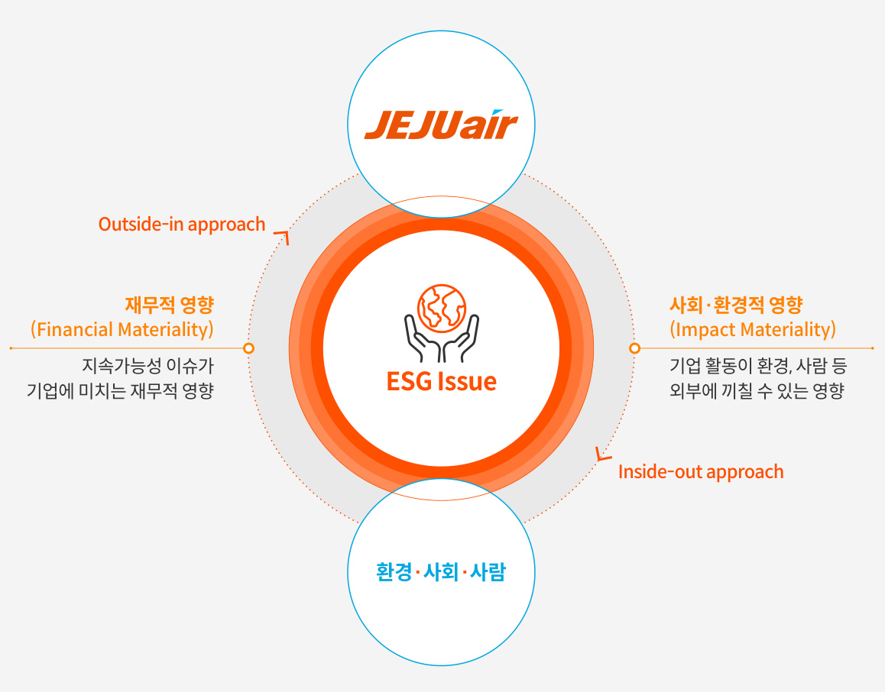  
이중 중대성 평가 개요  
Website ㅣhttp://www.jejuair.net E-mail ㅣesg@jejuair.net  

#  

  
이중 중대성 평가 프로세스  

# SUSTAINABILITY ON BO ARD  

제주항공 2024 지속가능경영보고서  

# 이중 중대성 평가  

# 이중 중대성 평가 결과  

#  

ESG 전략체계이해관계자 소통  

이중 중대성 평가 분석 결과를 바탕으로 중대 이슈 ３개를 선정하였고 전략적 측면에서 보완이 필요한 이슈 1개를 포함하여 최종적으로 제주항공의 중대 이슈 4개를 선정하였습니다. 제주항공은 중대성 평가를 통해 도출된 중대 이슈와 관련하여지속가능경영 목표와 전략을 수립하고, 실행 과제와 우선순위를 설정하여 체계적으로 관리해 나가고자 합니다.  

이중 중대성 평가Risks & Opportunities  

ENVIRONM  

  
Ｙ(재무적 영향)■중장기 대응영역■전략적 대응영역■핵심 대응영역(중대이슈)  
Website ㅣhttp://www.jejuair.net E-mail ㅣesg@jejuair.net  

  

#  

# SUSTAINABILITY ON BO ARD  

제주항공 2024 지속가능경영보고서  

# Risks & Opportunities  

ESG 전략체계이해관계자 소통이중 중대성 평가  

# 사고 및 안전관리  

  

  

SDG 3 안전한 사업장 구축Target3.9유해화학물질로 인한 질병 및 사망 감축Target3.d안전보건 리스크에 관한 조기 경보체계 개선  

Risks & Opportunities  

# Governance  

제주항공은 CEO를 항공 및 산업안전관리 총괄 책임자로 지정하고, 직속 조직인 안전보안본부를 통해 항공안전을 위한 안전관리시스템이적절히 이행 및 유지될 수 있도록 안전 목표 수립, 안전 성과 모니터링, 안전교육 등 다양한 안전활동을 관리, 감독하고 있습니다. 산업안전보건을 위해 안전보건 관련 이슈와 리스크를 논의할 수 있는 정기 회의체를 운영하고, 특히 최고 경영진 $\left(0\left|\lambda\right|\neq\left|\frac{\bot}{2}\right|\right)$ )과 중대재해처벌법 전담 조직은반기 1회 이상 산업안전보건관리체계 관련 실행계획과 이행 상황의 주요 성과를 점검, 개선하고 있습니다.  

# Risk Management  

제주항공은 전사적으로 안전관리가 내재화될 수 있도록 전자 안전관리시스템을 자체개발하여 운영하고 있습니다. 시스템을 통해 안전 관련 데이터가 수집되어, 위해요인식별, 분석 등과 함께 안전성과 목표 관리가 가능합니다. 또한, 모든 임직원은 중대재해대응 모의훈련을 통해 재해 발생 시 수행해야 하는 활동을 숙지하여, 리스크 발생 상황에서 피해를 최소화하고자 합니다.  

#  

  
Strategy   
1) 다운스트림: 제품이나 서비스가 최종 소비자에게 전달되는 단계  

Metrics & Targets   

  

# SUSTAINABILITY ON BO ARD  

제주항공 2024 지속가능경영보고서  

Risks & Opportunities  

# 기후변화 대응  

  

  

SDG 13 기후변화 대응Target13.1기후 관련 위험요인과 자연재해에 대한 적응 역량 및 탄력성 강화Target13.2국가정책, 전략, 계획에 통합한 기후변화 조치  

ESG 전략체계이해관계자 소통이중 중대성 평가  

Risks & Opportunities  

ENVIRONM  

# Governance  

제주항공은 이사회, ESG 담당 부서, 환경 부문 Working Group으로 구성된 기후변화 대응 담당 조직을 운영하고 있습니다. 이사회는 매년기후변화 대응 전략과 추진 방향을 검토하고 당사의 기후변화 주요 과제를 승인하며 이행 성과를 관리, 감독하고 있습니다. ESG 담당 부서와 환경 부문 Working Group은 기후변화 리스크 및 기회요인에 대해 논의합니다. 또한, 유관 부서와 주기적인 협의를 진행하여 세부 전략과 과제를 수립하고, 과제 이행 현황과 목표 및 계획을 논의합니다.  

# Risk Management  

#  

Website ㅣhttp://www.jejuair.net E-mail ㅣesg@jejuair.net  

제주항공은 기후변화에 체계적으로 대응하기 위하여 관련 조직 및 전략을 수립하였습니다. 또한, 기후변화 리스크 및 기회요인을 식별하고 이에 대한 중대성 평가를 실시하여, 각 요인이 제주항공에 미치는 영향 정도를 파악하였습니다. 그에 맞는 대응활동을 수행하고 모니터링하는 일련의 과정을 통해 리스크를 관리하고 있습니다.  

Strategy   

  
1) 업스트림: 제품이나 서비스의 생산 초기 단계  

Metrics & Targets   

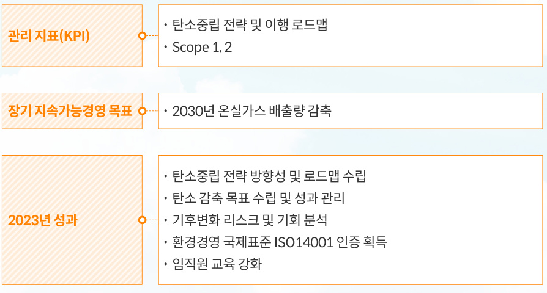  

# SUSTAINABILITY ON BO ARD  

제주항공 2024 지속가능경영보고서  

# Risks & Opportunities  

ESG 전략체계이해관계자 소통이중 중대성 평가Risks & Opportunities  

  

  

SDG 8 지속가능한 성장  
Target 8.2   
기술혁신을 통한  
지속가능한 성장  

  

SDG 10 불평등 감소Target 10.2 장애 여부에 상관없이동등한 서비스 제공  

# Governance  

제주항공은 고객경영팀을 중심으로 소비자중심경영을 실천하고 있습니다. 또한, 고객 VOC 대응과 서비스 품질 향상을 위해 고객 접점부서 관리 실무자가 참여하는 정례 회의체를 진행하고 있습니다. 본 회의체는 주요 VOC 및 Follow-Up 방안을 논의하고, 소비자중심경영 Practice를공유하며 잠재적 VOC 해결을 위한 과제별 워킹그룹을 운영하고 있습니다. 회의체를 통해 VOC 주요 사례와 처리결과를 공유하고, 개선 사항을도출하였습니다. 또한, CEO와 임원이 참여하는 회의를 별도 개최하여 회의체 논의 내용 및 성과를 보고하고, 고객 만족 제고를 위한 전략을수립하고 있습니다.  

# Risk Management  

제주항공은 소비자와의 적극적인 소통 활동을 통해 고객 만족 리스크를 관리하고 있습니다.  소비자의 요구를 파악하고 높은 수준의 서비스와 제품을 제공하고자, 접수된VOC를 신속히 처리하고 있습니다. 또한, 24시간 소통이 가능한 채널과 함께 온라인예약 발권 및 수속 절차를 개선하고 소비자 피해구제 정책을 마련하는 등 다양한 고객서비스로 고객 만족 리스크를 줄이기 위해 노력하고 있습니다.  

Strategy   

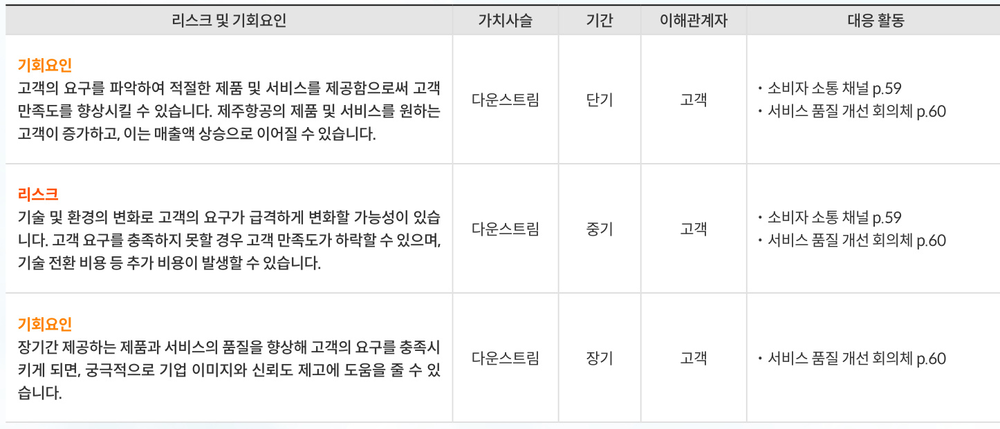  

Metrics & Targets   

  

#  

Website ㅣhttp://www.jejuair.net E-mail ㅣesg@jejuair.net  

# SUSTAINABILITY ON BO ARD  

제주항공 2024 지속가능경영보고서  

OVERVIEW ESG M ANAGEM ENT  

ENVIRONM  

기후변화 대응(TCFD Report)  
지속가능한 비행  
환경경영  

#  

23기후변화 대응(TCFD Report)  
28지속가능한 비행  
34환경경영  

# ON BO ARD  

제주항공 2024 지속가능경영보고서  

# 기후변화 대응(TCFD Report)  

# 거버넌스  

# 대응 전략  

#  

기후변화 대응(TCFD Report)지속가능한 비행  

#  

Website ㅣhttp://www.jejuair.net E-mail ㅣesg@jejuair.net  

# 기후변화 대응 조직  

제주항공은 잠재적 기후변화 리스크를 예방하고 항공산업을 고려한 환경경영을 실천하기 위해 기후변화 대응 조직을 강화하였습니다. 최고의사결정기구인 이사회와 ESG 담당 부서, 환경 부문 Working Group으로 구성된 제주항공 기후변화 대응 조직은 기후변화 대응 전략 수립, 기후변화리스크 식별 및 관리의 역할을 수행하며 탄소중립 실현을 위해 노력하고있습니다.  

이사회 및 담당 조직 역할  

  

# 기후변화 리스크 및 기회요인 분석  

기후변화 리스크 및 기회요인 중대성 평가제주항공은 동종업계 분석, 문헌 조사 등을 통해 기후변화 리스크 및 기회요인 풀(Pool)을 구성하고, 재무 영향과 발생 가능성을 기준으로 중대성 평가를실시하였습니다. 제주항공은 공개적으로 사용 가능한 기후변화 시나리오를바탕으로 물리적 기후변화, 정책 변화, 사회 경제적 변화, 환경 변화 등을 반영하여 리스크 및 기회요인이 제주항공에 미치는 재무적 영향을 파악하였습니다. 또한, 도출된 리스크 및 기회요인과 중대성 평가 결과를 통해 기후변화 대응 전략을 수립하였습니다.  

  
기후변화 리스크 및 기회 요인 중대성 평가  

기후변화 대응 전략  

  

리스크  

  

기회  

  

# ON BO ARD  

제주항공 2024 지속가능경영보고서  

ESG M ANAGEM  

ENVIRONM  

기후변화 대응(TCFD Report)  

지속가능한 비행  

환경경영  

GO VERNANCE  

#  

Website ㅣhttp://www.jejuair.net E-mail ㅣesg@jejuair.net  

# 기후변화 대응(TCFD Report)  

# 기후변화 리스크 및 기회요인 분석  

기후변화 리스크는 새로운 기후변화 정책 및 규제, 친환경 기술을 도입하는 저탄소 사회로의 전환과 관련된 전환 리스크와 항공운항에 영향을 줄 수 있는 태풍, 홍수 등 물리적 위험 요소인 물리적 리스크로 구분됩니다. 기후변화는 기업에 리스크 요인이 될 수 있지만 그와 동시에 새로운 사업 진출 등 기회요인이 될 수 있습니다.  

제주항공은 TCFD 권고안에 따라 기후변화 리스크 및 기회요인을 식별하고 있으며, 각 리스크 및 기회요인에 대한 영향도를 단기·중기·장기로 구분하여 잠재적 영향을 분석하고 대응 전략을 수립하였습니다. 리스크 및 기회요인 대응전략을 바탕으로 주요 리스크 및 기회요인에 대한 대응 활동을 지속적으로 강화하고 있습니다.  

  
기후변화 리스크 요인 분석  

# SUSTAINABILITY ON BO ARD  

제주항공 2024 지속가능경영보고서  

OVERVIEW   
ESG M ANAGEM ENT   
ENVIRONM ENTAL 기후변화 대응(TCFD Report)  
지속가능한 비행  
환경경영  
SOCIAL   
GO VERNANCE   
APPENDIX  

  
기후변화 기회요인 분석  

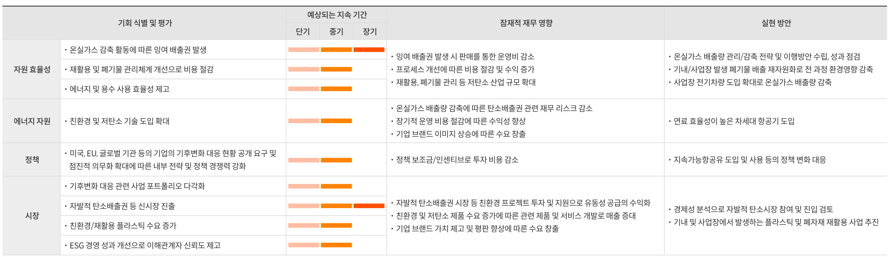  

# 기후변화 시나리오를 고려한 회복탄력성  

# 기후변화 대응 활동  

#  

기후변화는 정책 및 규제, 소비자 수요 등 사회 전반에 영향을 미칩니다. 제주항공은 2050년까지 지구 평균 온도 상승을 1.5도 수준으로 제한하는 전환 시나리오와 대한민국의 국가 온실가스 감축목표(NDC)를 활용하여, 당사에 미칠수 있는 잠재적 기후변화 관련 리스크 및 기회요인의 재무적 영향도를 분석하였습니다. 제주항공은 탄소중립 목표 추진 체계를 지속적으로 고도화하여, 당사에 미칠 잠재 리스크를 사전에 감지하고 리스크 발현에 따른 손실을 최소화하기 위해 2022년부터 전사 차원의 탄소중립 체계와 목표를 수립하여 관리하고 있습니다.  

또한, 저탄소 경제로 전환하는 과정에서 탄소 규제로 인한 비용 상승은 불가피하며, 선제적 감축 노력이 수반되지 않을 경우 비용 상승 리스크가 증가할 것으로 예상됨에 따라, 온실가스 배출권 가격 상승과 같은 국내외 규제 대응 강화를 주요 기후변화 관련 리스크로 선정하였습니다. 이러한 위험 진단 내용을 경영전략 및 재무 관리에 활용하고 있으며,내부적으로 수립한 목표 달성을 위해 지속적인 감축 활동을 추진할 예정입니다.  

온실가스로 인한 기후 영향을 줄이고 국내외 탄소중립 정책에 부응하고자 온실가스 감축 방안을 체계화하여 관리하고 있습니다. 연료 효율성이 개선된 항공기 도입과 사업장 전반의 운영 효율성 개선 등을 추진하고 있습니다.  

제주항공 기후변화 대응 활동  

  

# SUSTAINABILITY ON BO ARD  

제주항공 2024 지속가능경영보고서  

# 기후변화 대응(TCFD Report)  

OVERVIEW ESG M ANAGEM ENT  

# 리스크 관리  

ENVIRONM ENTAL 기후변화 대응(TCFD Report)  
지속가능한 비행  
환경경영  
SOCIAL   
GO VERNANCE   
APPENDIX  

제주항공은 리스크 관리를 위해 정비, 운항 등 운영 효율 개선, 차세대 항공기 도입 등 다양한 활동을 전개하고 있습니다. 나아가 기후변화 등 환경 리스크 관리 프로세스를 구축하고, 전사 중장기 전략 연계 등을 고려하여 리스크 관리체계를 지속적으로 고도화할 계획입니다. 또한, 이사회에 정기적으로 ESG 이슈사항을 보고하여 환경경영 전략 및 추진 방향에 대한 점검을이행하고 있습니다.  

  

기후변화 리스크 관리 프로세스  

  

# SUSTAINABILITY ON BO ARD  

제주항공 2024 지속가능경영보고서  

ENVIRONM ENTAL 기후변화 대응(TCFD Report)  
지속가능한 비행  
환경경영  

# 기후변화 대응(TCFD Report)  

# 지표 및 목표  

# 기후변화 지표 및 감축 목표  

제주항공은 항공운항으로 인해 발생하는 온실가스 배출량을 국내선과 국제선으로 분류하여 관리하고 매년 감축 목표와 성과를 모니터링하여 온실가스배출량 저감을 위해 노력하고 있습니다. 제주항공은 운항노선의 지속적인 확장에 따라 단기/중장기 온실가스 배출 감축 목표를 수립하였습니다. 효과적인 온실가스 감축을 위해 2026년까지 온실가스 인벤토리 관리체계 고도화를 목표로 하고 있으며, 고도화 완료 시점에 맞춰 탄소 배출량 감축 중장기 목표를 재수립할 계획입니다.  

온실가스 배출량  

  

  

# ON BO ARD  

제주항공 2024 지속가능경영보고서  

기후변화 대응(TCFD Report)  

환경경영  

# 지속가능한 비행  

# NET ZERO Plan  

# IATA/ICAO 기후 목표  

항공운송협회(IATA, International Air Transportation Association)는산업화 이전 대비 $1.5^{\circ}\mathrm{C}$ 이상 기온 상승을 제한하기 위해 노력한다는 파리협정에 따라 2021년 10월 미국 보스턴 연례 총회에서 ‘2050년 넷제로’달성을 위한 결의안을 채택하였습니다. 총회에서는 2050년까지 약 21.2기가톤(Gt)의 탄소 배출량을 감축하는 탄소중립을 선언하였습니다. 제주항공은 IATA의 탄소중립 목표를 지지하고 기후변화 대응에 적극적으로 참여하고자 합니다. 이에 따라 IATA에서 제시한 주요 탄소 감축 방안에 노력을 기울이며, 항공산업의 탈탄소화를 위해 항공 생태계 전반에서 주요 이해관계자와 협력하고 있습니다.  

제주항공은 IATA 및 국가 탄소 감축 목표를 준수하며, 중장기적 탄소 배출량 감축 목표를 달성하기 위해 5가지 핵심 전략을 수립하였습니다. 연료 효율성이 높은 차세대 항공기 도입과 운영 효율성 개선, 지속가능항공유 도입준비,  IT 시스템 고도화, 국내/국제 탄소규제 대응을 통해 탄소 배출량을 지속적으로 감축하고자 합니다.  

  
IATA 기후 목표 및 탄소감축 수단별 기여도  

  

# SUSTAINABILITY ON BO ARD  

제주항공 2024 지속가능경영보고서  

# 지속가능한 비행  

O  

# 탄소감축 이행  

# 차세대 항공기 도입  

ESG M ANAGEM  

기후변화 대응(TCFD Report)지속가능한 비행  
환경경영  

Website ㅣhttp://www.jejuair.net E-mail ㅣesg@jejuair.net  

제주항공은 IATA 및 국가 탄소감축 목표를 준수합니다. 중장기적인 탄소 배출량 감축 목표를 달성하기 위해 5가지 핵심 전략을 실행합니다. 연료 효율성이높은 차세대 항공기 도입, 운영 효율성 개선, 지속가능항공유 도입 준비, 국내/국제 탄소규제 대응, IT 시스템 고도화를 통해 탄소 배출량을 지속적으로 감축하고자 합니다.  

  
제주항공의 탄소저감 노력  

제주항공은 온실가스 및 소음을 감축하기 위해 2023년 11월부터 고효율차세대 항공기 B737-8을 도입하였습니다. B737-8 항공기는 주력 기종이던 B737-800 항공기 대비 약 $20\%$ 의 연료 절감 및 탄소 배출량 저감 효과가 있으며, 소음영향범위(Noise Footprint)도 약 $50\%$ 감축할 수 있습니다. 또한, 공기저항을 최소화하고 연료 절감을 위해 제작된 AdvancedWinglet, 재디자인된 Tail Cone, 차세대 엔진(LEAP-1B)을 장착하고 있으며, LEAP-1B 엔진은 대기오염물질 $({\sf N O}\times)$ 규제 CAEP/6 기준 대비 $50\%$ 낮은 수준의 배기가스를 방출합니다. 향후 순차적으로 38대를 추가 도입하여 기존 항공기를 대체하고, 제주항공의 중·단거리 노선에 투입할 계획입니다. 앞으로도 지속가능한 항공 운항을 실현하고, 쾌적하고 안전한 서비스를 제공하기 위해 친환경, 고효율 차세대 항공기에 대한 투자를 이어 나가고자 합니다.  

  
차세대 항공기 도입 목표1)  
1) 2023년부터 도입을 시작하여 2030년까지 순차 도입 예정, 도입 계획은 제주항공 대내외 환경변화에 따라 변동 가능성 있음  

# SUSTAINABILITY ON BO ARD  

제주항공 2024 지속가능경영보고서  

O  

ESG M ANAGEM  

ENVIRONM ENTAL 기후변화 대응(TCFD Report)  

지속가능한 비행  

환경경영  

# 지속가능한 비행  

# 운영 효율성 개선  

제주항공은 경제운항 비행절차, 지상 운영, 중량 관리, 데이터 기반의 연료 탑재 관리 등 5개의 연료 절감 항목에 대한 중점적인 관리를 통해 운영 효율성을 지속적으로 개선하고 있습니다.  

  

Website ㅣhttp://www.jejuair.net E-mail ㅣesg@jejuair.net  

엔진의 연소 효율 회복,개선된 연소 효율로 연료 소모량 감소  

항공기 부품을 더 가벼운 소재의 부품으로 교체하여항공기 전체 무게를 감소시켜 연료 사용량 감소  

# SUSTAINABILITY ON BO ARD  

제주항공 2024 지속가능경영보고서  

# 지속가능한 비행  

OVERVIEW ESG M ANAGEM ENT  

# 운영 효율성 개선  

# SPECIAL  

ENVIRONM ENTAL   
기후변화 대응(TCFD Report)지속가능한 비행  
환경경영  
SOCIAL   
GO VERNANCE   
APPENDIX  

# 경제운항 비행 절차  

제주항공은 2017년 운항승무원으로 구성된 탄소저감 TFT(이하 GreenCrew)를 결성하여 항공기 운항 중 발생하는 탄소 배출의 저감 방안을 연구하고 시행하고 있습니다. 운항승무원의 자발적 참여로 운영되는 GreenCrew는 국토교통부에서 발행한 ‘항공 온실가 $\therefore$ 저감기술 이행매뉴얼’과항공기 제작사의 각종 성능에 근거한 15가지의 온실가스 감축 기술을 수치및 세분화하고, 지속적인 데이터 수집을 통해 실효성을 검증하는 등 노력을이어가고 있습니다. Green Crew는 이륙-출항-상승-순항-강하-착륙에 맞춘 비행 단계별 탄소저감 운항기술을 적용하며, 안전 운항을 위한 교육을시행하고 있습니다.  

# 비행계획 효율  

운항 데이터베이스를 구축하여 계획보다 연료가 많거나 적게 소모되는Over/Under Burn 원인을 체계적으로 분석합니다. 이를 통해 최적의 연료탑재 정책과 효율적인 운항 계획을 수립하여 온실가스 감축을 실현하고 있습니다. 또한, 시즌별 최대 효율 항로를 분석하고 적극적인 단축 항로를 개발하여 근거리의 교체 공항을 계약하는 등 운항 효율을 향상하기 위해 전력을 다하고 있습니다.  

# 항공기 중량 관리  

항공기 중량 최적화를 위해 각 운항편 최신 예약 현황을 파악하고 노선별 수하물 무게 예측 모델을 개발하여 운영하고 있습니다. 이를 통해 계획 유상탑재량과 실제 유상탑재량 사이의 차이를 줄임으로써 연료를 절감, 2023년 약 2,584tCO2의 탄소 배출량을 감축하였습니다. 또한, 항공기 브레이크를 철강 소재에서 더 가벼운 카본 브레이크로 교체함으로써항공기 중량을 대당 약 320kg 감소시켜 연료 사용량을 줄일 수 있었습니다. 제주항공은 향후에도 체계적인 유상탑재량 분석 등 항공기 중량 감축을 위한 노력을 지속하여, 연료 절감을 위해 노력하겠습니다.  

# 엔진 물 세척 현황  

제주항공은 주기적인 엔진 물 세척을 통해 엔진의 성능을 회복하고 엔진 효율성을 높여 연소 효율을 개선하고 있습니다. 연소 효율이 높아짐에 따라연료를 절감할 수 있으며, 이를 통해 2023년에는 710ton의 연료와 2,237 $\mathtt{t C O}_{2}\underline{{\circ}}|$ 탄소를 감축하였습니다.  

# 지상운영(APU) 효율  

지상 대기 중 기내에 필요한 전력을 공급하기 위한 항공기의 보조동력장치(APU)를 지상전원장치(GPU, GPS)로 대체하였습니다. 항공유를 연소시켜야 하는 보조동력장치(APU) 가동을 최소화하여 연료를 절감하고 탄소 배출량을 줄일 수 있었습니다.  

# Green Crew  

제주항공은 항공기 운항 중 발생하는 탄소 배출의 저감 방안을 연구및 시행하는 탄소저감 TFT(이하 Green Crew)를 운영하고 있습니다.Green Crew는 2017년 결성되어 현재까지 운항승무원의 자발적인 참여로 운영되고 있으며, 국토교통부에서 발행한 ‘항공온실가스 저감기술이행 매뉴얼’과 항공기 제작사의 각종 성능 Chart에 근거하여 제주항공만의 15가지 온실가스 감축 기술을 수치화 및 세분화하고 지속적인 데이터 수집을 통해 실효성 검증하는 등 노력을 이어가고 있습니다.매월 정례회의를 통해 기술 수행 전 충분한 교육을 진행함으로써 안전운항을 할 수 있도록 활동을 독려하고 있습니다. 또한, 탄소배출량을 저감할 수 있는 기술 연구/개발 외에 ALPA-K 협회지 및 온라인 플랫폼을통해 다양한 활동 기고 및 홍보를 진행하고 있습니다. 더불어, 탄소발자국과 같은 공식 인증 획득을 목표로 온실가스 감축을 위한 꾸준한 관심과 노력을 기울이고 있으며, 모든 운항승무원에게 온실가스 감축 활동에 대한 중요성을 알리고자 노력하고 있습니다.  

  

# SUSTAINABILITY ON BO ARD  

제주항공 2024 지속가능경영보고서  

  

# 지속가능항공유 도입 준비  

# 국내/국제 탄소규제 대응  

ENVIRONM ENTAL  

기후변화 대응(TCFD Report)지속가능한 비행  
환경경영  

Website ㅣhttp://www.jejuair.net E-mail ㅣesg@jejuair.net  

지속가능항공유(SAF, Sustainable Aviation Fuel)는 화석연료가 아닌 폐식용유, 생활폐기물 등을 재활용한 항공유로, 등유 원료의 항공유에 비해 탄소 배출량을 최대 $80\%^{\circ}$ 까지 감축할 수 있습니다. 지속가능항공유로의 전환은 2050년까지 탄소중립을 가능하게 하는 가장 효과적이고 중요한 방법으로, 제주항공역시 지속가능항공유 도입을 준비하고 있습니다. 이에, 제주항공은 정부와 해외 국가의 지속가능항공유 도입과 사용에 대한 정책 및 로드맵을 지속적으로 모니터링하고 있으며, 국가 정책에 발맞춰 대응할 수 있도록 이행 계획을 수립할 예정입니다.  

  

  

# 국내 배출권거래제(K-ETS, Korea Emissions Trading System)  

국내에서는 2012년 제정된 ‘온실가스 배출권 할당 및 거래에 관한 법률’에따라 2015년부터 배출권거래제를 운영하고 있습니다. 제주항공은 국내선운항 및 지상시설 운영에 따른 배출량에 대해 배출권 정산 의무를 이행하고있습니다. 배출권 거래제 의무 요구사항을 충족시키기 위해 제3자 검증을받은 배출량 명세서를 매년 환경부에 제출하고 있습니다.  

# 국제항공 탄소감축/상쇄제도(ICAO CORSIA)  

2016년 국제민간항공기구(ICAO)는 글로벌 탄소규제 CORSIA(CarbonOffsetting and Reduction Scheme for International Aviation)를 선언 하며 국제항공의 온실가스 배출량을 2019년 수준으로 동결하는 것을 목표로, 2021년부터 시범운영 단계에 돌입하였습니다. 제주항공은 국제선 운항에 따른 온실가스 배출량 산정 후 검증 완료한 배출량 보고서를 국토부에제출하고 있으며, 2027년 CORSIA 의무화에 대비한 정책과 자체적 감축 계획 수립을 준비하고 있습니다.  

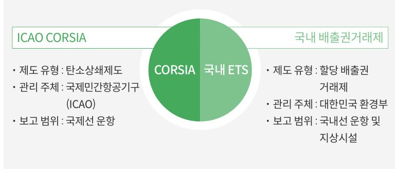  

# SUSTAINABILITY ON BO ARD  

제주항공 2024 지속가능경영보고서  

# 지속가능한 비행  

OVERVIEW ESG M ANAGEM ENT  

# IT 시스템 고도화  

기후변화 대응(TCFD Report)지속가능한 비행  
환경경영  

제주항공은 IT시스템 고도화를 통해 디지털 전환을 가속화하여 고객 편의를 강화할 뿐만 아니라 Paperless 운영에따른 탄소저감에 기여하고 있습니다. 2023년 웹, 모바일 체크인 이용을 활성화하여 약 460만 명의 고객이 해당 서비스를 통해 종이 사용량을 절감하였습니다. 이 외에도 전자비행정보를 활용하고 온라인 플랫폼 기반의 업무 환경 구축과 전자 서류 시스템을 도입하는 등 효율적인 자원 사용을 도모하고 있습니다.  

# 전자비행정보(EFB, Electronic Flight Bag) 도입  

태블릿 PC를 활용한 전자비행정보(EFB, Electronic Flight Bag)를 도입하여 항공기 조종에 필요한 각종 교범과 비행안전문서를 전자문서로 전환하였습니다. 특히 운항승무원의 모의비행훈련에 전자 훈련기록시스템(E-PAPER)을 적용하여 2023년 모의비행훈련에 전면 활용하였습니다. 정기훈련, 양성훈련 등 다양한 훈련에 전자 훈련기록시스템을적용함으로써 2023년 약 1만 2천 장의 종이를 절약할 수 있었습니다. 향후 다양한 훈련과정에 E-PAPER를 활용하여자원 절약을 실천해 나갈 예정입니다.  

# 온라인 플랫폼 기반 업무 환경 구축  

객실승무원의 업무 처리 방식을 개선하고 종이 사용을 줄이기 위해 웹, 어플리케이션 기반의 시스템을 개발하여 객실승무원의 업무 환경을 디지털화하였습니다.  

# 전자 서류 시스템 도입  

항공기 탑승을 위해 수기로 작성하던 10종의 탑승 서류를 디지털 기기를 통해 입력할 수 있도록 전자 서류 시스템을도입하였습니다. 그 결과, 탑승 수속 시간이 단축되어 고객 만족도가 상승했을 뿐 아니라 서류들이 보안서버에 자동보관, 파기되어 개인정보보호는 물론 연간 약 20만 장의 종이 절약 효과가 예상됩니다.  

  

전자 서류 시스템  

# ON BO ARD  

제주항공 2024 지속가능경영보고서  

# 환경경영  

OVERVIEW ESG M ANAGEM ENT  

# 환경경영 추진체계  

# 환경경영 추진체계  

#  

기후변화 대응(TCFD Report)지속가능한 비행  

환경경영  

환경경영 추진체계  

제주항공은 ‘JEJUAIR GREEN 2050’이라는 환경경영 비전 실현을 위해 전략방향과 목표를 설정하고, 이를 달성하기 위한 3대 전략과제와 10개의 추진과제를 수립하였습니다. 아울러 친환경 경영활동을 당사의 최우선 가치로 인식하며 6대 환경방침에 따라 온실가스·폐기물 감축, 에너지 관리 등 다양한ESG 경영 활동을 수행하고 있습니다. 특히 2022년 TCFD1)권고안을 토대로기후변화 리스크 및 기회요인을 분석할 수 있는 위험 식별, 사전 및 사후 보고,조치 실행 및 모니터링을 포함하는 환경 리스크 관리체계를 구축하였습니다.또한, 환경경영 조직, 시스템, 환경 관련 정보 공시 등 환경경영 체계 고도화를위해 지속적으로 노력하고 있으며, 이러한 과정을 통해 ESG 경영에 필요한 내부 역량을 강화하고, 기업 활동이 환경에 미치는 영향을 최소화하고자 합니다.  

# 환경경영방침  

  

1. 국내외 환경/에너지 관련 법령 및 규정을 철저히 준수한다.  
2. 기후 환경 변화의 중요성을 인식하고 온실가스 감축 활동을 지속적으로 실행한다.  
3. 온실가스 저감을 위해 신형 항공기 도입을 위한 투자를 지속하고 운항 절차를체계적으로 개선한다.  
4. 자원과 에너지를 절약하고 사전예방적 환경관리와 성과 개선을 통해 환경영향을 최소화한다.  
5. 고객 및 협력업체, 지역사회 등 이해관계자들과의 상생적 환경 활동 참여를 적극적으로 추진한다.  
6. 친환경 경영활동 정보와 성과를 대내외에 공개하고 모든 임직원이 실행할 수있도록 지속적인 홍보와 교육을 실시한다.  

환경경영방침 $\mathcal{O}$  

#  

Website ㅣhttp://www.jejuair.net E-mail ㅣesg@jejuair.net  

1) TCFD(Task Force on Climate Related Financial Disclosures): 국제기구인 금융안정위원 회(Financial Stability Board)가 2015년 설립한 기후 관련 재무 정보 공개 태스크포스, 기업과 금융기관이 투자자, 주주, 대중에게 기후 관련 재무 위험을 더 잘 알리기 위해 사용할 수 있는 프레임워크를 개발하여 권고안 제시  

# ON BO ARD  

제주항공 2024 지속가능경영보고서  

# 환경경영  

# 환경경영 조직  

# 환경경영시스템  

ESG M ANAGEM  

기후변화 대응(TCFD Report)지속가능한 비행  

환경경영  

GO  

환경경영을 강화하기 위해 탄소저감 TFT, 환경안전을 담당하는 산업안전보건팀, ESG를 담당하는 대외협력팀으로 구성된 환경경영 전담 조직을 운영하고있습니다. 또한, 환경경영 전략과제를 유관부서별로 분류하여 각 부서와 유기적 협업을 통해 환경경영 업무를 수행하고, 주요 이슈 발생 시 CEO에게 보고하여조치하고 있습니다. 유관부서는 주요 세부 실행과제를 이행하고, 목표에 따른 과제 이행 현황을 모니터링하며 환경경영을 추진하고 있습니다.  

  
환경경영 조직도  

제주항공은 환경경영을 체계적으로 추진하기 위해 2022년 환경영향평가절차서를 도입하고, 2023년 국제표준규격 ISO 14001(환경경영시스템)인증을 취득하였습니다. 또한, 사내 환경경영시스템의 이행 상황을 점검하고 평가하기 위해 환경안전담당자로 구성된 내부 심사팀을 운영하고 있습니다. 연 1회 이상 사업장별 특성에 맞는 환경영향평가를 실시하여 업무 중발생할 수 있는 환경 리스크 및 기회를 식별하고, 파악한 문제점의 개선활동을 수행하고 있습니다. 아울러 전 임직원이 높은 수준의 환경안전의식을갖출 수 있도록 다양한 활동을 추진하여, 자율성을 바탕으로 한 독자적 환경안전 관리체계를 구축해 나가고 있습니다.  

  
환경경영시스템 인증서  

# ON BO ARD  

제주항공 2024 지속가능경영보고서  

# 환경경영  

ESG M ANAGEM  

#  

기후변화 대응(TCFD Report)지속가능한 비행  

환경경영  

GO  

# 환경 법규 및 규제 대응  

# 환경 법규 및 규제 관리  

온실가스, 폐기물, 유해화학물질 등과 관련한 국내 환경 법규 및 규제를 주기적으로 모니터링하고 있습니다. 또한, 규제 유형별 중점관리사항을 파악하고 능동적으로 대응하고 있습니다.  

환경 법규 및 규제 관리  

  

환경 법규 위반 현황  

  

  

# SUSTAINABILITY ON BO ARD  

제주항공 2024 지속가능경영보고서  

  

OVERVIEW ESG M ANAGEM ENT  

# 환경영향 저감 활동  

# 에너지 관리  

# 화학물질 관리  

# 항공기 소음 관리  

기후변화 대응(TCFD Report)지속가능한 비행  

환경경영  

GO  

항공사에서 사용하는 에너지 가운데 가장 큰 비중을 차지하는 것이 항공유입니다. 제주항공은 항공유 사용량을 감축하기 위해 고효율 차세대 항공기를 지속적으로 도입하고 있습니다. 또한, 스마트 오피스를 확대하고, 고효율 전기제품을 구매함으로써 에너지 사용량을 낮추고 있으며, 매년 여름철 시원한 복장 착용을 권장하는 ‘쿨맵시 캠페인’을 실시하여, 전 임직원이에너지 절약에 동참하고 있습니다. 아울러 제주항공이 운영하는 호텔의 경우, 건물에 태양광 발전시설을 설치하여 친환경 에너지를 생산하고 있습니다. 전기, 가스 등 전체 에너지 사용량 대비 태양광 발전 전력 사용 비중은2021년 0.4%에 불과하였지만, 2023년에는 0.86%로 2배 가까이 확대되었습니다.  

# 폐기물 관리  

경영활동에 따른 환경영향을 최소화하기 위해 엄격한 절차에 따라 폐기물을 안전하게 처리 및 관리하고 있습니다. 2018년 사내 폐기물 관리 지침을제정하고, 협력사를 포함한 이해관계자에게 모든 폐기물을 적법하게 처리하도록 요구해 왔습니다. 또한, 폐기물 관리 업무를 총괄하는 전담 부서로산업안전보건팀을 운영하고, 부서별로 폐기물 관리자를 배정하여 책임을부여합니다. 당사 사업장에서 발생하는 모든 폐기물은 국내 폐기물관리법및 농림축산검역본부 고시에 의거하여 허가받은 폐기물 운반·처리 업체를통해 관리하며, 정비 과정에서 발생하는 폐유, 기내 서비스에서 발생하는 종이, 캔, 페트병 등을 전량 수거하여 재활용률을 높이기 위해 노력하고 있습니다. 이 외에도 모든 폐기물의 적법 처리 여부를 확인하기 위해 업체의 처리 시설, 운영 상황, 폐기물 처리 과정에 대한 정기점검을 실시합니다.  

국내 화학물질관리법, 화학물질의 등록 및 평가 등에 관한 법령에 의거하여화학물질을 구매 및 관리하고 있습니다. 또한, 자체적으로 화학물질 관리지침을 마련하여 이를 업무에 엄격하게 적용하고 있습니다. 특히 관리 시스템을 통해 제품의 물질안전보건자료(MSDS)와 사용 정보는 물론 화학물질의입고부터 폐기까지 전 과정을 모니터링하고 있으며, 유해화학물질 포함 제품은 유해·위험성 검토 후 필요시 대체품으로 교체하고 있습니다.  

화학물질 구매 및 관리 절차  

  

제주항공은 국제민간항공기구1)와 국내 법규에서 제시하는 공항 소음 저감기준을 준수할 뿐 아니라 운항규정 및 절차에 소음 경감 운항 관련 사항을 추가 적용하여, 항공기 운항 시 발생하는 소음을 최소화하고 있습니다. 또한,비행 시 소음감소 이륙절차2)및 연속 강하접근 착륙절차3)를 엄격히 적용하고 있으며, 이외에도 감소추력이륙 및 감소이륙4)을 준수할 수 있도록 노력합니다. 특히 항공기 이착륙 시 재래식 항법5)뿐만 아니라 지역 항법6)도 적극적으로 활용하여 항공기의 운항 효율을 향상시키고 있습니다. 아울러 기존대비 소음을 최대 50%까지 감소시킬 수 있는 고효율, 친환경 신형 항공기(B737-8)을 지속적으로 도입하고 있으며, 첨단 항법 장비를 사용한 항로 정밀관리 수행 결과를 바탕으로 소음 민감지역을 회피하여 운항하고 있습니다.  

항공 소음 저감 관련 기구 및 용어  

  

# SUSTAINABILITY ON BO ARD  

제주항공 2024 지속가능경영보고서  

  

OVERVIEW ESG M ANAGEM ENT  

# 환경경영 활동  

기후변화 대응(TCFD Report)지속가능한 비행  

환경경영  

# 녹색구매  

제주항공은 녹색구매 가이드라인을 수립하고 이를 바탕으로 녹색구매를확대해 나가고 있습니다. 연료 효율성이 높은 차세대 항공기 및 친환경 인증 제품의 구매를 확대하고 있으며, 기내에서 사용하는 플라스틱 컵과 빨대를 종이컵, 종이 빨대로 교체하고 있습니다. 앞으로도 녹색 제품의 사용량을 점진적으로 확대하여, 능동적인 녹색구매를 실천하고자 합니다.  

# 친환경 자동차 도입  

지구온난화 현상이 가속화됨에 따라 온실가스 배출량 감축의 중요성이 점차 확대되고 있습니다. 이에 제주항공은 당사 법인차량을 친환경 차량으로교체하여 탄소 배출 저감을 실천하고 있습니다. 전기 자동차와 하이브리드차량으로의 교체를 통해 친환경 차량 수는 2021년 1대, 2022년 6대, 2023년 7대로 점차 증가하였으며, 전체 법인차량 대비 친환경 차량 비율 또한2023년 9.46%로 전년 대비 확대되었습니다. 제주항공은 향후에도 전기차를 포함한 친환경 차량을 지속적으로 도입하여 기후변화 대응에 앞장서고자 합니다.  

# 환경교육  

임직원의 환경 관련 인식을 높이고 참여를 강화하기 위해 환경경영시스템(ISO 14001) 표준에 맞춰 자체적 온라인 환경교육, 신규 입사자 대상 ESG교육 등 다양한 교육을 진행하고 있습니다. 2022년 6월 환경부와 ‘지속가능한 미래 실현을 위한 환경교육 협력 업무 협약’을 체결하여 임직원 환경교육을 실시하고, 국민 대상 환경교육 사회공헌 사업 발굴 등 사회 전반에대한 환경교육을 활성화 해나가고 있습니다.  

녹색구매 실적  

  
1) 녹색구매 기준: 제주항공 내부 녹색구매방침 제4조 2항 의거하여 FSC 인증 및 재사용 또는재활용이 용이한 물품, 환경이나 인체에 영향이 적은 물품을 의미합니다.  

  

친환경 자동차 현황  

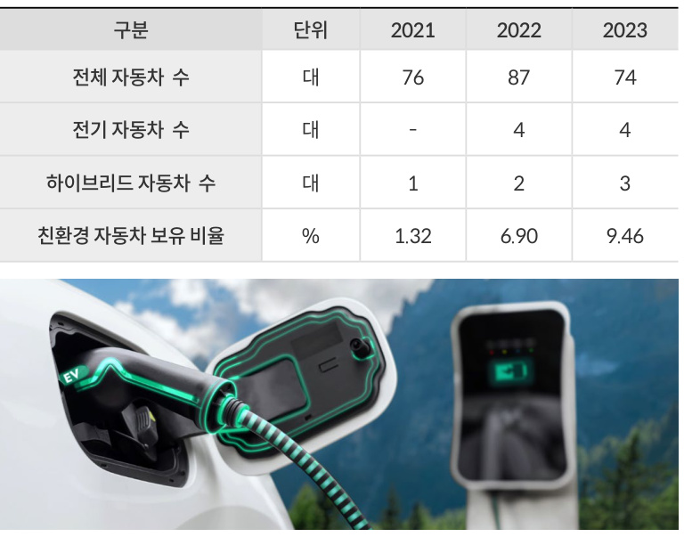  

환경교육 현황  

  

  
환경교육 협력 업무 협약  

# ON BO ARD  

제주항공 2024 지속가능경영보고서  

  

OVERVIEW ESG M ANAGEM ENT  

# SPECIAL  

# 자원순환 노력  

# 업사이클링  

# 우유팩 재활용  

# 헌 옷·담요 기부  

기후변화 대응(TCFD Report)지속가능한 비행  

환경경영  

GO  

제주항공은 매년 폐기 및 소각되는 항공 폐자재를 업사이클링함으로써자원순환을 위한 노력을 기울이고 있습니다. 2022년 1월 폐기 처분된 승무원유니폼을 재활용하여 ‘리프레시 백’ 시리즈를 제작하였으며, 2023년 4월에는 스페인 업사이클링 전문 브랜드 ‘누깍’과의 협업으로, $1807\sharp$ 의 폐구명조끼를 동전지갑, 여권지갑, 크로스백 등 총 500여 개 상품으로재탄생시켰습니다.  

2022년 자회사형 장애인표준사업장 모두락(樂) 카페, (사)따뜻한한반도사랑의연탄나눔운동과 업무 협약을 맺고 자원순환 활동을 이어가고 있습니다. 우유팩 다시쓰기 캠페인을 진행하여 사내 카페 모두락에서 사용한 우유팩을 세척한 후 (사)따뜻한한반도 사랑의연탄나눔운동에 전달하였으며, 2023년에는 13,870여 개의 우유팩을 전달하였습니다.  

2022년부터 탄소 저감과 자원순환을 위해 임직원과 함께 헌 옷 수거 캠페인을 진행하고 있습니다. 임직원이 기부한 헌 옷들을 아름다운가게에전달하여 자원 재순환을 실천했습니다. 또한, 겨울철에는 유기 동물의 따뜻한 생활을 돕기 위해 기내에 버려진 헌 담요와 임직원의 헌 이불을 모아 여러 유기 동물 봉사단체에 기부하고, 봉사활동도 함께 진행하고 있습니다. 자원순환에 대한 사회적 관심이 높아지고 있는 만큼 자원순환 캠페인을 지속하여 따뜻한 나눔의 가치를 전파할 수 있도록 노력하겠습니다.  

  
Website ㅣhttp://www.jejuair.net E-mail ㅣesg@jejuair.net  

#  

# SUSTAINABILITY ON BO ARD  

제주항공 2024 지속가능경영보고서  

# 환경경영  

# 참여형 친환경 캠페인  

환경보호와 탄소 중립 실천을 위해 임직원 및 고객 참여형 캠페인을 진행하고 있습니다. 임직원 참여형 ‘사내 일회용 컵 줄이기’를 통해 텀블러와 친환경 컵 사용을 장려하고, ‘이면지 사용 캠페인’으로 사용한 인쇄 용지의 재활용을 독려하고 있습니다. 고객 참여형 활동으로는 수하물 무게를 $5{\mathrm{kg}}\,^{0}{\mathrm{I}}$ 하로 줄인 고객에게 우선 탑승 기회를 제공하는 ‘그린 트래블패스 캠페인’, 제주 여행객에게 친환경 생분해 쓰레기 봉투를 제공하여 친환경 여행 참여를장려하는 ‘그린 트래블러 캠페인’을 시작하였습니다. 일상의 작은 실천으로도 환경을 보호할 수 있다는 인식이 확산될 수 있도록 다양한 캠페인을 꾸준히 진행할 계획입니다.  

# 남방큰돌고래 보존 활동  

제주 서남부와 동북부에서 발견되는 제주 남방큰돌고래는 개체수가 120마리 내외로 멸종위기에 처해있습니다. 오직 제주 연안에서만 서식하고 있는최상위 포식자이기 때문에 이들의 개체 수는 건강한 바다 생태계와 풍부한어족자원을 확인할 수 있는 지표입니다. 제주 남방큰돌고래의 개체 수 감소는 곧 제주 바다의 생태계가 보호에 취약하고 위협받고 있다는 것을 의미합니다. 제주항공은 남방큰돌고래를 보호하고, 생물다양성에 대한 인식을 확산하기 위한 활동을 진행해 왔습니다. 2021년부터 국제 보호종 제주 남방큰돌고래를 모티브로 하는 돌고래 캐릭터 ‘제코’를 개발하고, 기내, SNS, 램프 버스 등 다양한 홍보 채널을 통해 생물다양성 보존 캠페인을 실시하고 있습니다.2023년 제주 여행객의 남방큰돌고래 보호 인식을 확산하고자 제주환경운동연합과 협업 캠페인을 진행하였습니다. 이 외에도 생명다양성재단이 실시하는 돌고래 행동 및 생태 관련 과학적 연구를 지원하고, 돌고래 생태 관련 인식 제고를 위한 고객 캠페인을 함께 진행했습니다.  

  
이면지 사용 캠페인 포스터  

  
생물다양성 캠페인 포스터  

# SUSTAINABILITY ON BO ARD  

제주항공 2024 지속가능경영보고서ENVIRONM SOCIAL 안전경영인권경영인재경영소비자중심경영상생경영정보보호사회공헌  

  

# ON BO ARD  

제주항공 2024 지속가능경영보고서  

# 안전경영  

# 항공안전 관리체계  

ESG M ANAGEM  

ENVIRONM  

# 항공안전 정책  

# 안전관리 조직 및 회의체  

안전경영인권경영인재경영소비자중심경영상생경영정보보호사회공헌  

제주항공은 안전에 대한 최고경영자의 기본원칙과 철학을 담은 안전정책을 공표하고, 모든 직원이 이를 쉽게 인지할수 있도록 사내에 게시하고 있습니다. 고객과 직원을 포함한 모든 이해관계자의 안전은 당사가 추구하는 최우선 가치이자, 회사 존립과 성장의 근간이기도 합니다. 조직의 원활한 소통과 모니터링 활동을 바탕으로 안전 관리체계와 절차를 지속적으로 개선해 나가고 있으며, 사업 부문별 세부 이행계획에 따라 조직적인 안전관리 활동을 실행하고 있습니다. 이러한 활동을 통해 '인적오류에 의한 고심각/저빈도 지표 발생 0건' 등 안전위원회에서 수립된 안전목표를 달성하기 위해 노력하고 있습니다.  

대표이사 직속 안전보안본부를 배치하고, 본부 아래 안전기획팀, 안전품질팀, 안전관리팀, 항공보안팀의 총 4개 팀을 운영하고 있습니다. 안전보안본부는 객관성, 독립성, 공정성의 원칙에 따라 조직 전체에 안전관리시스템(SMS,Safety Management System)이 적절히 이행 및 유지될 수 있도록 안전목표·지표 수립, 안전 성과 모니터링, 안전 교육훈련 등 다양한 안전 활동에 대해 관리·감독하고 있습니다. 또한, 운항, 정비, 객실, 통제, 운송, 화물 부문의 안전관리자가 안전 업무를 수행하고 있습니다. 아울러 경영진부터 실무자까지 유기적으로 소통하며 안전 리스크에 효과적으로 대처하기 위해 안전관리자, 안전담당자, 안전실무자로 구성된 주요 회의체를 운영하고 있습니다.  

#  

Website ㅣhttp://www.jejuair.net E-mail ㅣesg@jejuair.net  

# 안전정책  

1. 회사는 최고 수준의 안전성과 달성을 위해 필요한 자원과 교육을 최우선으로 지원한다.  
2. 회사는 체계화된 안전관리를 위해 항공기 운항에 대한 안전 위험 데이터를 관리·수집·활용하고, 전사적 안전 목표 및성과관리를 통해 사후적 시정조치보다는 사전적 예방 안전에 중점을 둔다.  
3. 회사는 자발적 보고문화를 적극 장려하고 비밀을 보장하며 수집한 정보를 처벌 목적으로 사용하지 아니함으로써 전사차원의 긍정적인 안전 문화를 활성화 시킨다.  
4. 회사는 단순 부주의로 인한 인적 과실에 대하여 처벌을 지양한다. 단, 고의 또는 직무 태만으로 안전규정과 절차를 무시하거나 위반하는 행위에 대하여는 예외로 한다.  
5. 모든 임직원은 각자의 임무가 안전에 직접적 영향을 미친다는 책임감을 가지고 항공 안전에 관련된 제반 법규 및 규정과 절차를 철저히 준수한다.  
6. 모든 임직원은 안전사고를 유발할 가능성이 있는 위해 요인을 적극적으로 식별하여 위험을 경감, 제거함으로써 예방적안전관리에 힘쓴다.  
7. 모든 임직원은 위해 요인을 발견하였을 경우와 사고, 준사고, 항공안전장애, 비정상 운항, 법규위반 등이 발생하였을 경우 이를 즉시 보고하여야 한다.  

  
안전관리시스템 조직도  

# SUSTAINABILITY ON BO ARD  

제주항공 2024 지속가능경영보고서  

# 안전경영  

# 안전관리시스템 운영 현황  

ESG M ANAGEM  

ENVIRONM  

# 2023년 안전위원회 의결 및 보고 안건  

# 항공보안 관리체계  

# 전자교범시스템  

안전보안본부 조직도  

  
1) SSR(Safety & Security Report): ESMS에서 보고할 수 있는 안전 보고서  

위험 관리 대응 시스템 '항공보안정보시스템(Jeju Air Security InformationSystem, JSIS)'을 자체적으로 구축 및 운영하고, 해당 시스템을 활용하여 실제 위험과 위협 수준에 따른 신속하고 차별화된 보안 조치를 수행하고 있습니다. 이와 함께 정보 공유, 인력 및 자원 관리, 지속적인 개선 대책 수립, 위기대응, 교육 훈련 등 항공보안 전반에 실시간 모니터링이 가능하도록 고도화된 운영체계를 갖추고 있습니다.  

# 전자안전관리시스템  

  

전 직원이 안전과 직결된 비행안전문서를 PC 또는 모바일 기기를 통해 언제 어디서나 열람할 수 있도록 2018년 전자교범시스템(EM, ElectronicManual)을 자체 개발하여 업무에 활용하고 있습니다. 전자교범은 사용자를 위한 문서 조회, 책갈피, 문서 비교 등 편의 기능을 갖추고 있으며, 문서담당자가 각 문서에 최신 정보가 명확하게 포함되어 있는지 정기적으로 검토 및 개정할 수 있는 기능을 구현하였습니다. 2023년 12월 말 기준 비행안전문서 총 623건이 전자교범시스템에 등록되어 있습니다. 제주항공은전자교범시스템 개발로, 효과적인 문서관리뿐만 아니라 종이 사용을 줄임으로써 폐기물 저감효과를 이루어가고 있습니다.  

제주항공은 2019년 전자안전관리시스템(ESMS, Enhanced SafetyManagement System)을 자체 개발하였습니다. 해당 시스템은 전 임직원이 작성하는 의무·자율 안전보고서와 운항 관련 임직원이 작성하는 비행·운송 관련 업무보고서를 통합 관리할 수 있습니다. 또한, ESMS는 통합적으로 안전 데이터를 수집 및 관리할 수 있도록 모듈별로 구축되어 있습니다.ESMS는 안전조사, 안전감사, 품질심사, 비행자료 분석시스템(FAS, FlightAnimation System)과 연동이 가능하며, 수집된 데이터를 통해 위해요인식별·분석·경감 등의 위험도 관리 및 안전성과 지표·목표 관리를 수행할수 있습니다. 식별한 위해요인은 위험 평가를 진행하고, 위험 수준에 따라경감 조치를 실시합니다. 이행한 경감 조치의 유효성, 효과성을 검토하고해당 위해요인에 대해 위험평가를 재실시하고 있습니다. 또한, 위험도 관리결과를 모니터링 및 분석하여 전자안전관리시스템에 기록합니다. 제주항공은 효율적인 IT시스템을 구축하여, 선제적 안전관리가 내재화될 수 있도록 노력하겠습니다.  

# 차세대 비행감시시스템 도입  

제주항공은 2023년 차세대 비행감시시스템을 도입하여 여러 시스템에 분산되어 있던 비행감시 업무를 통합 관리하고 있습니다. 해당 시스템은 운항중인 항공편의 실시간 위치 추적, 항공기와 운항통제본부의 데이터 통신 메신저, 항로 및 공역의 악기상 감시·예측·분석, 항공정보 모니터링 기능이통합되어 있습니다. 또한, 기존 시스템 대비 개선된 항로 기상 분석 기능을갖추고 있어, 운항 시 잠재 위험요소를 사전 예측 및 식별하고 대응할 수 있습니다. 제주항공은 앞으로도 운항관리시스템의 지속적 투자를 통해 안전운항 지원체계를 고도화하며, 최상의 고객서비스 제공에 앞장서겠습니다.  

# ON BO ARD  

제주항공 2024 지속가능경영보고서  

# 안전경영  

# 항공안전 활동  

# 안전관리 활동  

# 안전 심볼 및 슬로건 제작  

# 안전 증진 활동 관련 포상제도  

# 모의 비상대응 훈련 실시  

안전경영인권경영인재경영소비자중심경영상생경영정보보호사회공헌  

Website ㅣhttp://www.jejuair.net E-mail ㅣesg@jejuair.net  

제주항공은 ‘안전 아이덴티티(Safety Identity)’를 상징적으로 표현하는 안전 심볼과 슬로건을 제작하였습니다. 비행운·비행기·방패로 구성되어 있는 안전 심볼과, ‘안전은 나로 시작해서 우리로 완성됩니다’라는 안전 슬로건으로 제주항공의 안전경영 의지를 담고 있습니다. 또한, 안전 관련 간행물 및 캠페인 등에 안전 심볼과 슬로건을 적극 활용하여, 임직원의 안전 의식을 격려하기 위해 노력하고 있습니다.  

안전보안 심볼 및 슬로건  

  

제주항공은 핵심 가치인 ‘안전’을 대표할 만한 공로가 인정되는 직원에게매년 ‘안전상’을 수여하고 있습니다. 또한, 안전보안본부에서는 위해요인을 발굴하고 안전 업무 증진에 기여한 모범 직원을 SSR(Safety & SecurityReport) 팔로워로 선정하여 매월 포상하고 있습니다. 포상자가 제안한 보고를 토대로 개선된 사례는 안전 뉴스레터를 통해 모든 임직원에게 공유합니다. 앞으로 제주항공은 임직원 포상 활동을 지속하여, 자발적인 안전보안보고 문화를 조성해 나가겠습니다.  

# 안전 증진 활동  

전 직원 대상 분기별 안전뉴스레터를 발행하여 안전관리시스템에 대한 최신 정보, 위험관리 현황, 안전문화 측정 결과, 품질 심사 프로그램 운영 결과, $\mathsf{F O Q A}^{1)}$ 분석 경향 등 다양한 안전 정보를 전달하고 있습니다. 또한, 2023년안전보안 보고 제도 리플렛을 배포하여 모든 임직원으로부터 안전보안과관련된 의견을 수렴하였습니다. 향후에도 제주항공은 다양한 안전 증진 활동을 실행하여 안전보안문화와 공정문화2)를 확산시키겠습니다.  

1) FOQA(Flight Operation Quality Assurance): 항공기 운항 중 발생한 상황을 전자 기록 장치로수집 및 분석하는 운항품질보증 시스템  

2) 공정문화: 자발적인 안전 활동에 대해 보상하며조직에서 허용할 수 있는 행위와 허용되지 않는행위에 대해 분명하게 구분하려고 노력하는 문화로, 안전한 행동은 증진시키고 불안전한 행동을중단시키기 위한 문화  

  
안전보안 보고 제도 리플렛  

항공기 사고에 대비하여 실제 사고 발생 시 각 부서가 효과적으로 대응할수 있도록 매년 사고 상황을 설정하여 모의 훈련을 실시하고 있습니다. 각부서는 훈련을 통해 여러 환경에서 발생할 수 있는 비상 상황의 적절한 대응 방법을 익히고, 훈련 후에는 대응 시나리오의 문제점과 취약점을 분석하여 개선 의견을 제시합니다. 개선이 필요한 사항은 차년도 비상대응훈련에반영하며, 효율적인 비상대응 체계를 구축하여 운영하고 있습니다.  

  
모의 비상대응 훈련(ERP Drill) 현장  

# SUSTAINABILITY ON BO ARD  

제주항공 2024 지속가능경영보고서  

# 안전경영  

# 안전운항 훈련  

ESG M ANAGEM  

# 운항승무원 훈련  

# 객실승무원 훈련  

# 훈련시설 투자  

ENVIRONM  

안전경영인권경영인재경영소비자중심경영상생경영정보보호사회공헌  

제주항공은 코로나19 이후 회복된 항공 수요에 대응하기 위해 신규 운항승무원 양성 프로그램을 재개하였으며, 기존 운항승무원 대상으로는 필수 법정 훈련시간보다 더 많은 훈련을 실시하고 있습니다. 또한, 신규 고효율 항공기 B737-8 도입에 대비하여 기존 운항 훈련 이외에 추가적 이론 교육과 시뮬레이터 교육을 실시하고 있습니다. 현행 항공안전법 63조, 64조에 따라 모든 운항승무원은 신규 항공기 운항 시 모의비행장치(FFS, FullFlight Simulator)를 이용하여 심사를 받아야 하며, 제주항공의 경우 국내LCC(Low Cost Carrier) 항공사 가운데 최초로 2019년 모의비행장치를 도입, 운영하고 있습니다. 아울러 항공기 제작사에 당사 비행교관을 파견하여 교관 인력을 양성하는 등 자체 훈련이 가능한 인프라를 구축하였습니다.2023년 말 기준, 약 76명의 운항승무원이 필수 훈련을 이수하여 B737-8항공기를 운항하고 있습니다.  

운항승무원 훈련시간(단위: 시간)  

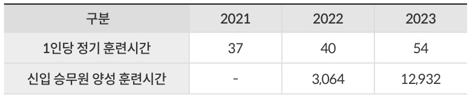  

고객의 안전을 위하여 객실승무원 훈련에 최선을 다하고 있습니다. 비상대응, 화재 진압, 항공보안 및 응급처치 실습 훈련 등 대면으로 실시되는체계적인 안전훈련과 함께, 국가항공운항분야 안전성과지표(SPI: SafetyPerformance Indicator) 항목 가운데 ‘운항 중 부상’, ‘화재·연기’와 관련한온라인 교육 콘텐츠를 개발하여 교육하고 있습니다.  

  
모의 안전훈련시설  

안전한 운항을 보장하기 위해 훈련시설에 지속적으로 투자하고 있습니다.제주항공은 국내 LCC 항공사 가운데 유일하게 2대의 모의비행장치를 보유하고 있습니다. 모의비행장치는 조종사의 교육과 정상·비정상·비상절차 숙달 및 특수 임무 등을 훈련하기 위해 활용되는 장치로, 일반 비행훈련에서 수행할 수 없는 기동과 환경을 시뮬레이션하여 다양한 상황에 대비할 수 있습니다. 특히 제주항공이 보유한 모의비행장치 중 1대는 신규 도입한 B737-8 기종을 위한 것으로, 신규 비행훈련장치(FTD, Flight TrainingDevice)를 도입하여 변화하는 운항환경에 발 빠르게 대응하고 운항승무원의 안전 역량을 강화하고 있습니다.  

  

모의비행장치  

# SUSTAINABILITY ON BO ARD  

제주항공 2024 지속가능경영보고서  

# 안전경영  

ESG M ANAGEM  

SOCIAL 안전경영인권경영인재경영소비자중심경영상생경영정보보호사회공헌  

# 항공보안  

안전하고 신뢰할 수 있는 여객 및 화물 운송을 보장하기 위해 ‘선제적 항공보안 위험 관리체계’를 운영하고 있습니다. 무엇보다 승객, 승무원, 항공기및 공항시설 등을 신종 위협으로부터 보호하고, 항공기 안전성과 정시성 및효율성을 확보하는 것을 중요한 과제로 삼고 있습니다. 취항하는 전 세계국가 주요 정보 및 공항 정보를 수집하여 보안 수준을 분석하고, 필요 예방조치를 수립하여 최고 수준의 항공보안을 유지하고 있습니다. 또한, 실효성있는 위험 관리 규정 수립, 지속적인 관리 감독 체계 운영과 함께 첨단 기술을 적용하여, 국제민간항공기구(ICAO) 등 국제기준과 국내 법적 요구사항을 모두 충족하는 미래형 항공보안 관리체계를 실현해 가고 있습니다.  

# IOSA 인증  

국제항공운송협회(lATA)에서 개발한 안전평가 프로그램 IOSA(IATAOperational Safety Audit)는 조직, 운항, 운항 통제, 정비, 객실, 지상조업,화물, 보안 등 항공사 운영 전 부문 약 920개 항목에 대한 인증을 취득하는제도입니다. 제주항공은 2008년 최초 인증 이후, 매 2년 주기로 정기 점검및 IOSA 재인증을 통해 글로벌 수준의 안전성을 입증하고, 안전 및 서비스품질을 지속적으로 향상해 오고 있습니다. 이러한 노력을 바탕으로 제주항공은 고객의 안전한 여행을 위해 신뢰할 수 있는 서비스를 지속적으로 제공해 나가고자 합니다.  

  

IOSA 인증 로고  

# SUSTAINABILITY ON BO ARD  

제주항공 2024 지속가능경영보고서  

# 안전경영  

# 산업안전보건 관리체계  

안전경영인권경영인재경영소비자중심경영상생경영정보보호사회공헌  

# 산업안전보건 경영방침  

제주항공은 모든 임직원의 생명과 안전을 지키기 위해 안전보건 경영방침을 수립하고, 환경·안전보건 전담 조직을 구성하여 환경·안전보건 계획 수립, 유해·위험 요인 점검 및 개선 활동, 임직원 의견 청취 등 다양한 활동을수행하고 있습니다. 제주항공의 모든 임직원은 산업안전보건에 관한 법령및 규정을 철저히 준수하고 식별된 위험을 허용 가능한 수준으로 관리하며,안전사고 예방 활동을 지속적으로 실시하고 있습니다. 아울러 협력사와 의사소통 체계를 구축하여 의견 청취, 문제 및 개선점 공유, 교육·훈련 실시 등다양한 공급망 안전보건 활동 또한 이어가고 있습니다.  

산업안전보건 추진체계  

산업안전보건 경영방침  

#  

Website ㅣhttp://www.jejuair.net E-mail ㅣesg@jejuair.net  

1.산업안전보건 및 건강 증진에 관한 법령 및 관련 규정을 철저히 준수한다.  
2. 산업안전보건에 관한 목표를 설정하고 주기적으로 그 이행실태를 점검함으로써, 사업장 업무환경에서 발생하는 위험을 허용 가능한 수준으로관리하고 작업중 사건·사고에 대한 예방활동을 지속적으로 실행한다.  
3. 제주항공 및 협력사 근로자와의 의사소통체계를 구축하여 의견의 수렴,개선방안 마련 및 필요한 정보를 제공함으로써 산업안전보건 경영활동에 대한 투명성과 효과성을 제고한다.  
4.산업안전보건에 관한 목표 달성과 경영방침 이행을 위해 필요한 적정수준의 예산을 편성·집행하고 모든 직원에게 체계적인 교육·훈련을 실시한다.  
5. 모든 근로자는 산업안전보건 활동의 주체로서 그 책임과 의무를 성실히준수한다.  

  

# SUSTAINABILITY ON BO ARD  

제주항공 2024 지속가능경영보고서  

# 안전경영  

# 산업안전보건 조직  

# 산업안전보건경영 시스템  

ESG M ANAGEM ENVIRONM SOCIAL 안전경영인권경영인재경영소비자중심경영상생경영정보보호사회공헌  

안전보건관리(총괄)책임자인 CEO를 중심으로 4개의 조직을 통해 안전보건을 관리하고 있습니다. 안전보건관리(총괄)책임자는 산업안전보건 담당조직을 이끌며, 전사 안전보건 관련 업무를 총괄합니다. 각 단위 사업장의담당자는 공정별 위험도를 사전에 분석하여 유해·위험요인에 대한 우선순위를 설정하고 실행계획을 수립합니다. 또한, 전사 및 사업장별 관리감독자·근로자와 함께 산업안전보건 관련 이슈 및 리스크를 논의하는 회의체를 정기적으로 실시하고 있습니다.  

나아가 외부 전문 기관과 협업하여 소음, 화학물질, 분진 등 유해인자로 인해 발생 가능한 잠재적 부상·질병·사고 요인을 사전에 파악하고, 사후조치를 적극 이행하고 있습니다. 이 외에도 중대재해처벌법 전담 조직을 구성하여 경영책임자와 함께 반기 1회 산업안전보건체계 관련 실행계획, 이행현황 및 주요 성과를 점검·감독합니다.  

  

# 산업안전보건 회의체  

제주항공은 CEO를 포함한 사용자위원과 근로자위원으로 구성된 산업안전보건위원회를 운영하고 있습니다. 산업안전보건위원회는 분기별 1회 이상 실시하고, 산업안전보건과 관련한 임직원 의견을 적극 경청하여 문제를완화하거나 해결하기 위해 노력합니다. 또한, 조치 결과와 관련하여 산업안전보건위원회를 통해 임직원과 적극 소통하고 있습니다. 2023년 조기 출근 객실승무원 보호 조치, 혹서기 옥외 근로자 온열질환 예방물품 지급 등총 10건의 안건을 논의하였습니다.  

  
산업안전보건 조직도  

임직원의 안전을 보장하고 안전한 근무환경을 조성하기 위해 안전보건 경영방침을 수립하고, 산업안전보건 회의체를 운영하며 정기적으로 사업장위험성 평가를 진행하는 등 산업안전보건시스템을 구축하였습니다. 이를통해 2023년 LCC 항공사 최초로 국제표준규격 ISO 45001(안전보건경영시스템) 인증을 취득하였습니다. 제주항공은 향후에도 산업안전보건시스템 이행 상황을 주기적인 평가와 개선을 통해 안전한 사업장을 조성하고,임직원의 안전에 기여할 수 있도록 노력하겠습니다.  

  
ISO 인증서 수여식  

# SUSTAINABILITY ON BO ARD  

제주항공 2024 지속가능경영보고서  

# 안전경영  

# 산업안전보건 활동  

ESG M ANAGEM  

ENVIRONM  

# 안전문화 조성  

# 중대재해 대응  

SOCIAL 안전경영인권경영인재경영소비자중심경영상생경영정보보호사회공헌  

제주항공은 정부의 중대재해 감축 로드맵 4대 전략에 따라 ‘사업장 중대재해 예방을 위한 안전의식, 문화 조성 및 확산’을 2023년 산업안전보건 목표로 수립하였습니다. 자발적 안전의식 확립과 건강하고 안전한 사업장 구축을 위해 임직원 모두가 참여하는 사보 발행, 안전문화 슬로건 공모, 산업안전보건경영 선포식, 혹서기 대비 안전보건 점검의 날,안전의식 설문조사, 안전문화 영상 제작, 안전문화 확산 협력사 상생간담회 등 다양한 안전보건 활동을 수행하였습니다. 특히 임직원의 안전의식 향상을 위한 특별 강연을 연 1회 실시하여, 안전문화 정착 및 산업안전보건 필요성에 대한 공감대를 형성하였습니다. 그 밖에도 외부 전문 기관과 협력하여 금연환경 조성사업, 직무 스트레스 및 정신건강관리, 뇌심혈관질환 예방 프로그램, 근로자 건강진단, 작업환경측정 등을 실시하고 있습니다. 2024년에는 기존 안전보건 활동과 연계한 신규 캠페인을 개발하고, 안전보건 관련 사항을 공유하는 경영진과 임직원 소통 채널을 다양화할계획입니다. 앞으로 제주항공은 안전문화 조성을 위한 활동을 지속하여, 모든 임직원이 산업안전보건의 주체가 되어안전문화가 조성될 수 있도록 노력하겠습니다.  

  
재해발생 대응 절차  

임직원의 인명피해를 방지하고, 당사 자산을 보호할 목적으로 중대산업재해 대응 기준을 제정하여 운영하고 있습니다. 중대산업재해 발생 예상 또는 발생에 신속히 대응하기 위해 대책본부를 운영하고, 보고·현장 처치·재해 조사·대책 수립 단계의 대응 절차를 구축했습니다. 아울러 발생한 모든 산업재해에 대해 과학·의학적 조사를 실시하여 재해요인을 분석하고, 회의체를 구성하여 정책, 관리, 기술 측면에서 개선과 재발 방지대책을 도출하고 있습니다.더불어 중대재해 사례를 바탕으로 전사 차원의 중대재해 예방 프로그램을 기획·운영하고 있습니다. 연 2회 전 임직원이 참여하는 중대재해 대응 모의훈련을 실시하여 비상 상황별 시나리오를 제시하고, 재해자 응급처치, 병원 이송,치료 등 적절한 대응 요령을 훈련합니다. 훈련 시 지적된 미흡 사항과 시사점을 반영하여 비상상황 대응 시나리오 및대응 계획을 지속적으로 개선해 나가고 있습니다. 제주항공은 중대재해사고 방지 대책을 수립하고 다양한 예방 활동을 통해 임직원의 안전에 지속적으로 이바지하고자 합니다.  

  

중대재해 대응 모의훈련  

# SUSTAINABILITY ON BO ARD  

제주항공 2024 지속가능경영보고서  

# 안전경영  

# 위험요인 예방활동  

# 협력사 안전보건 관리  

# 임직원 건강 증진  

안전하고 건강한 근무 환경을 조성하기 위하여 작업장 유해·위험요인을 식별하고, 이를 더욱 효과적으로 발굴하기 위해 공정별 담당자 의견을 적극청취하고 있습니다. 또한, 사업장의 잠재 위험요인에 대한 체계적이고 효율적인 대책을 수립하기 위해 실무자 대상 워크숍, 작업장 정기·수시 위험성평가와 더불어 안전보건관리자 현장점검, 현장근로자 인터뷰 등 다양한 활동을 수행하고 있습니다. 임직원을 대상으로 안전보건 관련 의견을 청취하고, 아차 사고 접수, 개선 조치, 피드백 등을 실시하며, 나아가 포상제도를 통해 임직원의 적극적인 참여를 유도하고 있습니다.  

제주항공은 중대재해 예방 및 안전보건문화 확산을 위해 협력사와 안전보건관리 체계를 구축하고 다양한 예방 활동을 전개하고 있습니다. 모든 협력사 대표이사 또는 안전보건담당 임원들과 매년 상생간담회를 열고, 이를 통해 협력사의 안전보건 관련 개선 및 발전사항 등을 협의하고 있습니다. 또한,매 분기 협력사와 합동으로 현장 작업장 안전보건 점검을 실시하고, 발굴한유해·위험요인의 개선방안을 수립한 후 이를 엄격하게 실행하고 있습니다.매월 실시하는 안전보건 상생협의체를 통해 협력사의 안전보건과 관련한애로사항 등을 청취하고, 더욱 안전한 근무환경을 조성하고자 노력하고 있습니다. 특히 제주항공의 관리감독자가 주 1회 이상 협력사 작업장을 순회점검하고, 도급, 용역, 위탁 업무 계약 체결 시 해당 협력사의 안전보건수준을 평가한 후, 일정 수준 이상의 평가 협력사와 계약을 체결하고 있습니다.또한, 산업안전보건공단 등과 연계하여 협력사에 외부 전문 컨설팅, 외부 전문 안전보건 세미나, 전문화 교육 등을 지원하고 있습니다.  

임직원의 건강 증진을 위해 금연 캠페인, 대사증후군 관리, 뇌심혈관질환예방 활동, 뇌파·맥파 측정, 건강 증진 교육 등을 실시하고 있습니다. 또한,건강검진, 비대면 운동 등 건강 관리 및 상담 프로그램을 지원합니다. 정신건강 관리를 위해 건강 증진실에 상담실을 운영하고, 자율신경 균형검사를통해 임직원의 스트레스 지수를 측정한 후, 맞춤형 정신건강 프로그램을추천합니다. 아울러 디지털 정신건강 관리 솔루션을 제공하고, 정신건강복지 지원센터의 외부 전문가 검진을 지원하고 있습니다. 제주항공은 앞으로도 다양한 건강 증진 프로그램을 기획하고 지속적으로 투자하여, 임직원의 건강관리와 증진을 위해 힘쓰겠습니다.  

임직원 건강 증진 프로그램  

  

안전관리 현황  

  

# ON BO ARD  

제주항공 2024 지속가능경영보고서  

# 인권경영  

# 인권경영 관리 체계  

ESG M ANAGEM  

ENVIRONM  

# 인권경영 정책  

# 인권경영 추진체계  

SOCIAL 안전경영인권경영인재경영소비자중심경영상생경영정보보호사회공헌  

제주항공은 2023년 모든 이해관계자의 인권 존중을 위해 인권경영 정책을 제정하였습니다. UN이 공표한 세계인권선언(Universal Declaration of Human Rights) 및 국제노동기구(ILO, International Labor Organization) 핵심 협 약등 인권∙노동 관련 국제 기준과 해당 기준이 반영된 국내 법령을 준수하며, 윤리헌장, 임직원 행동강령, 임직원 행동지침 등 자체 규범을 수립하여 윤리경영을 실천하고 있습니다. 인권경영 정책은 인도적 대우, 차별 금지, 아동노동 금지등 8가지 기본원칙으로 구성되며, 특히 성별, 연령, 인종, 사회적 신분 등에 따른 차별을 엄격하게 금지합니다. 제주항공과 자회사 임직원은 물론 공급사, 협력사 등 파트너사와의 거래에도 적용되어, 모든 이해관계자가 인권을 존중할 수있도록 노력하고 있습니다. 정책과 더불어 국내외 기준, 관계 법령 기반의 내부 실천 지침을 통해 경영 활동 전반에서발생할 수 있는 인권 리스크를 사전에 파악, 관리하고 있으며, 지속적으로 인권경영을 고도화해 나가고자 합니다.  

  
제주항공 인권경영 8대원칙  

임직원을 비롯한 협력사, 지역주민, 지역사회 등 모든 이해관계자의 인권 존중을 기본 원칙으로 삼아, 중장기 인권경영전략목표와 13개의 전략과제를 수립하였습니다. 2022년 인권관리체계를 구축하고, 이후 2026년까지 이를 고도화하여 사업장에서 발생 가능한 인권 관련 리스크를 식별, 완화 및 예방해 나가고자 합니다. 앞으로도 제주항공은 인권경영을 충실히 수행하며, 항공산업의 우수 사례를 전파하고 인권경영을 선도하는 기업으로 성장해 나가겠습니다.  

인권경영 전략목표 및 과제  

  

#  

Website ㅣhttp://www.jejuair.net E-mail ㅣesg@jejuair.net  

# SUSTAINABILITY ON BO ARD  

제주항공 2024 지속가능경영보고서  

# 인권경영  

# 인권 리스크 관리  

ESG M ANAGEM  

ENVIRONM  

# 인권교육  

# 고충처리제도  

인간의 존엄과 가치를 존중하는 기업문화를 조성하고, 직장 내 인권침해 및 차별을 예방하기 위해 모든 임직원을 대상으로 인권교육을 실시하고 있습니다. 교육 내용은 성희롱과 괴롭힘 예방, 장애인 인식 개선 등의 주제로, 연 1회 진행됩니다. 또한, 신규 입사자 대상 온보딩 프로그램 및 전사 주최 소통 워크숍에서 ‘건강한 근무환경 만들기’를 주제로 직장 내 성희롱과 괴롭힘의 정의, 유형, 발생 시 조치 방법 등을 안내하여, 인권 인식 수준을 높여나가고 있습니다. 나아가당사뿐만 아니라 협력사 임직원까지 해당 교육을 이수하도록 함으로써, 공급망 인권경영을 확산해 나가고 있습니다.제주항공은 임직원이 업무 중 발생되는 인권 침해를 포함하여 근무환경에 따른 개선 제안, 불만 등 임직원의 다양한고충을 청취 및 처리하는 고충처리제도를 운영하고 있습니다. 임직원은 사내 게시판 또는 상담 전화, 메일 등 다양한방법을 통해 고충 상담을 요청할 수 있으며, 익명성이 보장된 채 조치 사항과 처리 결과를 통보받을 수 있습니다.특히, 직장 내 괴롭힘, 따돌림, 성희롱 등 인권 관련 상담 및 신고 프로세스를 운영하고 있으며 사내 인사담당자(남성/여성), 외부기관 중 선택하여 상담을 진행할 수 있습니다. 또한, CEO Hot-line, 상담 전화 및 이메일 등 다양한 신고 채널을 통한 접수가 가능합니다. 고충 처리 전 과정에서 익명성을 철저히 보장하며, 피해자를 보호하며 신속하게 구제할수 있도록 최선을 다하고자 하며, 임직원 모두가 행복하고 건강한 마음으로 근무할 수 있도록 직장, 심리, 가족 등 여러상담 주제로 별도 외부의 전문 심리상담 프로그램까지 제공하고 있습니다.  

2023년 인권교육 수료인원 및 수료율  

  
1) 수료율: 교육 시행 월 기준 퇴사자, 휴직자를 제외한 교육대상 임직원 수 대비 수료율  

고충처리 절차  

  
2023 고충처리 실적  

  

# ON BO ARD  

제주항공 2024 지속가능경영보고서  

# 인재경영  

# 인재 고용 및 유지  

ESG M ANAGEM  

ENVIRONM  

# 인재 채용  

# 공정한 채용  

제주항공은 '철저하고 공정하게 선발한다'라는 고용 원칙을 바탕으로 채용 프로세스를 운영하며, 성장 잠재력이 높은 인재를 확보하고 있습니다. 빠른 진행이 필요하더라도 구성원으로서 함께 하는 것에 확신이 있을 때 비로소 선발합니다. 공정한 채용을 위해 직군에 따라 효과적인 채용 절차를 수립하고 있으며, 핵심가치와 직무 역량을 연계하여평가에 적용하고 있습니다. 면접 지원자에게 동등한 기회를 제공하기 위해 명확하고 공통된 합격자 선정 기준을 적용하며, 채용 과정에서 성별, 나이, 인종, 국적, 종교, 장애, 문화적 배경을 이유로 차별하지 않습니다. 또한, 우수한 역량을갖춘 전문 면접관을 육성하여, 채용 절차에 공정성과 전문성을 강화하였습니다. 제주항공은 우수한 인재를 확보하고,조직 다양성을 증진하기 위해 매진하고 있습니다.  

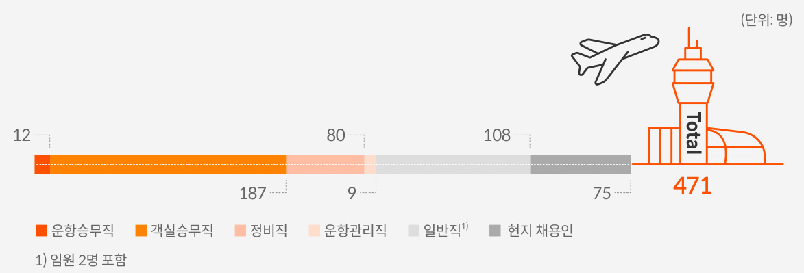  
2023년 직종별 채용 현황  

# 우수인재 확보  

제주항공은 직무, 인원 현황, 조직 역량 등을 분석하여 적정 인력을 관리하며, 적시에 인력을 확보하고 우수인재를 영입하기 위한 다양한 채용 프로세스를 운영하고 있습니다. 상·하반기 대규모 공개채용과 수시채용을 병행하며, 특히운항승무직, 객실승무직, 정비직 등 일부 직무는 항공기 운영 계획 및 인력 수급 현황을 고려하여 채용계획을 세우고있습니다.  

채용절차는 크게 5단계로 구성되며, 서류전형, 인성검사, 1차 및 2차 면접, 채용검진, 최종 합격 등의 단계로 진행됩니다. 또한, 직무 특성을 고려하여 추가 역량 검증이 필요할 경우 PT 면접, 실기전형, 필기전형 등을 실시합니다. 해외지점은 공항 소장, 운송, 영업, 경영지원 직무에 현지 인력을 직접 채용하며, 선발된 인력은 국내 온보딩 프로그램 및 교육 이수를 통해 본사와의 커뮤니케이션 역량을 강화합니다. 또한, 계열사 간 인적 교류제도를 운영하고, 부서 이동을희망하는 임직원을 위해 사내 공모와 직무만족도 조사 등을 통해 인력 재배치를 함께 실시하고 있습니다. 이 외에도체험형 인턴십 프로그램으로 지원자에게는 실무 경험의 기회를, 현업부서에는 조직에 적합한 인재를 양성할 수 있는기회를 제공하고 있습니다.  

  
인재 채용 전형절차  

# ON BO ARD  

제주항공 2024 지속가능경영보고서  

# 인재경영  

O  

# 임직원 복리후생  

ESG M ANAGEM  

ENVIRONM  

# 복리후생 프로그램  

인재경영  

제주항공은 복리후생 프로그램을 통해 임직원의 몰입도와 효율성 및 장기 근속률을 높이기 위해 노력합니다. 시차 출퇴근제 및 탄력근로제 등 근로시간을 유동적으로 사용할 수 있게 하였으며, 장기근속자에는 포상휴가를 제공합니다.또한, 여직원 휴게실과 애경 그룹 임직원 쇼핑몰을 운영함으로써 임직원 생활 편의를 지원하며, 그 외에도 임직원을위한 다양한 프로그램을 운영합니다.  

  
주요 복리후생 프로그램  
Website ㅣhttp://www.jejuair.net E-mail ㅣesg@jejuair.net  

# 일과 가정의 양립을 위한 근무제도  

제주항공은 임직원이 일과 삶의 균형을 이루며 업무에 대한 만족도를 높일 수 있도록 일반 직군에서 시차 출·퇴근제를 시행하고 있습니다. 매월 출·퇴근시간을 유동적으로 조정함으로써 저녁이 있는 삶, 육아는 물론 가족을 돌볼 수 있는 환경을 만들어 가도록 돕습니다. 또한, 컴퓨터 전원 끄기 캠페인 ‘PC-OFF제’를 실시하여 장시간 근무에 따른 스트레스를 줄이고 적절한 휴식을 취할 수 있도록 합니다. 이 외에도 주당 최대 12시간 범위 안에서 연장근로를 허용하여‘주 52시간 근무제’를 준수하고, 반반차 제도를 활용하여 개인 일정에 맞춰 업무에 집중할 수 있도록 제도적으로 지원하고 있습니다. 아울러 임직원이 가족을 돌봐야 할 경우를 대비해 출산휴가, 육아휴직, 가족돌봄휴직 등 다양한 제도를 실시하며 일과 가정의 균형을 뒷받침합니다. 특히 임신한 여성 임직원(승무원)은 출산휴가 전까지 별도의 휴직제도를 사용할 수 있으며, 출산 후에는 출산 축하금, $\frac{1}{4}0\vert-7\vert$ 단축근로와 같은 육아지원 제도를 제공하고 있습니다.  

#  

  

  

# SUSTAINABILITY ON BO ARD  

제주항공 2024 지속가능경영보고서  

# 인재경영  

O  

ESG M ANAGEM  

ENVIRONM ENTAL  

# 임직원 평가 및 보상  

임직원의 역량 개발 및 성과 향상을 유도하기 위해 직책자는 MBO 방식, 개인(팀원)은 OKR 방식으로 성과를 관리하고 있습니다. 개인 목표 수립 시 조직의 목표를 바탕으로 직급과 직무 난이도 등을 고려하여 직책자와 사전 협의 과정을 거친 후, 분기마다 목표를 수립하고 변경하는 등의 방법으로 개인 목표와 성과를 효율적으로 관리하고 있습니다. 또한, 전사-조직-개인 목표가 조율될 수 있도록 분기별 직책자의 코칭과 충분한 피드백 활동을 따르고 있으며, 연 1회 성과 점검과 역량 진단을 종합적으로 판단하여 인사평가를 진행합니다. 인사평가는 공정한 평가 원칙에 따라 운영하고, 평가등급은개인 임금 인상, 승급 등 보상의 기준으로 삼으며 인력 유지 및 직무 순환 관련 의사결정 자료로 활용하고 있습니다.  

아울러 매년 전년도 사업 실적, 물가 상승률 등 대내외 여건을 고려하여 적정한 임금 인상 수준을 설정하고자 하며, 급여 체계 및 인사 평가 결과에 따른 호봉제/연봉제를 구분하여 운영하고 있습니다. 특히 연봉제는 기본 임금 인상을 고려하고, 5단계 인사평가 등급을 활용하여 합리적인 보상이 이루어지도록 운영하고 있습니다.  

연간 성과관리 프로세스  

  

성과평가 실적  
(단위: 명, %)   

  
1) 대상 인원: 임원, 운항승무원, 단시간 근로자(계약), 하반기 입사자 제외2) 시행 인원: 근무일수 180일 이상 대상자  

# SUSTAINABILITY ON BO ARD  

제주항공 2024 지속가능경영보고서  

  

ENVIRONM SOCIAL 안전경영인권경영인재경영소비자중심경영상생경영정보보호사회공헌  

# 임직원 역량 개발  

# 인재육성  

# 임직원 역량 강화 제도  

제주항공은 임직원이 회사의 성장을 이끄는 잠재력 있는 리더로 성장할 수있도록 체계적인 인재 육성 제도를 운영하고 있습니다. 해당 제도는 임직원의 역할 및 직책에 따라 공통 역량, 리더십 역량, 직무 역량의 세부 항목으로나누어 구성됩니다. 전사 교육을 주관하는 인재 육성 담당 부서는 공통, 리더십, 직무 전 분야에 대한 프로그램을 기획하여 온·오프라인 교육을 제공합니다.  

  
제주항공 교육체계도  

  

# SUSTAINABILITY ON BO ARD  

제주항공 2024 지속가능경영보고서  

# 인재경영  

ENVIRONM ENTAL  

# 전사 현장실무 역량 강화  

임직원의 현장실무 역량을 키우기 위해 ‘전사적 교육·훈련 역량 강화’를 주제로 소통하고, 교수법 특강을 통해 교육·훈련 역량 개발을 지원합니다. 운송, 운항통제, 운항, 객실, 정비 등을 포함하는 항공직무 전문분야의 경우 연2회 세미나로 현장 훈련 부서 담당자와 주기적으로 교류하는 시간을 마련하고 있습니다. 아울러 인재 육성 담당 부서의 지원이 필요한 임직원에게관련 사항을 공지하고, 인재육성 제도에 대한 의견을 수렴하고 있습니다.  

# 임직원 직무수행 역량 강화  

임직원의 역량개발을 위해 러닝포인트와 북러닝포인트 제도를 운영하고있습니다. 해당 제도는 임직원에게 일정한 포인트를 제공하고 당사 러닝플랫폼에 개설된 온라인 직무 과정과 외국어 과정(온·오프라인)을 수강하거나, 책을 통해 학습할 수 있도록 지원하는 교육 프로그램입니다. 2023년 총683명의 임직원이 러닝포인트를 활용하여 직무 또는 외국어 교육을 수강하였고, 북러닝 포인트는 전체 임직원이 활용하였습니다.  

# 리더 역량 강화  

조직 역량을 강화하기 위해 CEO부터 현장 리더까지 전사 직책자를 대상으로 연 1회 리더교육을 진행하고 있습니다. 다양한 부서의 리더가 함께 소통하며 회사의 경영 현안과 전략 방향을 공유함으로써, 스텝·현장 직책에맞는 역할과 책임에 대한 인식 수준을 높여나가고 있습니다. 2023년에는170명의 리더가 리더교육에 참여하였습니다. 아울러 신임 리더 37명을 대상으로 ‘신임 리더 역량 강화 여정’을 별도로 운영하여, 리더가 갖추어야 할역량에 대해 안내하였습니다.  

  

# 퇴직자 역량 강화  

제주항공은 퇴직 예정 임직원을 대상으로 퇴직 이후 생애설계의 기회를 제공하고 이직의 불안을 해소하기 위하여 의무 교육인 ‘재취업지원서비스’를시행하고 있습니다. 이에 따라 매년 정년 등 비자발적 사유로 이직이 예정된 만 50세 이상 근로자에게 진로 설계, 취업 알선, 재취업 또는 창업에 관한교육을 지원하고 있습니다.  

# 임직원 총 교육시간  

296,886시간  

# 총 교육 인원  

  

1인당 교육시간  

10.15시간  

  
임직원 교육 실적(단위: 시간)  

#  

# SUSTAINABILITY ON BO ARD  

제주항공 2024 지속가능경영보고서  

# 인재경영  

# 노사관계  

ENVIRONM  

# 조직문화 활동  

# 상생적 노사관계  

제주항공은 모든 임직원이 서로 공감하고 격려하며 함께 일하기 좋은 기업이 되도록 노력해 왔습니다. 상호협력 문화를 만들기 위해 수평적 호칭을 권장하며,임직원의 자유로운 아이디어와 다양한 의견을 제시할 수 있는 사내 시스템을 구축하는 등 긍정적인 조직문화 조성을 위한 다양한 프로그램을 운영하고 있습니다. 앞으로도 임직원 모두가 자율성을 기반으로 건강한 조직문화를 형성할 수 있도록 지원하여 제주항공의 지속가능한 발전을 이루어 나가고자 합니다.  

  

  
조직문화 행사 7C-Day  

제주항공은 긍정적인 노사관계를 지향하며 상호 존중, 상생협력, 공정한 대우 등의 원칙을 바탕으로 노사 공동의 이익 증진을 위해 노력합니다. 노사간 협력과 소통을 강화하기 위해 조종사노동조합(JPU)을 대상으로 2년 1회 단체협약 교섭을 진행합니다. 또한, 매년 임금 교섭을 진행하고, 운항승무원 근로조건 유지 및 개선, 보상 등을 위해 주기적으로 소통하고 있습니다.노동조합 가입 대상은 운항승무원(조종사) 총 634명이며, 이 중 가입 인원은 613명(2024년 3월 31일 기준)입니다.  

# 노사협의회  

  

노사 공동의 이익을 증진하고, 상호 신의를 바탕으로 노사 협력과 소통을 위하여 노사협의회를 설치하였습니다. 협의회는 분기별 정기 회의를 개최하며,임직원 근무환경 개선과 복지 증진, 노동쟁의 예방 등 다양한 안건을 협의하고 개선하기 위해 노력합니다. 회사는 정기 회의에서 경영계획 전반 및 실적,인력계획에 관한 사항 등에 대해 성실하게 설명하고자 하며, 노사 협의 내용이 담긴 내용은 사내 게시판에 게시하여 전사적으로 공유하고 있습니다.  

#  

노사협의회 개최 현황1)  

  
1) 2023년 4분기 노사협의회는 2024년 1월 개최, 2020년\~2021년은 코로나19로 인해 미개최  

19주년 창립기념 행사  

# ON BO ARD  

제주항공 2024 지속가능경영보고서  

# 소비자중심경영  

# 소비자 권익 보호  

# SPECIAL  

ENVIRONM  

SOCIAL   
안전경영  
인권경영  
인재경영소비자중심경영  
상생경영  
정보보호  
사회공헌  

# 소비자 권익 보호 및 피해보상체계  

제주항공은 소비자가 항공운송 서비스 약관 및 규정에 쉽게 접근할 수 있도록 당사 홈페이지에 여객운송약관을 공시하고 있습니다. 또한, 국내외법규와 한국소비자원의 소비자 분쟁 해결 기준에 의거하여 보상기준을 마련하고, 홈페이지에 항공교통이용자 피해구제 절차를 안내하고 있습니다.제주항공은 항공교통이용자 서비스 및 지연 관련 대응 계획을 고지하여 공정하고 일관성 있는 기준으로 고객과의 약속을 실천하고 있으며, 정기적으로 고객의 소리(VOC, Voice of Customer)를 분석하여 서비스 실태 및 취약점을 상시 진단하고 개선 작업을 수행하고 있습니다. 앞으로 제주항공은다양한 소비자 권익 보호 방안을 마련하여 소비자중심경영을 실현해 나가겠습니다.  

# 소비자 소통 채널  

# 고객의 소리(VOC) 운영  

제주항공은 소비자중심경영 실천을 위해 VOC(Voice of Customer)를 적극 활용하고 있습니다. 제주항공 고객경영팀은 전담 조직으로서 접수된 의견을 신속하게 파악하여 처리합니다. 개선이 요구되는 중점 개선사항에 대한 대책을 수립하고, 주요 진행사항, 개선 조치 결과는 경영진에게 정기적으로 보고하고 있습니다. 2023년 VOC 접수 건수는 1,775건, 처리 건수는1,773건으로 $100\%$ 에 가까운 처리율을 달성하였습니다. 그 밖에도 전사적으로 고객 서비스에 대한 인식을 제고하고 소비자중심경영(CCM) 인증 및유지를 위해 노력합니다. 앞으로도 제주항공은 항공안전과 고객 가치를 최우선으로 두며, 항공여행 대중화를 실현해 나가고자 합니다.  

# VOC 기반 서비스 개선 사례  

제주항공은 VOC를 통해 접수된 의견을 참고하여, 변화하는 여행 트렌드에부합하는 고객 맞춤형 서비스를 제공하고자 스포츠 멤버십을 런칭하였습니다. 동남아 여행지 특성상 레저, 스포츠 활동을 희망하는 고객의 니즈에맞게 스쿠버다이빙, 스키, 서핑보드 등의 스포츠 용품은 20kg까지, 골프 캐디백, 보스턴백과 같은 골프용품은 25kg까지 1년간 추가 수하물 요금 없이무료 운송을 제공합니다. 또한, 자전거 캐링백 서비스를 도입하여, 자전거를항공 수하물로 운반할 수 있는 가방을 제공해 승객의 자전거를 목적지까지안전하게 운송하고 있습니다. 현재 김포\~제주 노선을 대상으로 운영 중이며 2024년 6월 말부터는 국내선 전 노선으로 확대할 계획입니다.  

# SNS 커뮤니케이션  

제주항공은 공식 홈페이지 외에도 고객 안내 및 소통채널로 인스타그램, 유투브, 페이스북, 틱톡 등의 SNS 채널을 운영하고 있습니다. 해당 채널을 통해 취항지 안내 및 프로모션뿐만 아니라 고객에게 다양한 정보와 필수 안내메시지를 전달합니다. 특히 유투브 Shorts, 인스타그램 Story 등 다양한 컨텐츠를 통해 고객과 소통하며 시시각각 변화하는 대중 트렌드에 대응하고있습니다.  

  
2023년 VOC 처리율  

99.89 %  

# 소비자중심경영(CCM) 인증 취득  

제주항공은 2023년 12월 공정거래위원회와 한국소비자원이 실시하는 소비자중심경영(CCM, Consumer Centered Management) 인증을 획득하였습니다. CCM 인증 제도는 소비자기본법에 근거하며, 기업이 수행하는 모든 활동을 ‘소비자 중심'으로 구성하고 이러한 관점에서 회사의 경영활동을 지속적으로 개선하고 있는지 여부를 평가합니다. 소비자중심경영 인증 제도는 제주항공이 수립한 7C 원칙 가운데Customer-Oriented(고객의 요구에 선제적 대응한다)와 부합하며,제주항공의 소비자중심 철학을 가장 잘 표현하고 있습니다. CCM 인증획득 이후 제주항공은 소비자중심경영을 추진하는 전담 조직인 고객경영팀을 구성하고, 고객 서비스 개선을 위한 회의체를 정례화하였으며,VOC(Voice of Customer) 위원회를 도입하였습니다. 향후에도 제주항공은 ‘더 넓은 하늘을 향한 도전으로 더 많은 사람들과 행복한 여행의경험을 나눈다’는 미션 실현을 위해 지속적으로 노력하고자 합니다.  

  

CCM 인증 수여식  

# SUSTAINABILITY ON BO ARD  

제주항공 2024 지속가능경영보고서  

# 소비자중심경영  

ESG M ANAGEM ENVIRONM  

SOCIAL   
안전경영  
인권경영  
인재경영소비자중심경영  
상생경영  
정보보호  
사회공헌  

# 서비스 품질 향상  

# 서비스 품질 개선 회의체  

제주항공은 고객 만족도 향상을 목표로 하는 운송 VOC 회의체 및 객실VOC회의체를 매월 개최하고 있습니다. 회의에는 고객 접점 부서 관리자들이 참여하여, 주요 고객의 소리(VOC, Voice of Customer)에 대한 처리 현황과결과를 주기적으로 공유하고, 문제점에 대해 개선 사항을 도출합니다. 또한,소비자중심경영과 관련한 정보를 공유하고, 잠재적인 VOC 해결을 위한 워킹그룹 운영 등을 논의합니다. 나아가 CEO와 임원이 참석하는 현황 보고회의를 별도로 개최하여 VOC 운영 성과를 검토한 후 고객서비스 전략을 수립하고 있습니다. 2023년 VOC 회의체에서는 항공기 지연 관련 보상, 기내식 미제공 이슈, 위탁 수하물 파손 및 보상 등의 안건을 다루었으며, 논의를통하여 총 4건의 VOC가 처리 완료되었습니다.  

# 서비스 품질 인증 및 수상  

국토교통부는 2013년부터 항공교통사업자의 자발적인 서비스 개선 유도와 정보 제공을 통한 이용자 알 권리 및 선택권 보장을 위해 항공교통서비스평가를 시행하고 있습니다. 이 평가는 국내에서 가장 영향력 있는 항공부문 서비스 평가로, 매년 항공사의 시간 준수성, 안전성, 항공교통이용자 보호 충실성, 이용자 만족도 등을 조사하여 발표하고 있습니다. 제주항공은2022 항공교통서비스평가1)에서 2021년 대비 개선된 성과를 나타냈습니다. 제주항공을 이용하는 고객의 만족도가 가장 높은 항목은 직원의 친절도였으며, 뒤를 이어 예약 및 발권의 용이성, 탑승수속의 용이성 등이 우수한평가를 받았습니다.  

1) 2023년 항공교통서비스평가 결과 발표 전으로, 2022년 발표 자료를 활용함  

# 내·외부 고객 제안 제도  

제주항공은 내·외부 고객을 대상으로 아이디어를 제안할 수 있는 각종 프로그램을 운영하고 있습니다. 사내 서비스 품질 개선을 위해서는 ‘제주항공 상상비행기’ 프로그램을 상시 운영하여 서비스 개선에 대한 직원들의 열린 아이디어를 접수하고 정기적으로 격려 및 포상하고 있습니다. 외부 고객의 경우 VOC(Voice of Customer) 제도를 통해 고객이 직접 겪은 불편 사례를 수집하고 부문별 서비스 개선을 위해 노력하며, 신규 상품 개발에도 활용하고있습니다.  

2023년에는 고객 중심 서비스 강화를 위해 문의사항 관련 24시간 소통 가능한 채널의 필요성이 지속적으로 대두됨에 따라‘Chat GPT 서비스’를 도입하였습니다. 이를 통해 제주항공 온라인 및 전화상담 업무시간 외에도 문의 고객 응대가 가능하게 되었습니다. 해당 서비스는 고객의 문의를 이해하고 분석하여 자연어 바탕의 응답으로 상담사처럼 상호작용이 가능하며, 다국어 지원, 번역 등 글로벌한 환경에 걸맞는 서비스를 제공하고 있습니다. 또한, 정해진 규칙 외 답변이 불가한 FAQ, 카카오톡 상담과 같은 기존 시스템을 대체하고 있습니다.  

이 외에도 민간항공 후급증(항공권) 온라인 예약 발권 및 수속 절차를 개선하였습니다. 제주특별자치도 출신 국군 장병 중 내륙에 근무하거나 육지 출신으로 제주에서 근무하는 병사에게는 휴가 시 사용할 수 있는 민간항공 후급증이 제공됩니다. 기존에는 제주항공 고객센터를 통한 전화 예약으로 휴가 항공권을 발급해야 하는 번거로움이 있었습니다. 시스템 개선을 통해 전화 예약 없이 홈페이지 또는 앱을 통하여 후급증 번호를 입력하고 스스로예약을 진행할 수 있게 하여 국군 장병 고객의 편의를 제고하였습니다.  

  

# SUSTAINABILITY ON BO ARD  

제주항공 2024 지속가능경영보고서  

  

# 고객 중심 서비스  

ENVIRONM  

SOCIAL   
안전경영  
인권경영  
인재경영소비자중심경영  
상생경영  
정보보호  
사회공헌  

# 교통약자 대상 서비스  

휠체어 이용 승객 등 교통약자의 항공기 탑승을 돕기 위해 2023년부터 리프트카를 운영하고 있습니다. 휠체어 이용 승객의 경우 사전에 탑승교를 배정하거나 불가피하게 배정이 어려울 시에는 지상 직원의 도움을 받아 탑승해야 했습니다. 이 과정에서 발생할 수 있는 낙상사고와 같은 안전 문제 예방을 위해 주요 공항에 ‘교통약자 리프트카’를 도입하여 탑승교 배정이 어려운 상황에서도 휠체어 이용 승객이 안전하고 편리하게 항공기를 탑승하도록 서비스를 개선하였습니다.  

이 외에도 2022년 4월부터 연 1회 운송직원에 대한 교통약자 서비스 교육을 신설하였으며, 당사 홈페이지 내 ‘도움이 필요한 고객(교통약자)’ 탭을 통해 서비스 대상과 신청 절차 등을 안내하고 있습니다. 향후에도 $\pm$ 약자, 임산부, 영유아 동반객 등 교통약자의 안전 및 이동 편의성 향상을 위해 적극노력하여 고객 만족도를 향상시키고, 사회적 책임을 다하고자 합니다.  

# 어린이 안심 케어 서비스  

제주항공은 어린이 안심 케어 서비스를 제공하고 있습니다. 보호자 또는 성인 고객의 동반 없이 단독으로 여행하는 비동반 소아(UM, UnaccompaniedMinor) 승객을 위해 항공기 탑승부터 하기까지 세심하게 보살피는 제주항공만의 특별 케어 서비스입니다. 국내선은 만 5세 이상부터 만 13세 미만,국제선은 필리핀, 사이판, 베트남을 제외한 지역의 만 5세 이상부터 만 12세 미만 어린이 승객을 대상으로 항공기 탑승 시 앞 좌석을 우선 배정하고전용 기내식 운영 및 수하물 우선 수취 서비스를 제공합니다. 기존에는 고객센터를 통한 유선 예약 또는 공항에서의 현장 신청만 가능하였으나 2023년 11월 국내 항공사 최초로 홈페이지 웹 사이트, 모바일 웹, APP을 통한 온라인 예약 기능을 오픈하여 승객 편의를 확대하였습니다.  

# SPECIAL  

# 리프레시 포인트 제도  

  
교통약자 서비스  

제주항공은 차별화된 마일리지 서비스인 리프레시 포인트 멤버십을 운영하고 있습니다. 순수 항공 운임의 기본 $5\%$ 부터 회원 등급에 따라 최대 $10\%$ 가 적립되고, 1포인트는 1원의 현금과 동일한 가치로 산정된다는 것이 특징입니다. 멤버십 회원은 제주항공 이용 시 또는 제휴사를 통해 포인트를 적립할 수 있습니다.  

  
어린이 안심 케어 서비스  

포인트로는 모든 좌석의 항공권, 사전 수하물, 기내식, 골프·스포츠 멤버십 등을 구매할 수 있습니다. 부족한 포인트는 수수료 없이 즉시 구매(충전)하여 사용할 수 있으며, 별도의 절차 없이 가족 이외 친구, 연인 등지정 회원 최대 4명에게 양도할 수 있습니다. 멤버십 등급은 탑승 횟수,적립 포인트에 따라 실버, 실버플러스, 골드, VIP의 4가지로 구분하고있으며, 탑승 적립 추가 제공, 사전 좌석 지정, 우선 탑승, 위탁 수하물 추가 허용, 우선 수하물 처리, 전용 카운터 운영 등의 혜택이 제공됩니다.2024년 3월 말 기준 멤버십 회원은 650만여 명으로, 2023년 신규 가입한 회원 수만 149만여 명에 이르고 있습니다.  

리프레시 포인트 멤버십 회원 수2023 신규 가입 회원 수Website ㅣhttp://www.jejuair.net E-mail ㅣesg@jejuair.net  

# ON BO ARD  

제주항공 2024 지속가능경영보고서  

# 상생경영  

# 공급망 관리 체계  

ENVIRONM  

안전경영  
인권경영  
인재경영  
소비자중심경영  

# 상생경영  

정보보호  

사회공헌  

GO  

# 협력사 행동규범  

제주항공은 협력사와 함께 사회책임경영을 실현하기 위해 2023년 7월 협력사 행동규범을 제정하고 홈페이지에 공개하였습니다. 행동규범은 4대 영역 내 25개 세부 항목을 포함합니다. 협력사와 신규 계약 체결 시, 행동규범 내 윤리영역에 대한 준수 요구를 계약서에 명시하고, 준수 서약서에 서명을 받고 있습니다. 향후에는 협력사의 행동규범 이행 여부를 모니터링 할 수 있는 체계를 구축하여 공급망 관리를 강화할 예정입니다.  

  
협력사 행동규범  
협력사 행동규범  

제주항공은 공급망 관리를 강화하고 ESG 관련 리스크를 줄이기 위한 정책 및 추진체계를 수립하여 시행하고 있습니다.인권·노동, 안전·보건, 환경, 윤리의 4대 영역을 다룬 협력사 행동규범 제정하였고, 협력사의 경쟁력 강화를 위해 여러재무적 및 비재무적 지원 제도를 운영하고 있습니다. 제주항공은 부문별 매출 규모 및 협력 관계를 고려하여 주요 협력사 규모를 점진적으로 확대하고, 다수의 협력사가 지속가능한 경영환경을 구축할 수 있도록 지원할 계획입니다.  

  
상생경영 추진체계  

# 동반성장 체계  

# SUSTAINABILITY ON BO ARD  

제주항공 2024 지속가능경영보고서  

# 상생경영  

# 공급망 상생  

ENVIRONM  

# 동반성장 프로그램  

# 기술 및 교육 지원  

제주항공은 기술 및 교육 지원을 통해 협력사의 경쟁력 강화와 더불어 상생협력 확산을 위해 노력하고 있습니다.  
2023년에는 기술 지원, 직무 역량 강화 교육, ESG 역량 강화 교육 등 크게 3가지 지원 프로그램을 제공하였습니다.  

협력사 지원 프로그램  

  

# 대금 지급조건 관리  

당사는 협력사에 대금 전액을 현금으로 지급하고, 법정 기일인 60일 보다 짧은 기간 내 지급하여 재무 건전성 확보를지원하고 있습니다. 또한, 협력사의 안정적인 자금 운용을 지원하기 위해 설이나 추석과 같은 명절 기간에는 상품 대금을 조기 지급하고 있습니다. 2023년 현금 결제 비율은 $100\%$ 였으며 60일 이내 지급 비율 역시 $100\%$ 였습니다.  

# 협력사 소통 채널  

제주항공은 협력사의 니즈를 파악하고 협력사 임직원과의 소통을 강화하기 위하여 여러 회의체 및 간담회를 운영하고 있습니다. 산업안전보건팀 주관으로 월 1회 개최되는 상생협의체는 산업재해예방을 위하여 협력사의 애로사항을청취하고 개선 필요사항을 발굴하는 논의의 장으로 활용되고 있습니다. 2023년 12월에는 사업장 비상상황 대비 가이드라인, 산업안전 뉴스 및 사고사례를 전파하고, 협력사별 안전보건 개선 사례를 발표하였습니다. 상생협의체 회의자료는 각 협력사에서 임직원 교육자료로 활용 중이며, 협의체에 참석한 협력사를 대상으로 만족도 조사를 시행하여안전보건 관련 미흡한 부분을 개선해 나가고 있습니다. 그 외에도 운송품질팀에서는 오퍼레이션 이슈사항 등을 논의하는 월간 회의체를 운영하고 있으며, 정비기획팀에서도 별도의 상생 간담회를 진행하여 2023년 총 28회의 회의 및간담회를 개최하였습니다.  

회의체 외에도, 국내 지점 조직원 및 조업사를 대상으로 업무 효율 제고와 유대감 형성을 위한 Cheer up 활동을 병행하고 있습니다. 2023년 2분기부터 4분기까지는 인천, 김포, 제주, 부산, 청주, 대구, 광주, 무안 등 총 8개 지점을 대상으로 지점 내 다양한 직무의 조직원을 아우르는 스포츠 활동, 겨울 간식차 운영, 도시락 증정 이벤트 등을 진행하였습니다. 앞으로도 제주항공은 협력사와의 지속적인 교류와 지원을 통해 함께 성장할 수 있도록 최선을 다하고자 합니다.  

# 협력사 고충처리 프로세스  

제주항공은 협력사 고충 신고채널을 운영하고 있습니다. 협력사는 내부 인트라넷 또는 신고 채널용 메일계정을 이용할 수 있고, 협력사와 체결하는 계약서 내에도 해당 메일 계정을 명시하였습니다. 협력사는 해당 채널을 통해 하도급이슈, 인권·환경·안전보건 이슈, 불만사항 등 다양한 고충과 개선 제안 등의 의견을 접수할 수 있습니다. 협력사 고충처리는 VOC 접수, 검토, 심의, 결과통보의 4가지 단계로 구성되어 있습니다. 2023년 협력사 고충 접수 건수는 0건이었습니다.  

# ON BO ARD  

제주항공 2024 지속가능경영보고서  

# 정보보호  

# 정보보안 관리체계  

ENVIRONM  

# 정보보안 정책 및 지침  

# 정보보안 추진체계  

Website ㅣhttp://www.jejuair.net E-mail ㅣesg@jejuair.net  

제주항공은 서비스의 안정적인 운영과 고객 개인정보 및 프라이버시 보호를 위해 정보보호 규정 체계를 수립하고, 최고경영진의 의지를 담은 정보보호 선언문을 공표하였습니다. 규정 체계는 최상위 정책인 정보보호 규정과 일반업무보안지침, 정보보호업무지침 등 7개의 하위 지침으로 이루어져 있습니다. 또한, 절차 및 양식을 통해 업무 수행 시 준수해야 할 세부적인 행동 기준을 제시하였습니다. 이러한 정보보호 정책은 국내외 법규 및 동향을 반영해 주기적으로제·개정하고, 모든 임직원들이 보안을 준수할 수 있도록 지속적으로 공유하고 있습니다.  

아울러 제주항공은 정보보호 규정에 따라 홈페이지에 개인정보 처리 방침을 게시하고 있으며, 이를 통해 이용자는 개인정보가 활용되는 용도와 방식, 개인정보 보호 관련 당사의 조치 사항을 파악할 수 있습니다. 특히 개인정보와 관련된 사항은 더욱 직관적으로 구성하여 투명성 및 접근성을 강화하였습니다. 앞으로도 제주항공은 이용자의 개인정보를 소중히 여기고, 철저하게 관리하여 소비자의 권익을 보호하겠습니다.  

# 정보보안 인증  

제주항공은 신뢰성 높은 정보보호 인증제도를 통해 지속적으로 사내 정보보호 관리체계(ISMS)를 검증하고 있습니다.당사는 2022년 ISMS 갱신 후, 국제표준화기구에서 제정한 정보보호 경영시스템 인증(ISO 27001)을 새롭게 획득하였습니다. 아울러 정보보호 정책 및 조직 등에 대한 글로벌 표준을 준수하여 정보 자산을 안전하게 보호하고 있으며, 카드결제 관련 규정(PCI-DSS 요건)을 준수하기 위해 매년 심사를 진행하여, 개인정보보호도 철저하게 관리하고 있습니다.  

정보보호 인증 마크  

  

제주항공은 정보통신망 이용 촉진 및 정보보호법 제45조에 의거하여 정보보호최고책임자(CISO, Chief InformationSecurity Officer)를 지정하였습니다. 정보보호 규정에 명시된 CISO 임명 기준에 따라 겸직 여부, 전문성 보유 등 규정에 부합하는 임원급을 최고책임자로 선정하고, 전담 조직을 구성하여 정보 유출 방지와 보안 업무를 수행하고 있습니다. 아울러 개인정보보호법 제31조에 의거하여 개인정보보호책임자(CPO, Chief Privacy Officer)를 지정하였으며,CPO를 의장으로 하는 정보보호 실무협의체를 구성하여 개인정보 처리 실태 점검, 이슈 해결, 침해사고 대응 보고 등의 활동을 수행하고 있습니다.  

  
정보보호 조직도  

# SUSTAINABILITY ON BO ARD  

제주항공 2024 지속가능경영보고서  

# 정보보호  

ESG M ANAGEM ENT   
ENVIRONM ENTAL   
SOCIAL   
안전경영  
인권경영  
인재경영  
소비자중심경영  
상생경영정보보호  
사회공헌  
GO VERNANCE   
APPENDIX  

# 정보보안 리스크 관리  

# 정보보호 수준 고도화  

제주항공은 정보보호를 효과적으로 지원할 수 있도록 IT 전략과 비전을 정의하고, 비즈니스 및 정보기술에 대한 현황과 요구사항을 분석하여, 연간Master Plan을 수립하고 있습니다. 또한, 통합 보안 플랫폼을 구축하여 ID,엔드포인트, 전자 메일, 데이터, 네트워크, 저장소, 클라우드, 애플리케이션등 다양한 계층에서 발생하는 사이버 위협 및 침해 사고 대응 역량을 강화하고, 자동화된 정보보호 대응이 가능하도록 시스템을 고도화하고 있습니다.  

# 정보보안 인식 제고 활동  

제주항공은 정보보호 문화를 내재화하여 신뢰성 저하, 기업 이미지 하락 등중대한 손실로 이어질 수 있는 정보보호 리스크 예방에 힘쓰고 있습니다.회사는 임직원의 인식 수준을 높이기 위해 매년 개인정보보호 교육뿐만 아니라 업무·역할별 맞춤형 전문 교육을 시행하고 있습니다. 이러한 노력의일환으로 2023년에는 ‘알고 있으면 든든한 개인정보 지키기’ 캠페인을 실시하였습니다. 또한, 모든 임직원들이 정보와 관련된 위험을 식별하고 대처할 수 있도록 이메일 및 사내 인트라넷을 통해 주요 보안 사항들을 주기적으로 공지하고 있습니다.  

# 정보보호 관련 법률 위반 건수  

# 개인정보 침해 예방 및 대응  

제주항공은 개인정보 수집 및 이용 시 정보 주체의 개인정보 자기결정권을존중하며, 개인정보의 처리 단계에서 분실·도난·유출·위변조 또는 훼손되지 않도록 기술적, 관리적, 물리적 안전 조치에 최선을 다하고 있습니다.또한, 개인정보를 처리하는 과정에서 발생할 수 있는 유출 사고에 대비하고자 개인정보 유출 사고 대응 절차를 마련하였으며, 개인정보보호법 제39조에 의거하여 손해배상책임보험에 가입하였습니다. 2023년 개인정보보호관련 법률 위반 건수는 0건이었습니다.  

  
개인정보보호 캠페인 포스터  

개인정보 유출사고 대응 절차Website ㅣhttp://www.jejuair.net E-mail ㅣesg@jejuair.net  

  

  

# SUSTAINABILITY ON BO ARD  

제주항공 2024 지속가능경영보고서  

# 사회공헌  

O  

ESG M ANAGEM  

# 사회공헌 추진체계  

SOCIAL 안전경영인권경영인재경영소비자중심경영상생경영정보보호사회공헌  

제주항공은 ‘더 넓은 하늘을 향한 도전으로 더 많은 사람들과 행복한 여행의경험을 나눈다’라는 미션을 기반으로 지방자치단체, 공공기관, 비영리 단체등 다양한 이해관계자와 함께 지역사회 참여 활동을 수행하고 있습니다. 지역사회, 동반성장, 환경 3가지 전략방향을 설정하고, 이를 달성하기 위해 각방향에 맞는 활동을 추진하고 있습니다. 2023년 서울중앙혈액원, 코레일,열린의사회 등과 함께 총 9가지 활동을 진행하였으며, 제주항공의 임직원및 고객 역시 활발히 참여하였습니다. 향후에도 제주항공의 특성과 강점을살린 사회공헌 중장기 목표를 토대로 지속가능한 사회를 실현하기 위한 활동을 다각도로 확대해 나가겠습니다.  

  
사회공헌 중장기 전략 및 체계  

#  

# SUSTAINABILITY ON BO ARD  

제주항공 2024 지속가능경영보고서  

# 사회공헌  

# 지역사회공헌 활동  

ESG M ANAGEM  

# 해외 의료봉사  

# 초록여행 프로그램  

# 헌혈 기부행사  

ENVIRONM 사회공헌GO VERNANCE APPENDIX  

지난 2011년부터 2024년까지 14년 동안 열린의사회와 함께 해외 의료 서비스 취약지를 대상으로 연 2회 해외 의료봉사를 펼쳐오고 있습니다. 의료진 및 자원봉사자로 구성된 봉사팀은 의료 분야 낙후 지역을 방문하여, 지역민의 위생 상태와 보건 의식을 높이기 위해 기초 보건 교육과 의료 서비스를 제공합니다. 자원봉사자 구성은 제주항공 임직원뿐만 아니라 매년 일반 고객의 참여 신청을 받아, 고객과 함께 지역사회에 봉사활동의 가치를나누고 있습니다. 2023년 총 11명의 일반 고객이 봉사자로 참여하였으며,필리핀 말라본, 라오스 루앙프라방 지역에서 주민 총 2,089명을 대상으로진료를 진행하였습니다.  

제주항공은 이동에 불편을 느끼는 장애인의 여행 편의를 높이고 여행 문화저변 확대를 위해 기아, 한화리조트, 코레일과 협업하여 2023년 4인 가족총 67가구의 제주도 여행을 지원하였습니다. 제주항공은 항공권을 무상 지원하였으며, 앞좌석 확보, 체크인 카운터 휠체어 서비스와 함께 리프트카를지원하는 등 이동약자의 자유로운 여행 실현에 이바지하였습니다.  

2019년부터 헌혈 기부행사를 진행하고, 헌혈 증서를 모아 한국백혈병어린이재단 등 혈액이 필요한 곳에 기부하고 있습니다. 또한, 제주항공 굿즈를서울중앙혈액원에 기증하고 헌혈 참여자에 무상 나눔하였으며, 이러한 노력을 인정받아 대한적십자사로부터 혈액사업유공 표창을 수상하였습니다.제주항공은 앞으로도 지역사회의 발전과 사회적 책임 이행을 위해 헌혈 기부 활동을 확대해 나갈 계획입니다.  

# 사랑의 연탄 나눔  

  
해외 의료봉사 현장  

  
초록여행 포스터  

지난 2018년부터 ‘사랑의 연탄 나눔 운동’을 매년 1회 진행하고 있습니다. 제주항공 임직원과 지역 봉사단체가 취약계층 거주지에 방문하여 연탄을 배송하는 나눔 행사로, 2023년 서울과 부산지역 취약계층 가정에 총26,000장의 연탄을 기부하였습니다.  

  

#  

Website ㅣhttp://www.jejuair.net E-mail ㅣesg@jejuair.net  

# SUSTAINABILITY ON BO ARD  

제주항공 2024 지속가능경영보고서  

# 사회공헌  

# 동반성장 활동  

ESG M ANAGEM  

# 소상공인 판매 활성화  

# 보육원 교육 재능기부  

# 청소년 교육 재능기부  

ENVIRONM  

제주항공은 제주시 소상공인을 위해 지역 단체와 업무 협약을 맺고 공동광고 및 홍보 활동을 진행해 왔습니다. 특히 기내 판매 서비스 에어카페에서 제주도 특산품 판매를 지원하여 지역 경제 활성화에 기여하고 있습니다.2024년 기준으로 2022년 대비 약 2배 증가한 총 61개 품목을 판매하고있으며, 제주 은갈치, 옥돔, 감귤 등 농수산물부터 청귤파이, 우유 샌드와 같은 먹거리, 마유 멀티밤, 핸드크림 등의 뷰티 제품까지 다양한 제주도 소상공인의 제품을 판매함으로써 지역 브랜드 홍보 기회를 제공합니다. 또한, 기내 제품을 원하는 곳에 무료로 배송 해주는 ‘설렘 배송’을 통해 제주도 제품이 전국 곳곳에 판매될 수 있도록 판로를 확대했습니다. 제주항공은 앞으로도 소상공인을 지원하여, 제주산 제품 홍보를 넘어 제주의 가치를 알릴 수있는 상생 모델을 제시해 나갈 것입니다.  

제주항공은 2007년부터 제주보육원과 자매결연을 맺고 교육봉사 활동을이어오고 있습니다. 객실승무원으로 구성된 봉사단체 ‘봉우리’는 매주 제주보육원을 방문해 영어, 중국어, 일본어 등 어학과 $\mathbb{L}|0|\underline{{\mathbf{\lambda}}}_{\pm}$ 특별 수업을 진행합니다. 더불어 학용품, 실내화 등을 선물하여 보육원생들이 행복한 학교 생활을 할 수 있도록 응원하고 있습니다.  

제주항공은 2014년부터 매월 1\~2곳의 전국 초·중학교와 청소년 단체를방문하여 어린이와 청소년을 대상으로 항공안전체험교실을 진행하고 있습니다. 항공안전 교육을 전문적으로 운영할 수 있도록 객실특화팀  ‘항안체’를 구성하였으며, 교육에서 항공기에 장착된 안전벨트 착용법, 구명조끼 사용법 및 주의사항, 산소마스크 사용법을 안내합니다. 학교 방문 외에 2014년부터 제주범도민 안전한마당, 2018년부터 서울안전한마당 등의 행사에도 꾸준히 참여하여 항공안전체험교실을 진행하고 있으며, 지역사회에 다양한 교육 기회를 제공하기 위해 노력합니다.  

또한, 중·고등학생 대상 ‘탐라는 꿈’ 활동을 운영하고 있습니다. 실제 객실승무원 교육과 훈련을 담당하는 현직 승무원이 강사로 참여하여, 객실승무원의 직무와 연관된 교육 및 체험을 진행합니다. 2023년 5회에 걸쳐 총 125명의 학생들에게 동기부여 및 진로탐색 기회를 제공하였습니다.  

  
제주항공 제주도 ‘LOUNGE J’  

  
교육봉사 현장  

Website ㅣhttp://www.jejuair.net E-mail ㅣesg@jejuair.net  

  
항공안전체험교실 현장  

# SUSTAINABILITY ON BO ARD  

제주항공 2024 지속가능경영보고서  

# 사회공헌  

ESG M ANAGEM ENVIRONM SOCIAL 안전경영인권경영인재경영소비자중심경영상생경영정보보호  

사회공헌  

# 소아암 환자 교육 재능기부  

제주항공은 기부 활동의 하나로 2024년부터 부산나음소아암센터와 협력하여 매월 항공안전체험교실, 생일잔치, 유니폼 체험 교육 등을 진행하고 있습니다. 이러한 활동을 통해 환아들의 회복을 돕고 치료 의지를 높여, 지역사회 일원으로 성장하는 데 기여하고자 합니다. 그 밖에도 재능기부 활동을위한 객실특화 봉사팀 '나누제이'를 구성하여 지속적인 기부 활동을 추진하고 있습니다.  

# 애착 인형 물품 재능기부  

제주항공은 2018년부터 서울, 제주, 전남, 부산, 대구 등 전국 7개 지역 보육원과 영아원에 총 14회에 이어 애착 인형1)을 전달하였습니다. 당사 임직원이 한 땀 한 땀 직접 바느질해 만든 인형으로, 아이들의 행복을 기원하는 의미를 담아 기부하였습니다. 2024년에는 부산 백혈병협회를 포함하여 더많은 지역의 아이들에게 애착 인형을 전달할 계획입니다.  

1) 애착 인형: 아이들이 자나 깨나 늘 가지고 다니는 인형으로, 영유아기에 불안감을 덜어주는 역할을 함  

# 환경공헌 활동  

해양 정화 활동  

제주항공은 2019년부터 제주 해안을 살리기 위한 환경 정화 활동을 진행하고 있습니다. 2023년 객실 승무원으로 구성한 객실 특화 공헌팀 ‘에코머(ECOMER)’가 을숙도 등 지역 해안 생태 정화 활동을 매월 1회 수행하였습니다. 앞으로도 지속적으로 해양 정화 활동을 실천하여 지역사회 환경보호에 기여하겠습니다.  

  
나누제이 재능기부 현장  

  
애착인형 전달식  

  

# SUSTAINABILITY ON BO ARD  

제주항공 2024 지속가능경영보고서  

GO VERNANCE 지배구조주주권리 강화윤리 및 준법경영리스크 관리  

  

# ON BO ARD  

제주항공 2024 지속가능경영보고서  

ESG M ANAGEM  

ENVIRONM  

#  

주주권리 강화윤리 및 준법경영리스크 관리  

# 지배구조  

# 이사회 구성  

# 기업지배구조헌장  

제주항공은 2022년 7월, 투명하고 공정한 지배구조를 구축하고 회사의 지속가능한 성장과 주주 권익 보호의 의지를 담은 ‘기업지배구조헌장’을 제정하였습니다. 제주항공은 지배구조의 공정성과 투명성 등을 확보함으로써균형 있는 지배구조 체계를 위해 노력하고 있습니다.  

  
이사회 구성 현황  

# 이사회 구성 체계  

제주항공 이사회는 정관 등에서 정하는 적법한 절차에 따라 선임되며, 2023년 12월 기준 사내이사 2인, 기타비상무이사 1인, 사외이사 3인 등 총 6인으로 구성되어 있습니다. 사내이사는 전문성에서 가장 적합한 인물을 선정하고 있으며, 사외이사는 항공산업에 대한 이해뿐 아니라 여러 전문 분야의 경력이 풍부한인물을 선정하고 있습니다. 이에 따라 행정, 재무, 법률, 기획 등 다양한 전문 지식과 배경을 가진 이사를 고르게 선임하여 이사회의 전문성과 다양성을 강화하였습니다. 또한, 사내이사보다 많은 수의 사외이사를 선임하여 이사회의 독립성을 확보하였습니다.  

(2023년 12월 31일 기준)  

  

# SUSTAINABILITY ON BO ARD  

제주항공 2024 지속가능경영보고서  

  

O  

#  

지배구조  

주주권리 강화윤리 및 준법경영리스크 관리  

#  

Website ㅣhttp://www.jejuair.net E-mail ㅣesg@jejuair.net  

# 이사의 선임  

제주항공의 이사는 모두 주주총회에서 선임하고 있으며, 관련 법령과 이사회 정관에 명시된 자격요건의 충족 여부를 사전에 확인하고 있습니다. 이사선임 시 주주총회 소집 통지를 통해 후보자의 약력, 회사와의 최근 3년 이내거래 관계, 최근 5년 이내 체납처분 사실 여부, 임원으로 재직한 기업의 회생파산절차 진행 사실 여부, 취업제한 사유 등 결격 사유 유무를 주주에게제공하고 있습니다. 아울러 주주총회 개최 시 후보자별로 분리하여 안건을상정하고 있습니다.  

# 사외이사 선임 기준 및 절차  

제주항공은 사외이사후보추천위원회에서 후보자 POOL을 구성하고 심도있는 논의를 통해 후보 확정과 이사회 승인, 주주총회 의결 등에 따라 전문성있고 독립적인 사외이사를 선출하고 있습니다. 2023년에는 사외이사후보추천위원회 추천으로 조남관 사외이사를 공정하고 투명하게 선임하였으며,중·장기적으로 글로벌 기준에 부합하는 전문가를 선임해 나갈 계획입니다.  

사외이사 선임 프로세스  

  

# 이사회 산하 위원회  

제주항공은 이사회의 전문성을 확보하고 효율성을 제고하기 위해 이사회 산하에 감사위원회, 내부거래위원회, 경영위원회, 사외이사후보추천위원회 등 총 4개위원회를 설치하여 이사회의 의사결정을 지원하고 있습니다. 각 위원회는 설치 목적에 따른 권한을 바탕으로 회사 운영과 관련한 중요 사항을 심의 또는 의결합니다.  

(2023년 12월 31일 기준)  

  
이사회 산하 위원회 현황  

# SUSTAINABILITY ON BO ARD  

제주항공 2024 지속가능경영보고서  

  

ESG M ANAGEM  

# 이사회 운영 및 활동  

# 이사회 운영  

# 사외이사 전문성 제고  

Website ㅣhttp://www.jejuair.net E-mail ㅣesg@jejuair.net  

제주항공은 분기별 1회 정기 이사회를 개최하고, 필요에 따라 수시로 임시 이사회를 소집하고 있습니다. 2023년 총8회의 이사회를 개최하여 17건의 안건을 처리하였으며, 이사회 출석률은 평균 $98\%$ 였습니다. 제주항공은 이사들이회사의 중요 의사결정에 적극적으로 참여하고 조직의 목적, 전략, 정책 개발 등과 관련하여 의견을 개진할 수 있도록지원하고 있습니다. 이사회는 정관에 따라 의장인 대표이사가 소집하며, 각 이사는 필요시 의장에게 이사회 소집을요청할 수 있습니다. 이사회의 권한과 책임, 운영 절차 등은 이사회 규정에 따라 운영하며, 이사회 안건에 대한 의견 및내용은 의사록을 통해 상세히 작성, 보존하고 있습니다. 이사회는 법령 또는 정관에서 정한 사항, 주주총회에서 위임받은 사항, 회사 경영의 기본 방침 및 업무 집행에 관한 주요 사항을 의결하며 이사 및 경영진의 직무집행을 감독하고있습니다. 전문적이고 효율적인 이사회 운영과 사외이사 직무수행 지원을 위해 사외이사 지원조직으로 경영혁신팀을 운영하고 있습니다.  

  

사외이사 역량 강화를 위한 교육 활동을 매년 지원하고 있습니다. 2023년에는 AK홀딩스가 주최한 그룹 사외이사 세미나에서 기후위기와 탄소중립 시대를 주제로 ESG 관련 교육을 제공하였습니다. 또한, 최근 트렌드를 반영한 ChatGPT관련 외부 교육과 더불어 감사위원의 전문성 확보를 위해 딜로이트 안진에서 지배구조 관련 전문 교육을 실시하였습니다.  

(2023년 12월 31일 기준)  

사외이사 교육실시 현황  

  

# 이사회 보수  

제주항공은 정기주주총회 결의로 이사의 보수 한도를 정하고 있으며, 주주총회에서 승인된 보수 한도 범위 안에서 각 $0\lvert\lambda\rvert\underline{{\circ}}\rvert$ 담당 업무 등을 감안하여 집행하고 있습니다. 매년 지급된 보수 총액 및 1인 평균 금액에 대하여 사업보고서를 통해 투명하게 공시하고 있습니다.  

(단위: 백만 원)  

이사회 보수  

  

# ON BO ARD  

제주항공 2024 지속가능경영보고서  

# 주주권리 강화  

ESG M ANAGEM  

# 주주현황  

# 주주권리 보호  

# 주식 및 주주 현황  

# 주주권익 보호  

# 주주총회  

제주항공의 발행 가능한 주식의 총 수는 200,000,000주(1주당 액면금액1,000원)이며, 2023년 말 기준 발행 주식 총 수는 보통주 80,640,985주입니다. 최대주주는 애경그룹의 지주회사인 AK홀딩스로 $50.37\%$ 를 보유하고있습니다. 특수관계인을 포함한 최대주주 등의 소유 주식 지분율은 $53.59\%$ 입니다. 기타 주요 주주로는 국민연금공단이 전년 대비 증가한 총 $7.84\%$ 를보유하며 최대주주 및 특수관계인 다음으로 높은 지분을 소유하고 있습니다.제주특별자치도 또한 제주항공 최초 설립 당시 50억 원을 출자하여 $3.18\%$ 의 주식을 보유하고 있습니다. 이 외에도 제주항공은 $0.09\%$ 의 자기 주식을보유하고 있으며, 우리사주조합에 1,176,494주가 예탁되어 있습니다.  

제주항공은 상법이 정하는 절차에 따라 주주 가치를 극대화하며 주주 권리를 보호하고 있습니다. 이를 위해 제주항공 정관과 기업지배구조헌장을 수립하였습니다. 기업지배구조헌장 1조에는 최대한 많은 주주가 참가할 수 있도록 주주총회의 일시와 장소를 결정하고, 주주에게 주주총회에 대한 충분한 정보를 적시에 제공하며 주주는 주주총회의 의안을 제안할 수 있고, 의안에 대하여 질의하고 설명을 요구할 수 있음을 명시하고 있습니다. 앞으로도제주항공은 관련 정책을 강화하여 주주 권익 보호를 위해 노력하겠습니다.  

  
제주항공 주주 구성  

# 주주환원 정책  

제주항공은 주주의 가치와 권리를 존중하여 경영환경을 고려한 배당 가능한 이익 범위 내에서 배당금 지급 및 자사주 매입에 관해 과거 2016년부터2019년까지 $0\lvert\lambda\rvert\frac{\lambda}{\Omega}\rvert$ 결의와 주주총회 승인을 거쳐 실시해 왔습니다. 팬데믹 기간 영업 환경 악화에 따른 누적 결손금으로 인해 배당정책 등을 진행하지 못하였으나, 향후에는 중장기 경영 계획과 재무구조, 배당 재원을 종합적으로 고려하여 적극적으로 주주환원 정책을 실시할 계획입니다. 또한,2024년 3월 개최한 정기주주총회에서 금융위원회의 배당절차 개선 방안을 반영하여 배당기준일을 배당결정일 이후의 날로 정할 수 있도록 하여 주주의 배당 예측 가능성을 높일 수 있도록 정관을 개정하였습니다. 제주항공은 앞으로도 주주 친화적 정책을 지속 확대하여 주주가치 제고에 최선을 다하겠습니다.  

제주항공은 매 결산기 종료 후 3개월 이내 이사회 결의를 거쳐 정기 주주총회를 개최하고, 필요에 따라 임시 주주총회를 소집하고 있습니다. 정기 주주총회 개최 시 주주들에게 개최 6\~7주 전 이사회를 통해 일시, 장소, 안건등을 담은 내용의 소집 결의를 공시하고, 개최 2주 전까지 소집 통지를 하고있습니다. 또한, 주주들이 다양한 방법으로 의결권을 행사할 수 있도록 전자투표제 도입, 의결권 대리 행사를 권유하며, 매년 주주총회 집중 개최일을피하여 제주항공 주주총회를 개최하여 더 많은 주주의 참여 기회를 보장합니다. 주주총회 종료 이후 의결권 행사 결과를 제주항공 홈페이지에 공개하고 있습니다.  

# 공시 및 접근성 확대  

제주항공은 주주 및 투자자의 의견을 적극 경청하고 주요 경영 사안을 신속·정확하게 공유하여 이해관계자의 이익을 보호하고 사회적 책임을 실천하고 있습니다. 관련 규정에 따라 공시 책임자 1명과 담당자 2명을 지정하고있으며, 지정된 책임자 및 담당자는 유가 증권시장 공시 규정 제88조에 따라 한국거래소에 등록 후 자격 유지에 필요한 교육을 정기적으로 이수하고있습니다. 법적인 요구사항 외에도 주주 및 투자자와 적극적으로 소통하기위해 매 분기 실적자료를 회사 홈페이지에 공지하고, 분기당 1회 이상 외부투자설명회(NDR, Non-Deal Roadshow)에 참여합니다. 이 외에도 국내외기관, 증권사, 자산운용사 등과 필요시 컨퍼런스 콜을 진행하여 경영정보와실적을 투명하게 공유하며, 외국인 투자자를 위한 영문 공시와 자율 공시측면의 잠정 실적 공시 등 투자자와의 소통을 성실히 이행하고 있습니다.  

#  

Website ㅣhttp://www.jejuair.net E-mail ㅣesg@jejuair.net  

# SUSTAINABILITY ON BO ARD  

제주항공 2024 지속가능경영보고서  

# 윤리 및 준법경영  

# 윤리경영 관리 체계  

# 윤리규정  

제주항공은 고객과 이해관계자로부터 신뢰를 확보하는 것이 가장 중요한 가치 중 하나라고 여기며, 윤리경영 실천을 위해 윤리헌장, 윤리규범, 윤리규정을 제정,회사 홈페이지 및 사내 그룹웨어 게시판에 공개하고 있습니다. 윤리헌장은 제주항공의 가치관을 담은 7개 조항으로 구성되었습니다. 윤리규범은 8개 조항으로,고객과 이해관계자에 대한 자세, 임직원·사회·투자자에 대한 책임, 임직원의 기본 윤리 등을 포함합니다. 헌장 및 규범을 기반으로 제주항공 임직원 및 이해관계자가 준수하여야 할 윤리규정을 제정하고, 규정 위반의 구체적인 처리 절차 및 내용을 마련하였습니다. 이를 통해 제주항공의 임직원이 기본 원칙을 충실히 지키며 모든 업무를 정직하고 투명하게 수행하여, 건전하고 깨끗한 기업문화를 조성하도록 독려하고 있습니다. 이 외에도 협력사 행동규범에 윤리 관련 조항을 제정하여 이해관계자가 윤리경영에 참여하도록 하였습니다.  

윤리헌장  

우리는 회사가 추구하는 ‘기업 이념’과 이에 따라 경영진이 설정한 ‘경영 가치체계’를 공유하고 상장기업으로서 의무와 책임을 다한다.  

우리는 고객의 만족과 안전을 최우선 가치로 삼고 고객 및 이해관계자로부터 신뢰를 확보한다.  

우리는 자유경쟁 원칙을 존중하고 건전한 시장 질서 확립을 도모하며 관계 법령을 준수하여 국가와 사회의 건전한 발전 및 환경 보전에 적극 동참한다.  

우리는 애경인으로서의 긍지와 자부심을 가지고 개인의 명예와 품위를 유지하며 협력업체와 상호 신뢰에 기반한 상생의 관계를 유지한다.  

우리는 임직원 개개인의 인간적 존엄성을 존중하며 동등한 기회를 제공하고 능력과 업적에 따라 공정하고 동등하게 대우한다.  

우리는 투자자의 권리를 보호하고 투자자의 이익을 위해 노력한다.  

# 윤리경영 추진 조직  

윤리규정 제12조에 따라 윤리위원회를 운영하고 있으며, 윤리 관련 위반 행위에 대한 심의 및 징계가 필요한 경우 인사소위원회 및 인사위원회를 대체하는 윤리위원회를 개최합니다. 윤리경영 전담 조직은 CEO 산하 직속 부서인 경영혁신팀으로, 그룹 차원의 컴플라이언스 및 사내 규정 준수를 독려하며, 투명한 기업문화 조성을 위해 노력하고 있습니다. 또한, 2023년부터 윤리경영 인식도 조사를 바탕으로 임직원의 윤리의식 진단과 개선에 활용하고있습니다. 2023년 인식도 조사 결과, 제주항공에서 제공하는 윤리경영 교육만족도는 $96\%$ 로 높았으며, 제주항공 임직원이 타 항공사와 비교하여 윤리적 가치를 잘 준수하고 있다고 생각하는지에 대해서도 $91\%$ 로 나타났습니다. 그 밖에도 전반적으로 윤리경영 관련 이해도가 높은 것으로 조사되었으며,조사를 통해 파악한 윤리 신고 채널 이용에 관한 어려움을 개선하기 위해 노력하고 있습니다.  

#  

우리는 모든 임직원이 지켜야 할 올바른 가치판단의 기준과 행동의 원칙이 되는 윤리규범을 제정하고 적극 실천할 것을 다짐한다.  

# SUSTAINABILITY ON BO ARD  

제주항공 2024 지속가능경영보고서  

  

# 윤리경영 활동  

ESG M ANAGEM  

ENVIRONM  

# 윤리 교육  

# 윤리 위반 징계제도 운영  

# 신고 채널 운영  

제주항공은 모든 임직원을 대상으로 연 1회 윤리경영 교육을 실시하고 있습니다. 2023년 교육 대상자의 $100\%$ 가 윤리경영 교육을 이수하고 실천 서약을 하였습니다. 또한, 하반기에 외부 윤리경영 교육기관 국민권익위원회와함께 신규 입사자 421명을 대상으로 온보딩 교육을 실시하고, 교육 내용으로 청렴 윤리경영이 필요한 이유와 제주항공 ESG 경영의 핵심가치 등에 대해 다루었습니다. 이를 통해 전 임직원 및 이해관계자의 윤리의식을 높일 수있었습니다.  

제주항공은 임직원의 윤리 위반 행위에 대해 심의 및 징계가 필요한 경우 윤리위원회를 운영하여 처리하고 있습니다. 윤리위원회 위원장은 대표이사로임명하고, 재적 위원 과반수 출석 시 개최가 성립되며, 출석위원 과반수의 찬성으로 의결할 수 있습니다. 또한, 윤리위원회는 윤리규정 위반 사실에 대해명확히 규명하고, 인사 조치 등 기타 사항을 결정하며, 재발 방지를 위해 부서전환, 행위자에 대한 재발 방지 교육 등 조치를 취합니다. 제주항공은 임직원의 윤리 위반 행위에 엄정하게 대처하여 윤리 위반 사항이 발생하지 않도록관리하고 있습니다. 2023년 윤리 위반 신고는 0건으로, 징계를 위한 윤리위원회 운영은 발생하지 않았습니다.  

내부 임직원 및 외부 이해관계자의 고충처리를 위한 신고 제보 채널을 운영하고 있습니다. 임직원은 사내 그룹웨어의 신고 제보 채널과 이메일을 통해각종 위법 및 부정행위 등을 제보할 수 있습니다. 제보 내용은 사실관계 확인,심의, 징계 및 재발 방지 조치, 결과에 대한 서면 통지의 절차에 따라 처리합니다. 또한, 제보자가 불이익을 당하지 않도록 신원을 철저히 보호합니다. 제주항공은 신고 제보 채널 이용 확대를 위해 2023년 매 분기 1회 사내 그룹웨어에 팝업 카드 뉴스를 발행하여 신고 채널을 적극적으로 홍보하고, 윤리 위반 사례 제보를 독려하며 지속적으로 윤리경영 실천을 위해 노력하였습니다.  

  

  
윤리경영 온보딩 교육  

Website ㅣhttp://www.jejuair.net E-mail ㅣesg@jejuair.net  

# SUSTAINABILITY ON BO ARD  

제주항공 2024 지속가능경영보고서  

윤리 및 준법경영  

# 내부통제 및 감사  

# 준법경영  

ESG M ANAGEM  

# 내부통제  

제주항공은 기업 경영의 안정성 및 재무제표의 신뢰성을 높이기 위해 내부회계관리제도를 운영하고 있습니다. 금융감독원의 내부회계관리제도 모범규준에 근거하여 통제 유형별 변화내역, 수행 절차, 위험 수준에 대한 내부통제활동을 수행합니다. 또한, 독립된 외부 감사인의 감사를 통해 제도 운영실태의 적정성을 인증 받고 있습니다. 더불어 매년 내부회계관리제도의효과성을 점검하고 있으며, 제도 운영 현황을 감사위원회, 이사회, 주주총회에 보고하고 사업보고서에 공시하고 있습니다.  

# 준법 리스크 관리  

제주항공은 경영진을 포함한 모든 임직원이 법령을 준수할 수 있도록 준법지원인 및 지원조직을 구성하여 준법지원 활동을 수행하고 있습니다. 준법지원인의 주된 역할은 임직원 업무 수행의 준법 점검 및 임직원 준법 교육이며, 2023년 제주항공 제 규정을 정비하였습니다. 또한, 회사의 법적 이슈대응을 위한 법무지원시스템(Legal Service System)을 구축하고, 해당 시스템을 통해 계약서 검토 및 법률 자문 업무를 진행함으로써 임직원의 업무수행 관련 법적 리스크를 관리하고 있습니다.  

#  

#  

# 내부감사  

제주항공은 감사위원회를 통해 이사와 경영진이 합리적 경영 판단을 할 수있도록 직무 집행을 감독하고 있습니다. 내부감사 전담 조직을 운영하여재무 리스크에 대한 사후 적발 통제뿐만 아니라 사전 리스크 예방을 위한컨설턴트의 역할을 수행하도록 하였습니다. 또한, 매년 내외부 환경 변화에따른 부정 위험평가를 진행하고, 이를 통해 자금 부정위험 및 재무 리스크를 예방할 수 있도록 내부통제 절차를 운영하고 있습니다. 2023년에는 부문별 업무 프로세스에 있는 잠재적 위험 요소를 발굴하고 내부감사 수행과개선 활동을 진행하여, 자금 부정위험이 발생하지 않도록 하였습니다. 각 요소별 조치사항은 모니터링을 통해 사후 관리하며, 감사위원회에 보고하고있습니다.  

# 준법경영 활동  

상법 제542조의 13에 따라 2020년 준법통제기준을 제정하였습니다. 준법통제기준은 경영진을 포함한 모든 임직원이 법령을 준수함으로써 공정하고 투명한 업무 수행과 회사의 건전한 발전을 도모하기 위한 준칙입니다. 아울러 전 임직원을 대상으로 국내외 다양한 규제 동향 및 준법 관련 이슈를 담은 Legal Compliance Letter를 발송하여 준법 의식을 제고하고있습니다. 2024년 1월 환경표시광고 법령 준수와 관련된 내용으로 LegalCompliance Letter를 발행하였습니다.  

$\curlyeqcirc$  

#  

  

#  

  

# SUSTAINABILITY ON BO ARD  

제주항공 2024 지속가능경영보고서  

# 리스크 관리  

# 리스크 대응 체계 구축  

제주항공은 회사의 경영 목표 달성에 영향을 줄 수 있는 잠재적인 리스크를사전 발굴하고 선제적으로 관리함에 따라, 경영 리스크 영향을 최소화하고자 합니다. 기업 경영의 안정성 확보를 위해 재무적·비재무적 측면에서 조직 전체에 영향을 미칠 수 있는 리스크를 다각도로 식별 및 분석하고, 리스크 유형에 따른 관리 절차 및 대응 방안을 수립하여 체계적으로 관리하고있습니다.  

# 리스크 관리 체계  

제주항공은 기업활동에 중대한 영향을 미치는 재무 리스크 관리에 대한 이사회와 이사회 산하 위원회의 기능을 강화하고 있습니다. 이사회 산하 위원회인 경영위원회는 조직 관리, 신규 투자, 차입 등 회사의 중요 경영사항 중이사회 규정에 의하여 위임한 사항을 의결하고 있습니다. 또한, 내부거래위원회는 상법, 공정거래법 등 관련 규정에서 정하고 있는 특수 관계인, 최대주주 등과의 거래를 심사하고 있습니다. 감사위원회는 법률 및 경영/행정전문 사외이사 2명, 회계/재무 전문 사외이사 1명으로 구성되어 있으며, 내부회계관리제도의 위험관리를 기반으로 재무 보고와 관련된 업무별 리스크를 식별하고, 해당 리스크 통제를 위한 업무 절차를 확인하여 매년 운영현황을 검토하고 있습니다. 이사회 산하 위원회는 정기적으로 재무, 비재무리스크 관련 사항을 이사회에 보고하고 승인받고 있습니다. 앞으로도 이사회는 재무적 가치에 영향을 미치는 리스크와 더불어 환경, 사회, 지배구조와관련된 비재무적 주요 사안도 체계적으로 관리하겠습니다.  

리스크 관리 체계  

  

# 리스크 관리 프로세스  

제주항공은 리스크 식별 및 분석, 리스크 대응 방안 수립, 리스크 대응, 모니터링 및 결과 보고까지의 절차에 따라 리스크 관리하고 있습니다. 경영활동과 관련하여 발생할 수 있는 잠재적 리스크를 유형화하여 지속적인 점검과관리로 리스크를 사전에 식별하고, 내부 프로세스와 우선순위 및 시급성에따라 리스크 대응 방안을 수립하여 대응합니다. 리스크의 대응 우선순위를결정할 때 3단계로 구성된 리스크 영향도 식별 및 분석 기준에 따라 우선순위를 결정하고 있습니다.  

리스크 관리 프로세스  

  

# SUSTAINABILITY ON BO ARD  

제주항공 2024 지속가능경영보고서  

O  

# 리스크 관리  

ESG M ANAGEM ENT ENVIRONM ENTAL SOCIAL  

지배구조주주권리 강화윤리 및 준법경영리스크 관리  

Website ㅣhttp://www.jejuair.net E-mail ㅣesg@jejuair.net  

#  

# 유형별 리스크 관리  

제주항공은 기업에 중대한 영향을 미칠 것으로 예측되는 리스크를 식별하고 시나리오 기반의 전략을 수립하여 대응하고 있습니다. 사업 운영, 유동성 리스크등의 재무 리스크와 안전 리스크, 정보보안 리스크 등의 비재무 리스크로 구분하여 중, 장기적으로 기업에 중대한 영향을 미칠 것으로 예상되는 리스크를 식별하였고 리스크별 관리 활동을 수립하여 수행하고 있습니다.  

리스크 유형 및 관리 활동  

  

# 주요 재무 리스크 관리  

# 환율 변동 리스크  

제주항공은 글로벌 영업활동을 수행함에 따라 매출 및 매입 등 정상적인 거래에서 기능 통화와 다른 외화 수입, 지출이 발생하고 있으며, 이에 따라 환율 변동 위험에 $\sqcup$ 출되어 있습니다. 이에 달러화, 유로화, 엔화 등 주요 외화를 기반으로 하는 자금의 유입과 지출에 대하여 내부적 관리 기법으로 매칭(matching), 리딩(leading)과 래깅(lagging) 기법을 이용하여 외환 위험을최소화하고 있으며, 연간 외화 자금의 유입과 지출 계획을 수립하여 환율변동 위험에 대응하고 있습니다.  

# 유가 변동 리스크  

제주항공은 항공 운송을 위해 지속적으로 항공유를 구매하고 있으므로 항공유 가격의 변동 위험에 노출되어 있습니다. 항공유 등 석유제품의 시장가격은 세계 원유 시장의 수요와 공급 등 영향을 미치는 여러 가지 요소들로인해 크게 변동됩니다. 정유사들을 대상으로 공항별 경쟁 입찰 방식으로 항공유 공급자를 선정하고 있기에 정유사 및 급유 조업사 마진 절감 추진과동시에 다양한 방법(Into Storage 등)을 사용하여 항공유 조달 비용을 낮추기 위한 노력을 지속적으로 진행하고 있습니다.  

# 이자율 변동 리스크  

시장 이자율의 변동으로 인하여 금융 상품의 공정가치나 미래현금흐름이변동할 위험이 있습니다. 당사는 일부 차입금과 관련된 시장 이자율의 변동위험에 노출되어 있습니다. 이에 따라, 당사의 경영진은 이자율 현황을 주기적으로 검토하여, 고정이자율 차입금과 변동이자율 차입금의 적절한 균형을 유지하고 있습니다.  

# SUSTAINABILITY ON BO ARD  

제주항공 2024 지속가능경영보고서  

  

ESG M ANAGEM  

ENVIRONM ENTAL  

#  

지배구조주주권리 강화윤리 및 준법경영  

리스크 관리  

#  

# 주요 비재무 리스크 관리  

비재무 리스크가 경영 및 재무 상태에 미치는 영향을 식별하여 관리하고 있습니다. 환경 리스크의 경우 기후변화 전환 리스크, 물리적 리스크, 국내 ETS 및 해외CORSIA와 같은 환경 규제 리스크, 화학물질, 폐기물 관리와 같은 환경 사고 리스크로 구분하여 관리하고 있습니다. 사회 리스크의 경우 항공 및 산업 안전 리스크, 인권 리스크, 지역사회 영향 리스크 등으로 구분하여 관리하고 있습니다. 지배구조 리스크 또한 외부의 규제 변화에 대응하기 위한 규제 리스크, 윤리, 반부패 리스크, 내부 통제 및 대응 등으로 구분하여 관리하고 있습니다.  

  
Website ㅣhttp://www.jejuair.net E-mail ㅣesg@jejuair.net  

리스크 유형 및 관리 활동  

# 조세  

# 조세 정책  

제주항공은 주기적으로 당사와 관련한 세법 규정과 해석에 대한 검토를 시행하고 있으며, 각 국가에서 법규를 준수하며 성실한 납세 의무 이행을 통해 조세 리스크를 최소화하는 데 최선을 다하고 있습니다. 지속적으로 변화하는 조세 정책으로 인한 조세 리스크를 방지하기 위해 국내외 세법 및 국가별 세무 동향을 모니터링하여 규제를 준수하고 있습니다.  

# 조세 리스크 관리  

# 세금신고 및 납세 의무 이행  

제주항공은 각 국가의 법령에 따라 적법하고 성실한 납세 의무를 이행하고있습니다. 납부 세액 관련 세무 자문 및 위험 요소에 대한 수시 검토, 검증 진행으로 불확실성을 최소화하여 법규를 준수하기 위한 $\sqcup$ 력을 다하고 있습니다. 세법 개정 사전에 당사에 유의미한 개정사항에 대해 파악하고 발생할수 있는 조세 리스크에 대비하기 위한 사전 점검 및 사후 관리를 진행하고있습니다.  

# 세무 투명성 제고  

조세 리스크를 최소화하기 위하여 관련 법규를 성실히 준수하여 정상적이고 투명한 조세 정책을 추구하고 있습니다. 각 국가에서 발생하는 모든 거래에서 국제 조세 법률, 조세 조약 등 당사에게 적용되는 법규와 정책에 대해 정기적으로 검토하며 국가별 규정을 준수하여 세무 투명성을 제고하고있습니다. 과세당국과 투명한 관계를 유지하며, 필요한 경우 외부 전문가와협력하여 관련 법규에 따른 업무를 성실히 수행하고 있습니다.  

# SUSTAINABILITY ON BO ARD  

제주항공 2024 지속가능경영보고서  

ESG M ANAGEM ENVIRONM  

ESG Data Pack   
UN SDGs Commitments   
GRI Index   
SASB Index   
TCFD Index   
온실가스 검증 성명서  
제3자 검증의견서  
가입 협회 및 대외 수상  

  

Website ㅣhttp://www.jejuair.net E-mail ㅣesg@jejuair.net  

# ON BO ARD  

제주항공 2024 지속가능경영보고서  

# ESG Data Pack  

  

# 환경  

온실가스 배출량1)  

  
1) 배출량에 대해 제3자 검증 실시  

에너지 사용량1)  

  
1) 보고 범위: 국내 사업장  

# SUSTAINABILITY ON BO ARD  

제주항공 2024 지속가능경영보고서  

# ESG Data Pack  

# 환경  

ESG M ANAGEM  

폐기물 발생량1)  

  
1) 보고 범위: (지정 폐기물) 김포/인천/부산/대구 사업장, (일반 폐기물) 국내/국제 항공기  

친환경 구매  

  
1) 녹색구매 기준: FSC 인증 및 재사용 또는 재활용이 쉬운 물품, 환경이나 인체에 영향이 적은 물품(제주항공 내부 녹색구매방침 제4조 2항 의거)  

환경 관련 투자  

  
1) 기재 에너지 효율성 개선을 통한 온실가스 감축 투자 비용2) 순매출액 기준  

환경 교육  

  
1) 법정/직무 교육(지정 폐기물 온라인 교육, 유해화학물질 대면 교육) 및 일반 환경 교육(대면 집체 교육)  

용수 사용량1)  

  
1) 전량 상수도 사용, 용수 사용량과 용수 취수량 동일2) 엔진 물 세척 당 최대 사용 추정치  

환경 법규/규제 위반 현황  

  

# SUSTAINABILITY ON BO ARD  

제주항공 2024 지속가능경영보고서  

# ESG Data Pack  

# 사회  

ESG M ANAGEM  

임직원 현황  

  
1) 관리자: 팀장급 이상 직원(단, 객실승무 직군/정비 직군은 파트장, 유닛장 이상 직원)  

임직원 다양성 현황  

  
1) 여성 관리자 비율: 팀장급 이상 직원(단, 객실승무 직군/정비 직군은 파트장, 유닛장 이상 직원)2) 제주항공 및 자회사(모두락)의 장애인 고용 현황(제주항공은 자회사인 모두락과 통합하여 장애인 고용 진행 중)  

신규 채용  

  

# SUSTAINABILITY ON BO ARD  

# ESG Data Pack  

제주항공 2024 지속가능경영보고서  

# 사회  

ESG M ANAGEM  

이직 현황  

  
1) 자발적 이직: 정년퇴직, 희망퇴직, 징계에 따른 해고, 계열사 내 이직 등 제외, 국내 사업장 기준2) 자발적 이직자 비율(%): 자발적 이직자 수 / 총 임직원 $\neq\times100$  

성별 임금 격차1)  

  
1) 임원 제외, 현지 직원 포함, 비과세 제외  

임직원 성과평가  

  
1) 성과평가 심사 대상자 기준은 ‘연 최소 근무일수 충족자’에 한하며, 임원 및 운항승무원, 파견직은 제외하여 데이터 산출  

유연근무제1)  

  
1) 각 연말 기준 제도 사용자 수(임원, 해외 제외)  

# ON BO ARD  

제주항공 2024 지속가능경영보고서  

# ESG Data Pack  

# 사회  

모성보호제도  

  
1) 해외 사업장 제외, 휴가 시작일 기준2) 기 소진자 포함  

임직원 교육 및 역량 개발  

  

임직원 인권 교육  

  
1) 2023년 직장 내 괴롭힘 교육은 산업안전보건 교육으로 진행  

# SUSTAINABILITY ON BO ARD  

# ESG Data Pack  

제주항공 2024 지속가능경영보고서  

# 사회  

ESG M ANAGEM  

Website ㅣhttp://www.jejuair.net E-mail ㅣesg@jejuair.net  

#  

산업안전보건 교육1)  

  
1) 시간: 사무직(분기 3시간), 비사무직(분기 6시간) 기준  

임직원 고충처리 현황  

  
1) 직장 내 괴롭힘 및 성희롱  

노동 관행  

  
1) 운항승무원 기준  

안전관리  

  

# SUSTAINABILITY ON BO ARD  

제주항공 2024 지속가능경영보고서  

# ESG Data Pack  

# 사회  

ESG M ANAGEM  

ENVIRONM ENTAL  

공급망 관리  

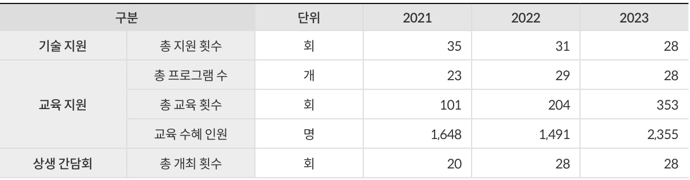  

소비자 VOC  

  
1) 홈페이지 및 대외 민원 건수(단순문의 제외)  

소비자 만족도  

  
1) 국가고객만족도 조사(K-BPI) 저비용항공사(LCC) 부문  

정보보호 위반  

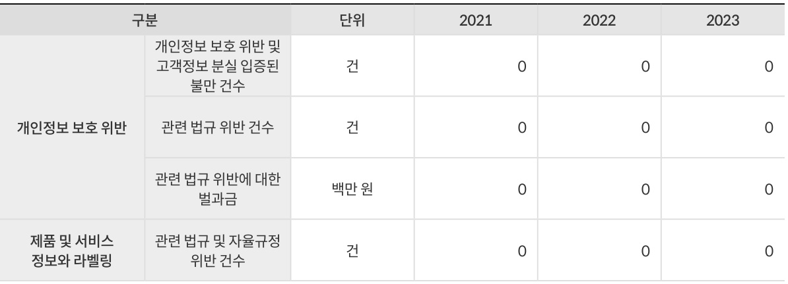  

정보보호 투자  

  

사회 공헌  

  

#  

Website ㅣhttp://www.jejuair.net E-mail ㅣesg@jejuair.net  

# SUSTAINABILITY ON BO ARD  

제주항공 2024 지속가능경영보고서  

# ESG Data Pack  

# 거버넌스  

ESG M ANAGEM  

이사회 운영현황1)  

  
1) 인원 수 및 참석률 연말 기준  

이사회 보수1)현황  

  

1) 기본급/성과급 포함 기준  
2) 사외이사, 감사위원회 제외  

#  

# ON BO ARD  

제주항공 2024 지속가능경영보고서  

# ESG Data Pack  

# 거버넌스  

이사회 내 위원회 활동 현황1)  

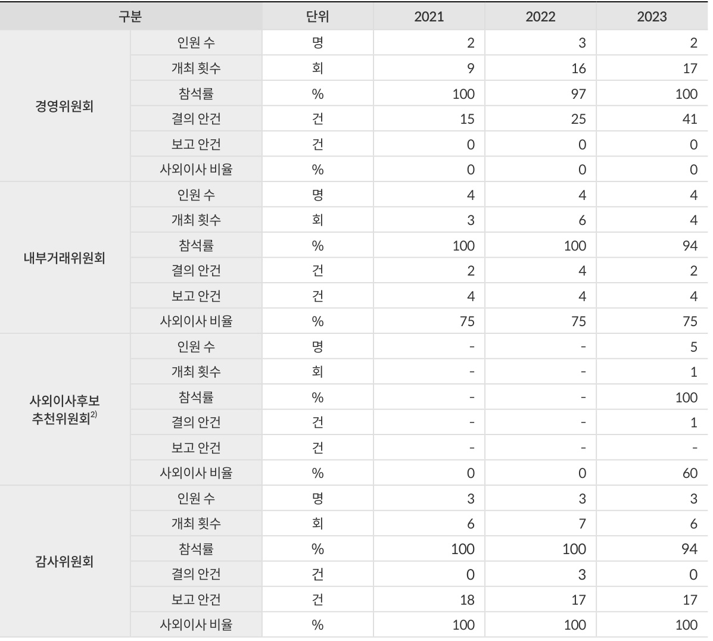  
1) 인원 수 및 참석률 연말 기준2) 사외이사후보추천위원회 2023년 5월 신설  

반부패(윤리경영) 커뮤니케이션 및 교육  

  

반경쟁 행위 및 독과점 등에 대한 법적 조치  

  

# ON BO ARD  

# ESG Data Pack  

제주항공 2024 지속가능경영보고서  

ESG M ANAGEM  

경제  
별도 재무상태표  

  

(단위: 백만 원)  

(단위: 백만 원)  

  

# ON BO ARD  

제주항공 2024 지속가능경영보고서  

# ESG Data Pack  

OVERVIEW   
ESG M ANAGEM ENT ENVIRONM ENTAL   
SOCIAL   
GO VERNANCE   
APPENDIX   
ESG Data Pack   
UN SDGs Commitments GRI Index   
SASB Index   
TCFD Index   
온실가스 검증 성명서  
제3자 검증의견서  
가입 협회 및 대외 수상  

Website ㅣhttp://www.jejuair.net E-mail ㅣesg@jejuair.net  

경제  
별도 포괄손익계산서  

  

(단위: 백만 원)  

별도 현금흐름표  

  

# SUSTAINABILITY ON BO ARD  

제주항공 2024 지속가능경영보고서  

# ESG Data Pack  

ESG M ANAGEM  

경제  
별도 현금흐름표  

  

(단위: 백만 원)  

(단위: 백만 원)  

  
1) 별도 재무제표 기준  

#  

# ON BO ARD  

제주항공 2024 지속가능경영보고서  

  

# UN SDGs Commitments  

제주항공은 유엔의 지속가능발전 목표를 지지하며 인류와 국제사회의 지속가능한 발전에 기여하기 위해 노력하고 있습니다. 이에 따라 제주항공의 지속가능경영 3대 분야를 통해 기여할 수 있는 UN SDGs 관련세부 목표를 선정하여 관리하고 있습니다.  

  
Website ㅣhttp://www.jejuair.net E-mail ㅣesg@jejuair.net  

# SUSTAINABILITY ON BO ARD  

제주항공 2024 지속가능경영보고서  

# UN SDGs Commitments  

  

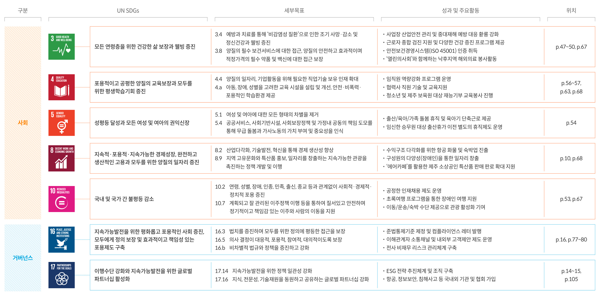  
Website ㅣhttp://www.jejuair.net E-mail ㅣesg@jejuair.net  

# SUSTAINABILITY ON BO ARD  

제주항공 2024 지속가능경영보고서  

# GRI Index  

  

  

일반표준 공개 (GRI 2: General Disclosures 2021)  

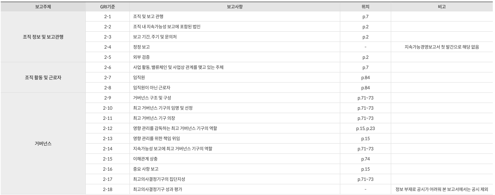  
Website ㅣhttp://www.jejuair.net E-mail ㅣesg@jejuair.net  

# SUSTAINABILITY ON BO ARD  

제주항공 2024 지속가능경영보고서  

# GRI Index  

일반표준 공개 (GRI 2: General Disclosures 2021)  

  

  

일반표준 공개 (GRI 3: Material Topics 2021)  

  

# SUSTAINABILITY ON BO ARD  

제주항공 2024 지속가능경영보고서  

GRI Index  

  

특정표준 공개 (Topic Standards Disclosures)  

  

중요 토픽 외 (Marked as Non-Core Topics)   

  

Website ㅣhttp://www.jejuair.net E-mail ㅣesg@jejuair.net  

# SUSTAINABILITY ON BO ARD  

제주항공 2024 지속가능경영보고서  

GRI Index  

  

특정표준 공개 (Topic Standards Disclosures)  

  

# ON BO ARD  

제주항공 2024 지속가능경영보고서  

# SASB Index  

  

Sustainability Disclosure Topics & Accounting Metrics   

  

Activity Metrics   

  

# SUSTAINABILITY ON BO ARD  

제주항공 2024 지속가능경영보고서  

# TCFD Index  

  

  
Website ㅣhttp://www.jejuair.net E-mail ㅣesg@jejuair.net  

# ON BO ARD  

제주항공 2024 지속가능경영보고서  

# 온실가스 검증 성명서  

# ‘제주항공’ 온실가스 배출량 검증 성명서  

ESG M ANAGEM  

#  

ESG Data Pack   
UN SDGs Commitments   
GRI Index   
SASB Index   
TCFD Index 온실가스 검증 성명서  
제3자 검증의견서  
가입 협회 및 대외 수상  

# 서문  

한국화학융합시험연구원(이하, KTR)은 제주항공의 2023년도 온실가스 배출량에 대하여 제3자 검증을 수행하였습니다. KTR은 제주항공과 합의된 계약 조건 및 기준에 따라 검증성명서를 독립적으로 제시할 책임이 있으며, 본 검증성명서를 기반으로 한 투자 등의 결정에 대한 책임은 지지 않습니다.  

# 검증 기준 및 범위  

본 검증은 ‘온실가스 배출권거래제의 배출량 보고 및 인증에 관한 지침(환경부 고시 제2023-279호)’ 및 ‘온실가스 배출권거래제 운영을 위한 검증지침(환경부 고시 제2021-112호)’ 기준이 적용되었습니다. 본 검증에서 다루어진 온실가스 배출량은 제주항공 본사의 운영 통제 하에 있는 국내 사업장의 직접배출(Scope 1) 및 간접배출(Scope 2)을 포함하고 있습니다.  

# 검증 방식  

본 검증은 제주항공에서 제공된 명세서, 배출량 산정계획서 및 관련 데이터와 정보 검증 계획에 따라 샘플링 방법을적용하였습니다. KTR은 제주항공이 보고한 온실가스 배출량에 대한 검증 의견을 제시하는데 필요한 정보와 데이터를 얻기 위하여 검증 계획을 수립하여 검증을 실시하였습니다. KTR은 검증 프로세스의 부분으로 다음 사항을 확인하였습니다.  

˙2023년 제주항공 온실가스 배출량 및 에너지 사용량 명세서˙제주항공 온실가스 데이터 관리 및 수집, 배출량 산정 및 보고 프로세스  

# 보증 수준  

본 검증은 합리적 보증 수준으로 중요성 평가 기준 $5\%$ 를 바탕으로 검증을 실시하였습니다.  

# 검증 한계  

본 검증은 규정된 지침에서 명확하게 명시되어 있지 않은 기준 및 방법 등을 적용하는 검증 가이드라인, 명세서 작성해설서 및 검증기관 자체 결정사항 적용에 따른 검출 오류에 대한 한계를 내포하고 있습니다.  

# 검증 결론  

제주항공의 온실가스 배출량 선언과 관련한 정보는 상기의 검증기준을 준수하여 오류, 누락 및 허위 진술 없이 적정하게 기술되었습니다. 제주항공의 2023년 온실가스 배출량은 아래와 같이 확인되었습니다.  

  

  

# SUSTAINABILITY ON BO ARD  

제주항공 2024 지속가능경영보고서  

  

O  

ESG M ANAGEM  

# ‘제주항공’ 국제항공 온실가스 배출량 검증 성명서  

#  

ESG Data Pack   
UN SDGs Commitments   
GRI Index   
SASB Index   
TCFD Index 온실가스 검증 성명서  
제3자 검증의견서  
가입 협회 및 대외 수상  

# 서문  

한국화학융합시험연구원(이하, KTR)은 제주항공의 ICAO CORSIA에 따른 2023년 온실가스 배출량에 대하여 합리적보증 수준에서 제3자 검증을 수행하였습니다. KTR은 제주항공과 합의된 계약 조건 및 기준에 따라 검증성명서를 독립적으로 제시할 책임이 있으며, 본 검증성명서를 기반으로 한 투자 등의 결정에 대 한 책임은 지지 않습니다.  

# 검증 기준 및 범위  

본 검증은 ICAO CORSIA 보고기준에 따른 ‘Annex 16, Volume IV (CORSIA)’, ‘ETA (Doc 9501), Volume IV’ 및 승인된배출량 보고서(V.1)와 ISO 14064-3:2019 기준이 적용되었으며, 본 검증에서 다루어진 온실가스 배출량은 제주항공본사의 운영 통제 하에 있는 국내 사업장 내 ICAO에서 규정하고 있는 국제선 보고기준 항공기로부터의 온실가스 배출을 포함하고 있습니다.  

# 검증 방식  

KTR은 제주항공에서 제공된 CORSIA 배출량 보고서 및 관련 데이터와 정보 검증 계획에 따라 샘플링 방법을 적용하였습니다. KTR은 제주항공이 보고한 온실가스 배출량에 대한 검증 의견을 제시하는데 필요한 정보와 데이터를 얻기 위하여 검증 계획을 수립하여 검증을 실시하였습니다. KTR은 검증 프로세스의 부분으로 다음 사항을 확인하였습니다.  

˙2023년 제주항공 CORSIA 배출량 보고서  

˙온실가스 데이터 관리 및 수집, 배출량 산정 및 보고 시스템 및 프로세스  

# 보증 수준  

본 검증은 합리적 보증 수준으로 중요성 평가 기준 $2\%$ 를 바탕으로 검증을 실시하였습니다.  

# 검증 한계  

본 검증은 규정된 지침에서 명확하게 명시되어 있지 않은 기준 및 방법 등에 대해서는 검증기관 자체 결정 사항 적용에따른 검출 오류에 대한 한계를 내포하고 있습니다.  

# 검증 결론  

제주항공의 온실가스 배출량 선언과 관련한 정보는 상기의 검증기준을 준수하여 오류, 누락 및 허위 진술 없이 적정하게 기술되었습니다. 제주항공의 2023년 온실가스 배출량은 아래와 같이 확인되었습니다.  

  

  

# ON BO ARD  

제주항공 2024 지속가능경영보고서  

#  

#  

# 제3자 검증의견서  

ESG Data Pack   
UN SDGs Commitments   
GRI Index   
SASB Index   
TCFD Index   
온실가스 검증 성명서  

Website ㅣhttp://www.jejuair.net E-mail ㅣesg@jejuair.net  

제3자 검증의견서가입 협회 및 대외 수상  

컨트롤유니온 Sdn. Bhd. (Control Union Sdn Bhd 이하 “컨트롤유니온”)은 (주)제주항공 (이하 “제주항공”)로부터 제주항공 2024 지속가능경영보고서 (이하 “보고서”)에대한 독립적인 검증을 요청받았습니다. 검증사인 컨트롤유니온은 다음과 같이 명시된 검증 범위 및 기준에 따라 독립적인 검증의견서를 발급하고, 독립적인 검증에 대한의견을 제시할 책임이 있으며, 제주항공의 모든 이해관계자들에게 그 정보를 제공하는데 있습니다. 컨트롤유니온은 보고서의 작성에 관여하지 않았으며, 보고서의 작성에 대한 책임은 제주항공 경영진에게 있습니다.  

# 검증 범위 및 기준  

컨트롤유니온의 검증팀은 국제적 검증 기준인 AA1000AS v3에 따라 검증을 계획하고 수행하였습니다. 이 때, 검증의 종류는 Type 1 및 2, 수준은 Moderate Level로 수행되었습니다. 보고서는 GRI (Global Reporting Initiative) 표준을 사용하여 작성되었으며, 검증 과정은 보고 내용이 GRI Standards에 부합하는지 확인하고, 데이터의정확성 및 신뢰성 평가하는 방식으로 수행되었습니다. 검증 프로세스는 AA1000ASAccountAbility의 4대 원칙인 포괄성, 중요성, 대응성 및 영향의 준수 평가를 따랐습니다. 검증 프로세스는 아래 내용과 같습니다.  

- GRI 1: 기초 2021  
- GRI 2: 일반 사항 2021  
- GRI 3: 중대 이슈 2021  
- 직장 내 건강 및 안전: GRI 403-1\~10  
- 배출: GRI 305-1\~2, 4 (Type 2)   
- 고객 건강 및 안전: GRI 416-2  
- 경제성과: GRI 201-1\~2  
- 세금: GRI 207-1  
- 간접 경제효과: GRI 203-1  
- 에너지: GRI 302-1, 3 (Type 2)  
- 물과 방류: GRI 303-5  
- 생물 다양성: GRI 304-3  
- 폐기물: GRI 306-1\~2   
- 고용: GRI 401-1\~3  
- 노사관계: GRI 402-1  
- 교육 및 훈련: GRI 404-1\~3  
- 다양성 및 기회 균등: GRI 405-1\~2  
- 결사 및 단체 행동의 자유: GRI 407-1  
- 지역사회: GRI 413-1  
- 고객 정보 보호: GRI 418-1  

# 포괄성  

포괄성은 지속가능성에 대한 조직의 의사결정과정에서 이해관계자를 참여토록 하는것을 의미합니다. 제주항공은 이해관계자를 임직원, 주주 및 투자자, 고객, 협력사, 지역사회/NGO, 정부/지자체/협회로 구분하여 정의하고 있으며, 이들의 의견을 의사결정에 반영하고 있습니다. 검증팀은 이해관계자와 소통하는 과정에서 제외된 중요한이해관계자 그룹이 있음을 발견하지 못하였습니다.  

# 중요성  

중요성은 이해관계자에게 적합하고 의미 있는 중요한 이슈 식별 및 존재 여부 파악을의미합니다. 여기서 중요한 이슈는 조직 혹은 이해관계자들의 의사결정과 행동 및 성과에 영향을 끼칠 수 있는 것을 말합니다. 제주항공은 다양한 이해관계자 커뮤니케이션 채널과 자체적인 중대성 평가 프로세스를 통해 이슈들의 중요성을 파악하고 있습니다. 도출된 핵심 이슈들은 보고서에 구분되어 기술되었으며, 검증팀은 이 프로세스와 핵심 이슈풀에서 제외된 중요한 이슈를 발견하지 못했습니다.  

# 대응성  

대응성은 조직의 의사결정, 행동, 성과, 이해관계자와의 커뮤니케이션 등을 통해 지속가능성 이슈에 대응하고 피드백을 제공하는 것을 의미합니다. 제주항공은 ESG 친화적인 경영체계를 구축하기 위해 분산되어 있는 ESG 분야별 활동가치를 ESG 경영 플랫폼에 연결하고 확장하여 이해관계자와 투명하게 소통할 수 있는 체계를 마련하였습니다. 또한, 비재무적 성과를 반영한 기업가치를 다양한 이해관계자와 소통하고 있는 것을 확인했습니다.  

# 영향성  

영향성이란 조직의 활동이 경제, 환경, 사회, 이해관계자, 조직 자체에 미치는 영향에대한 모니터링, 측정, 책임 등을 다하는 것을 의미합니다. 제주항공은 중대 이슈를 파악하고 이해관계자와 지속적으로 소통하기 위해 설문조사를 실시하였습니다. 그리고,제주항공은 중대이슈에 대한 영향 모니터링을 수행했습니다. 그 결과 제주항공이 지역사회에 긍정적인 영향을 미치기 위해 노력하고 있음을 확인했습니다.  

# 컨트롤유니온의 검증 수준  

검증 수준은 검증 제공자가 중요한 오류, 누락 또는 왜곡 표시가 있는지 식별하는데사용하는 세부 정보의 깊이를 결정하는데 사용됩니다. 보고서에 대한 검증 수준은Moderate입니다.  

# 컨트롤유니온의 검증 방법  

- 제주항공의 보고서에 제시한 내용/수치에 대한 내외부적 문서 및 관련 기록 검토- 회사 차원에서의 데이터 수집 접근 방식 검토- (Type 2) 데이터 샘플에 대한 검토를 및 보고서에 제시된 데이터에 대한 검토- (Type 2) 서울시 강서구 위치한 제주항공 본사 방문하여 ESG 관련 핵심 인원들 면담  

# 컨트롤유니온의 자격 및 독립성  

컨트롤유니온은 당사의 글로벌 범위 및 운영을 다루는 ISO 17021-1:2015/ISO17065:2012에 따라 인증되었습니다. 위 인증에는 운영 전반에 걸쳐 객관성뿐만 아니라 윤리적, 법적 요건에 대한 준수, 문서화된 정책과 절차를 포함한 포괄적인 품질관리 시스템을 유지해야 하는 등의 필요성이 포함됩니다. 컨트롤유니온은 내부적인자격, 훈련 및 경험에 근거하여 적절한 자격을 부여받은 검증 심사원을 선정하고 있습니다. 또한, 적용된 접근 방법과 검증이 엄격히 지켜지고 투명하게 운영될 수 있도록경영진에 의해 검토되고 있습니다.  

# 결론 및 개선 권고사항  

상기 검증 활동을 수행한 결과, 적용된 기준에 기반했을 때 본 보고서에 제시된 내용들과 수치가 불공정하게 기재되었다고 판단되는 사항은 발견하지 못하였습니다. 또한,포괄성, 중요성, 대응성, 영향성에 대한 적용을 적절하게 반영하고 있음을 확인하였습니다.검증결과에 영향을 미치지 않는 범위에서 다음 의견을 제시합니다.  

- 제주항공은 국내 저비용항공사로서 여객, 화물, 호텔 분야의 다양한 사업을 진행하고 있습니다. 보고서 검증 과정에서 사고 및 안전관리, 기후변화 대응, 고객 만족, 임직원 안전 보건,지역사회 관계, 인적 자원 관리 및 개발, 정보보호 및 개인정보 보호, 인권/다양성 및 포용성,임직원 복리후생, 컴플라이언스, 통합 리스크 관리, 환경영향 저감, 건전한 지배구조, 윤리경영, 노사관계, 공급망 관리 등의 이슈가 충분히 중요하게 다뤄지고 있음을 확인할 수 있었습니다. 또한, 국내 저비용항공사로서 지역사회 기반의 사회공헌 활동을 강화하고 있음을 확인했습니다.  

- ‘제주항공 2024 지속가능경영보고서’는 제주항공의 첫번째 지속가능성보고서입니다.제주항공은 핵심 ESG 이슈에 대해서 이사회에 보고 및 의결하며, 관련 실무협의체를 운영하는 시스템을 갖추고 있습니다. 향후 더욱 강조될 임팩트 측정, ESG 관리 내재화, ESG 관련 성과 보고 이슈에 대응하기 위해서는 관련 데이터의 지속적 축적, 관리, 보고가 필요합니다. 이와 관련하여 제주항공의 ESG 성과를 추적하고 관리하기 위해서는 향후 꾸준히 지속가능성보고서를 발간할 필요가 있습니다.  

#  

  

Zulkarnain Ishak Manager Sustainability Assurance  

# ON BO ARD  

제주항공 2024 지속가능경영보고서  

# 가입 협회 및 대외 수상  

  

가입 협회  

  

대외 수상  

  